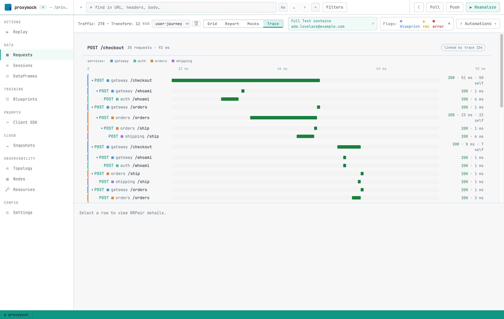
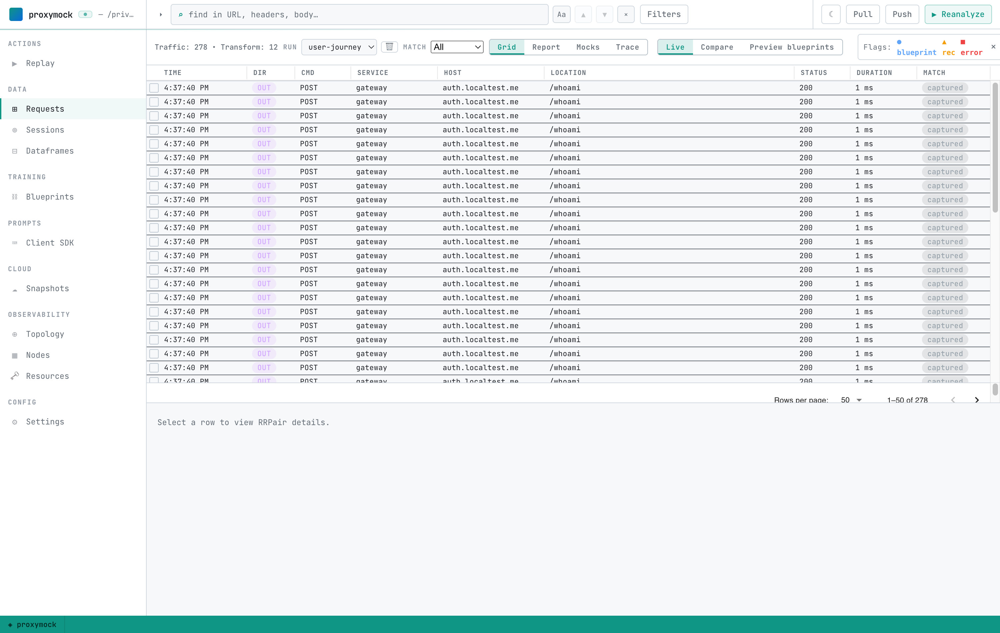
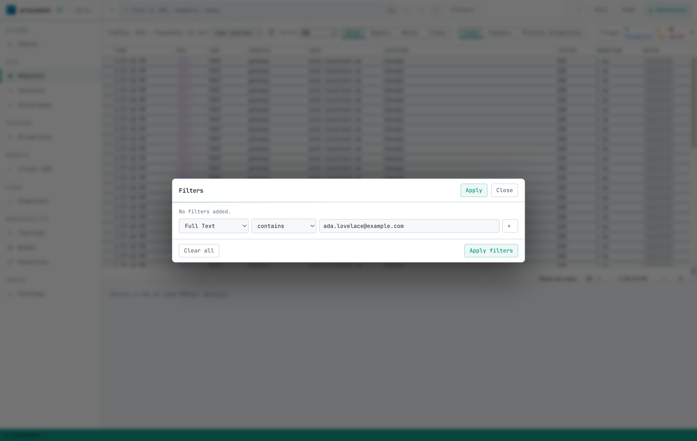
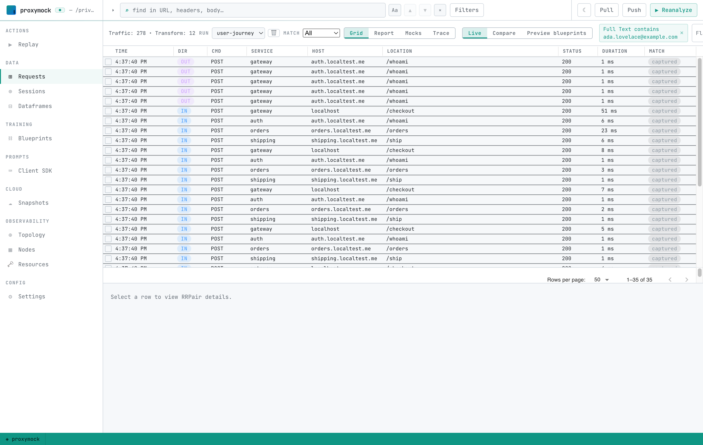
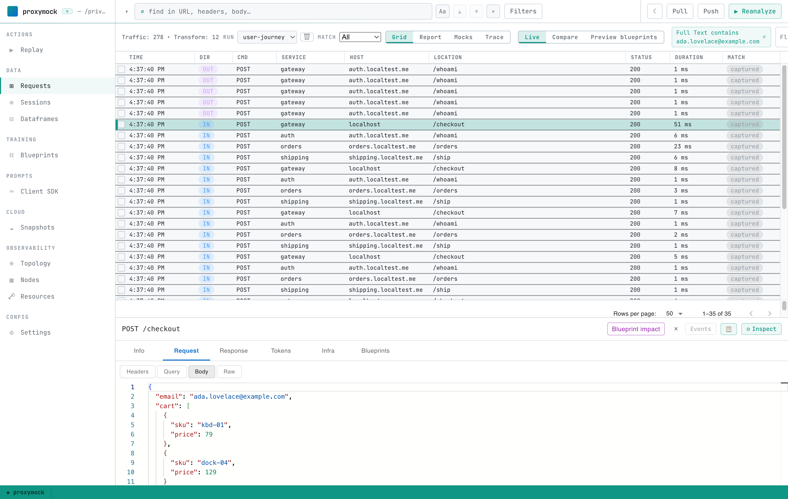
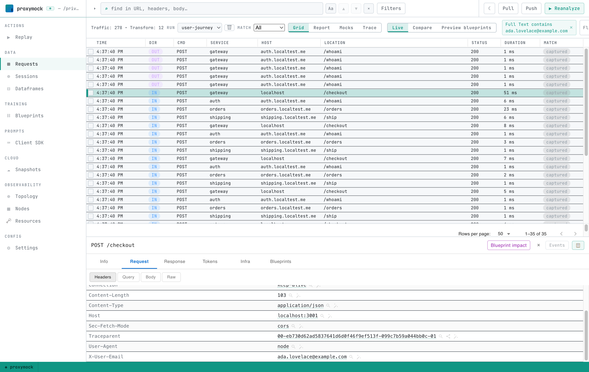
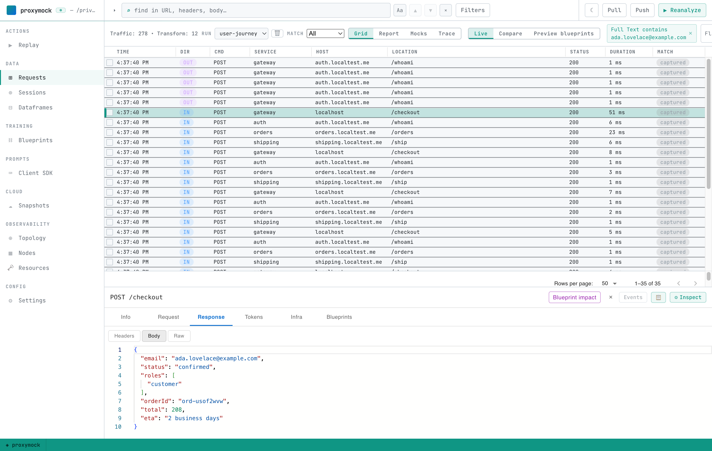

# Trace a request without traces

Distributed tracing is great when every service is instrumented, nothing is
sampled away, and the request never crosses a system you don't own. When one of
those isn't true — the trace was sampled out, a library dropped the context, or
the hop went through a third party — you get a waterfall with a hole in it right
where the bug is.

But the journey still happened on the wire, and proxymock already recorded it.
This guide shows how to reconstruct one customer's full path across four
services using the identifier that's *already in the traffic* — their email —
instead of a trace ID.

The result is a Grafana-style waterfall, scoped to a single person, built from
real recorded requests:



## What you'll need

- proxymock installed ([installation](/proxymock/getting-started/installation.md)).
- The **user-journey** demo from the Speedscale demo repo, under
  `scenarios/otel-trace-replay-gate/user-journey/`. It's a four-service checkout
  app — `gateway → auth`, `gateway → orders`, `orders → shipping` — that threads
  the customer's email through an `X-User-Email` header, the request bodies, and
  the response bodies. Nothing in it uses OpenTelemetry.

## Step 1 — Record the traffic

From the demo's `user-journey/` directory:

```bash
npm install
./record-all.sh
```

`record-all.sh` starts one `proxymock record` per service into a single shared
workspace and drives ~40 checkouts for five named customers (Ada Lovelace, Grace
Hopper, Alan Turing, Katherine Johnson, and Margaret Hamilton). Every request and
response on every hop is captured to disk as real traffic — no application code
changes required.

## Step 2 — Open the recording

```bash
proxymock web --in .
```

`proxymock web` opens on the whole recording — every customer's traffic,
interleaved. This is the haystack: hundreds of requests across all four services.



## Step 3 — Filter to one customer

You don't need a trace ID to find one person — you need something that travels
with their requests. Here that's their email, and it shows up in different places
on different hops: a header on one, a request body on another, a response body on
a third. The **Full Text** filter matches against the entire request/response
pair, so one filter catches all of them.

Open **Filters**, add a filter, choose the **Full Text** field with the
**contains** comparator, and enter the customer's email:



Apply it, and the grid collapses from every customer to just this one — matched
across all four services:



## Step 4 — See where the identifier was found

Select any row and open the **Request** tab. On the checkout, the email is in the
request **body**:



On the **Headers** sub-tab, the same email rides the `X-User-Email` header (and a
W3C `traceparent` is present too — more on that below):



And on the **Response** tab, downstream services echo the email back in their
response **bodies**:



Header, request body, response body — three different fields, across different
services, all found by the single Full Text filter. That's the part a trace ID
can't do: it only works if every service agreed to propagate it. A business
identifier survives across systems that were never instrumented.

## Step 5 — Read the waterfall

Switch the Requests view to the **Trace** lens. proxymock draws the filtered set
as a time-ordered, nested waterfall — one customer's transaction across every
service:


You can read the whole journey top to bottom: the checkout hits the **gateway**,
which calls **auth** to verify the customer and **orders** to place the order, and
**orders** calls **shipping** for a delivery estimate — every hop, in order, with
each span's duration and self-time. Because these are the real recorded requests,
every bar is clickable and drills into the exact request and response for that
customer on that transaction.

## How this works

- **The filter does the correlation.** The Full Text filter narrows the Requests
  list, and the Trace lens is a pure renderer over that filtered set (see
  [the Trace view](#step-5--read-the-waterfall)). Change the email to
  `grace.hopper@example.com` and you get Grace's journey instead. Any value that
  travels with the request works — an order id, an account number, a session
  token.
- **`traceparent` is only used for nesting, never for filtering.** The demo
  propagates a W3C `traceparent` so the waterfall can nest hops into a tree, but
  you never filter on it. The grouping key is business data, not a trace ID — which
  is exactly why this works when tracing is missing or incomplete.
- **Nothing is instrumented.** proxymock recorded the wire, not the code. The same
  recording can also be [replayed](/proxymock/getting-started/quickstart/local/index.mdx)
  or turned into mocks — so the traffic that reconstructed this trace can also
  become a regression test.

## Related

- [Topology and cluster visibility](/proxymock/guides/observability.md)
- [Local quickstart](/proxymock/getting-started/quickstart/local/index.mdx)
