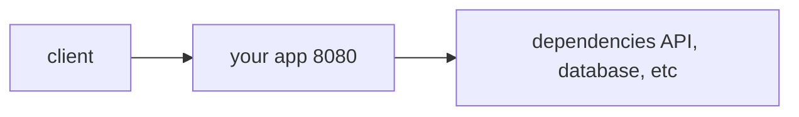
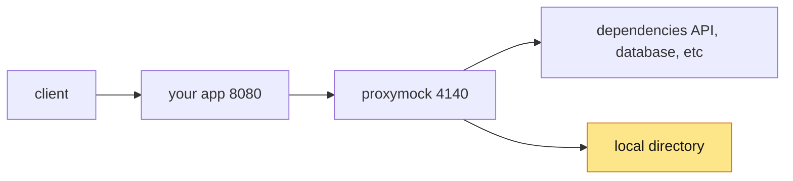
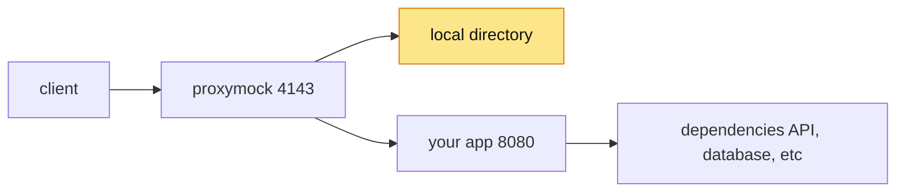
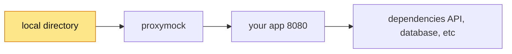

import Tabs from '@theme/Tabs';
import TabItem from '@theme/TabItem';

# Architecture

**proxymock** utilizes a [proxy](/reference/glossary.md#proxy) to capture
traffic to and from your application.

Get a feel for the shape your local system with various **proxymock** configurations:

<Tabs>
  <TabItem value="no-proxymock" label="No Proxymock">
This is probably close what your setup looks like.  A client making requests to
your app's API (listening on port `8080` in this case) and your app making
requests to various other services, APIs, databases, etc.

  </TabItem>
  <TabItem value="proxymock-capturing-outbound" label="Record Mocks">
With **proxymock** we can transparently capture outbound traffic, the requests
your app makes to other services and the associated responses.  Once captured
these are called [mocks](/reference/glossary.md#mock) and are written to
artifacts in a local directory.

Once the necessary env vars are set in the environment where "your app" is
running outbound traffic from your app is routed through **proxymock** and
captured in the process. Is is **not** necessary to modify your app.

  </TabItem>
  <TabItem value="proxymock-capturing-inbound" label="Record Tests">
With **proxymock** we can capture inbound traffic, the requests your client
makes to your app the associated responses.  Once captured these are called
[tests](/reference/glossary.md#test) and are written to artifacts in a local
directory.

Requests from the client are routed through **proxymock** and captured in the
process, but unlike outbound traffic where we can just set env vars the client
will need to target the proxy port instead of the app port. In this case that
means making requests to `localhost:4143` instead of `localhost:8080`.

  </TabItem>
  <TabItem value="proxymock-mocking" label="Mock Server">
Once **proxymock** has created [mocks](/reference/glossary.md#mock) from
outbound traffic it can be used as a [mock
server](/reference/glossary.md#mock-server) to respond to requests from your
app.  Mock [signatures](/proxymock/how-it-works/signature.md) are generated from the
mock artifacts captured earlier.

While dependencies can be fully replace by **proxymock**, there is a dotted line
to indicate "passthrough", which is what happens when a request to the mock
server does not match a [signature](/proxymock/how-it-works/signature.md). In that case the
request is forwarded to the real resource.

  </TabItem>
  <TabItem value="proxymock-load-generating" label="Replay / Load Generator">
Once **proxymock** has created [tests](/reference/glossary.md#test) from inbound
traffic it can replay those requests back to your app. Requests are
generated from the test artifacts captured earlier.

In this configuration the client is fully replaced by **proxymock** which makes
requests to your app on port `8080`.

Send enough requests and this replay becomes a full [load
generator](/reference/glossary.md#load-generator).  See the **proxymock** flags
for to increase the number of [VUs](/reference/glossary.md#vuser), run for a
period of time, skip writing new files from replayed requests, etc.

  </TabItem>
</Tabs>
