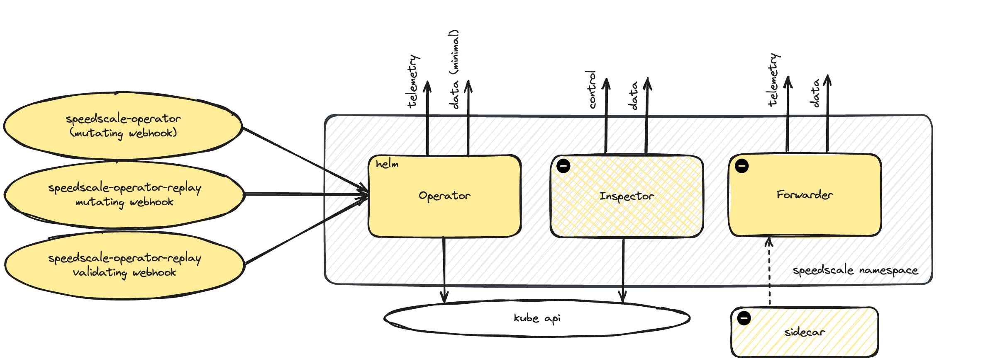
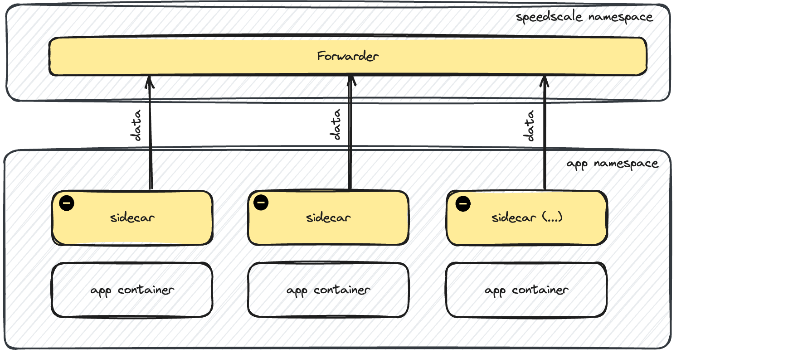
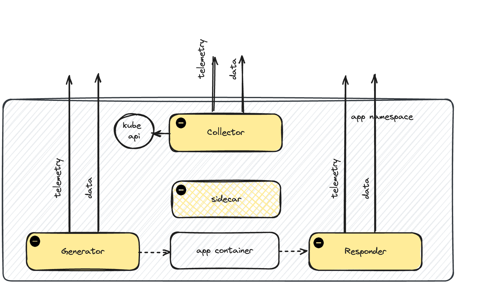

# Deployment Architecture

Speedscale runs a set of components and processes in your Kubernetes environment. This document outlines the specific components and the network requirements for each component.

The Speedscale deployment breaks into three modes:

1. Operator (shared)
2. Ingest
3. Replay

The Operator is usually installed via the helm [chart](https://github.com/speedscale/operator-helm). Once that is installed, most additional deployment activities are automated using either the Speedscale Infrastructure UI, the `speedctl` API or via direct Custom Resource [editing](../guides/replay/kube.md). It is possible to automate the entire Speedscale installation via Argo, git or your deployment system of choice. This page outlines the components used in a typical deployment. Speedscale supports highly secure environments and there are different recipes for different constraints. Please reach out to [support](https://slack.speedscale.com) for assistance.

## Shared Components

By default, Speedscale's helm chart installs an operator and a complement of webhooks. This operator is necessary to both ingest data and perform replays. Components in the diagram with a caution icon are managed by the speedscale operator and typically should not be modified directly. These optional components are deployed by the operator and thus are not present in the helm [chart](https://github.com/speedscale/operator-helm). Keep in mind that your exact deployment may omit some of these components due to security constraints and other factors.



A full complement of Speedscale services deployed to the default `speedscale` namespace will produce output similar to this pod listing:
```bash
kubectl -n speedscale get pods
NAME                                    READY   STATUS    RESTARTS   AGE
java-client-67bf4b4cb4-7lmkd            1/1     Running   0          7d6h
java-server-5786d56974-pv765            2/2     Running   0          7d6h
speedscale-forwarder-7785df55c-688sn    1/1     Running   0          7d6h
speedscale-inspector-7f797bb75f-dvmr8   1/1     Running   0          7d6h
speedscale-operator-d9cc9c794-mtcdp     1/1     Running   0          7d6h
```

**speedscale-operator (mutating webhook)** - A Kubernetes API extension that listens for workloads. If a workload has the necessary annotations, the operator modifies it. If this is not in working order then the operator will not "notice" workloads that are applied to the cluster.

**speedscale-operator-replay (validating webhook)** - A Kubernetes API extension that listens for changes made to trafficreplay [CRs](https://kubernetes.io/docs/concepts/extend-kubernetes/api-extension/custom-resources/)

**speedscale-operator-replay (mutating webhook)** - A Kubernetes API extension that listens for trafficreplay [CRs](https://kubernetes.io/docs/concepts/extend-kubernetes/api-extension/custom-resources/). trafficreplay CRs control which workloads have sidecars and running replays.

**operator** - The central controller for Speedscale ingest and replays. The operator listens to the webhooks and responds to commands. For instance, if a trafficreplay CR is created the operator will do the work of actually initiating the replay. The operator communicates directly with the Kubernetes API.

**inspector (optional)** - Provides remote control services initiated from Speedscale cloud. This component is intentionally separate from the rest of Speedscale's system so it can be removed in secure environments. Once this component is disabled, Speedscale will work normally but remote environment control will be no longer be possible.

**java-server/client (optional)** - A simple demo app provided by Speedscale that can be easily turned off.

The Speedscale sidecar is shown in this diagram to indicate connectivity but the operator installation does not automatically deploy a sidecar.

:::note
All connections to Speedscale Cloud are initiated outbound from your cluster. Speedscale does not require listener ports to be opened.
:::

:::note
`telemetry` and `control` are very low bandwidth connections. `data` typically utilizes more bandwidth depending on your traffic ingest. Please see the helm [chart](https://github.com/speedscale/operator-helm) and networking [requirements](../reference/networking.md) for more information.
:::

## Ingest Only

During traffic ingest, Speedscale utilizes a data pipeline that is optimized for data masking, filtering and high volume. As a result, these components use additional network channels and components which are outlined below. It is technically possible to add these components manuallly but it is unusual. Typically, either a trafficreplay CR is created or the workload is annotated which lets the operator manage the sidecar injection.



**sidecar** - This is the listener proxy, similar to an Envoy sidecar.

Each sidecar connects to the in-cluster forwarder in the `speedscale` namespace. Data is filtered and forwarded to Speedscale Cloud by the forwarder itself.

Pods with the speedscale sidecar injected should have a new container named `speedscale-goproxy`.

```bash
kubectl -n speedscale get pods java-server-5786d56974-pv765 -o jsonpath='{.spec.containers[*].name}'
speedscale-goproxy java-server
```

:::tip
Speedscale can dynamically prevent PII data from leaving your environment during ingest. Learn more in our [Data Loss Prevention Guide](../guides/dlp.md)
:::

## Replay Only



During replay, the operator starts a collector to retrieve logs and other events from the Kubernetes API. The load generator only starts if tests are being executed. The responder only starts if service mocking is enabled.

**speedscale-collector (optional)** - A logging and event data collector. Events are forwarded to the cloud and included in the report.

**speedscale-generator (optional)** - The Speedscale load generator. Note this can be run from anywhere but is often included in the namespace.

**speedscale-responder (optional)** - The Speedscale mock server. 

During replay, you may see some or all of these components in the testing namespace depending on the type of replay you are running (tests only, mocks only, etc).

```bash
kubectl get pods
NAME                                                   READY   STATUS              RESTARTS   AGE
java-client-67bf4b4cb4-7lmkd                           1/1     Running             0          7d7h
java-server-5786d56974-pv765                           2/2     Running             0          7d7h
speedscale-collector-abstract-yucca-7fb7d8f89b-z8btv   1/1     Running             0          8s
speedscale-generator-abstract-yucca-nlkm9              0/1     ContainerCreating   0          2s
speedscale-responder-abstract-yucca-ffc7a8ffec-f11av   1/1     Running             0          8s
```

## Data Security

To learn more about Speedscale's overall approach to data security, please visit our security [hub](../../security/security_).