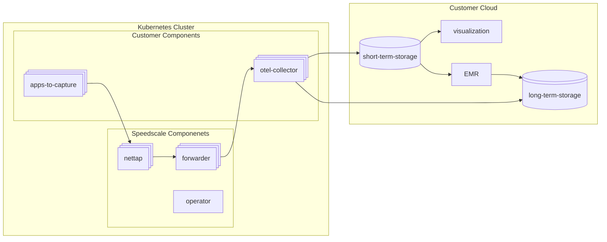

# Bring Your Own Cloud

## Components

### Speedscale Components

| Component     | Description                                                                                                                                            |
| ------------- | ------------------------------------------------------------------------------------------------------------------------------------------------------ |
| **nettap**    | Network tap that intercepts traffic from customer applications. It captures requests/responses flowing through the cluster for recording and replay.   |
| **forwarder** | Receives captured traffic from nettap and forwards it downstream to the OTel collector. Acts as a buffering/routing layer between capture and storage. |
| **operator**  | Kubernetes operator that manages the lifecycle of Speedscale resources (CRDs), orchestrates replay, and coordinates the other Speedscale components.   |

### Customer Components

| Component           | Description                                                                                                                                                                                                      |
| ------------------- | ---------------------------------------------------------------------------------------------------------------------------------------------------------------------------------------------------------------- |
| **apps-to-capture** | The customer's own application workloads whose traffic is being captured by nettap. These are the services under test.                                                                                           |
| **otel-collector**  | An OpenTelemetry Collector instance that receives forwarded traffic data as logs and routes it to both short-term and long-term storage backends. Examples include FluentBit, OTelCollector, Datadog agent, etc. |

## Customer Cloud

### Short Term Storage

Hot/queryable storage for recent traffic data. Feeds visualization and EMR processing. This may be the entire RRPair JSON object or a selection of fields. Recommended lifecycle is 7-30 days depending on observability/queryability needed.

| Cloud     | Options                                                                                                                                                                                                                                                                                                                 |
| --------- | ----------------------------------------------------------------------------------------------------------------------------------------------------------------------------------------------------------------------------------------------------------------------------------------------------------------------- |
| **AWS**   | [Amazon OpenSearch](https://docs.aws.amazon.com/opensearch-service/), [Amazon Timestream](https://docs.aws.amazon.com/timestream/), [Amazon DynamoDB](https://docs.aws.amazon.com/dynamodb/), [Amazon ElastiCache (Redis)](https://docs.aws.amazon.com/elasticache/)                                                    |
| **GCP**   | [Cloud Bigtable](https://cloud.google.com/bigtable/docs), [Memorystore (Redis)](https://cloud.google.com/memorystore/docs/redis), [Firestore](https://cloud.google.com/firestore/docs), Elasticsearch on GCE                                                                                                            |
| **Azure** | [Azure Data Explorer (ADX)](https://learn.microsoft.com/en-us/azure/data-explorer/), [Azure Cache for Redis](https://learn.microsoft.com/en-us/azure/azure-cache-for-redis/), [Azure Cosmos DB](https://learn.microsoft.com/en-us/azure/cosmos-db/), [Azure AI Search](https://learn.microsoft.com/en-us/azure/search/) |

### Long Term Storage

Cold/archival storage for full RRPair objects and EMR output. Optimized for cost and durability. Recommended lifecycle is 365 days or indefinite depending on use cases for security vs observability. One strategy may be to retain raw data for X days and keep saved artifacts ie. snapshots from EMR jobs indefinitely.

| Cloud     | Options                                                                                                                                                                                            |
| --------- | -------------------------------------------------------------------------------------------------------------------------------------------------------------------------------------------------- |
| **AWS**   | [Amazon S3](https://docs.aws.amazon.com/s3/), [S3 Glacier](https://docs.aws.amazon.com/AmazonS3/latest/userguide/glacier-storage-classes.html)                                                     |
| **GCP**   | [Cloud Storage](https://cloud.google.com/storage/docs) (Standard, Nearline, Coldline, Archive)                                                                                                     |
| **Azure** | [Azure Blob Storage](https://learn.microsoft.com/en-us/azure/storage/blobs/), [Azure Data Lake Storage Gen2](https://learn.microsoft.com/en-us/azure/storage/blobs/data-lake-storage-introduction) |

### Visualization

Dashboards and UI for exploring captured traffic and test results stored in short-term storage.

| Cloud     | Options                                                                                                                                                                                                                                                             |
| --------- | ------------------------------------------------------------------------------------------------------------------------------------------------------------------------------------------------------------------------------------------------------------------- |
| **AWS**   | [Amazon Managed Grafana](https://docs.aws.amazon.com/grafana/), [Amazon QuickSight](https://docs.aws.amazon.com/quicksight/latest/user/welcome.html), [OpenSearch Dashboards](https://docs.aws.amazon.com/opensearch-service/latest/developerguide/dashboards.html) |
| **GCP**   | [Looker](https://cloud.google.com/looker/docs), [Grafana on GKE](https://grafana.com/docs/grafana/latest/setup-grafana/installation/kubernetes/), [Google Cloud Console custom dashboards](https://cloud.google.com/monitoring/dashboards)                          |
| **Azure** | [Azure Managed Grafana](https://learn.microsoft.com/en-us/azure/managed-grafana/), [Azure Monitor Workbooks](https://learn.microsoft.com/en-us/azure/azure-monitor/visualize/workbooks-overview), [Power BI](https://learn.microsoft.com/en-us/power-bi/)           |

### EMR

Batch or stream processing engine that reads from short-term or long-term storage, transforms/aggregates traffic data and writes snapshots back to long-term storage.

| Cloud     | Options                                                                                                                                                                                                                                                                                                                                   |
| --------- | ----------------------------------------------------------------------------------------------------------------------------------------------------------------------------------------------------------------------------------------------------------------------------------------------------------------------------------------- |
| **AWS**   | [Amazon EMR](https://docs.aws.amazon.com/emr/) (Spark/Hadoop), [AWS Glue](https://docs.aws.amazon.com/glue/), [Amazon Kinesis Data Analytics](https://aws.amazon.com/kinesis/data-analytics-for-sql/), [AWS Lambda](https://docs.aws.amazon.com/lambda/)                                                                                  |
| **GCP**   | [Cloud Dataproc](https://cloud.google.com/dataproc/docs) (Spark/Hadoop), [Cloud Dataflow](https://cloud.google.com/dataflow/docs) (Apache Beam), [Cloud Functions](https://cloud.google.com/functions/docs)                                                                                                                               |
| **Azure** | [Azure HDInsight](https://learn.microsoft.com/en-us/azure/hdinsight/) (Spark/Hadoop), [Azure Databricks](https://learn.microsoft.com/en-us/azure/databricks/), [Azure Stream Analytics](https://learn.microsoft.com/en-us/azure/stream-analytics/), [Azure Synapse Analytics](https://learn.microsoft.com/en-us/azure/synapse-analytics/) |

## Using Data Effectively

### Observability

Depending on the choice of short term storage, you will want to index certain dimensions for quick lookups:

- Time - choose a data store that can handle time series data efficiently for quick partitioning and filtering.
- Service/Namespace/Cluster - information about where the RRPair is from.
- Command/Location/Status - for http rrpairs this is something like "POST /endpoint 404", for non-http rrpairs this is protocol dependent.
- Direction - always a simple IN/OUT relative to the service being captured.
- Long Term Storage Location - The full RRPair JSON may be too large to index completely depending on your choice of short-term storage in which case it is useful to index where the full object can be retrieved from.

### Using Traffic for Tests/Mocks

Speedscale's native processes operate on a 'raw' file usually named `raw.jsonl`. This is a newline delimited file of JSON objects with no particular guarantees about ordering or grouping.

In order to use raw traffic there are two main patterns that can be implemented:

- Use short-term storage as a data source: Construct a raw file by grabbing full objects from short-term storage either directly or by using the indexed long-term storage location.
- Use long-term storage as a data source: Point your EMR job at the long-term storage with the correct set of filters to construct output. Usually the output of an EMR job will be several chunks that need to be combined to form a working raw file.

### Rehydration

It may be useful to load a slice of captured traffic that has aged out of short-term storage back in so that it can be inspected and visualized again. There may be a way to configure your collector to read from long-term and ingest into short-term again (for eg. S3 input -> FluentBit -> short term) or you may want to have a separate job that ingests into the short-term storage directly.
