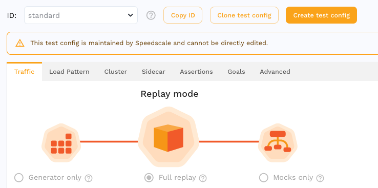

# Test Config

Speedscale's load generator relies upon a basic set of config items to
determine how it will behave at runtime.

You can view these in the [UI](https://app.speedscale.com/config):



Or via the CLI:

```bash
speedctl get testconfigs
speedctl get testconfig standard
```

### Structure

There are several sections within a Test Config:

1. **Traffic** - Set general configuration for how a replay should run
1. **Load Pattern** - Set how load should be applied throughout the replay
1. **Cluster** - Set infrastructure specific settings
1. **Sidecar** - Set sidecar secrets for replays running inside a Kubernetes cluster
1. **Assertions** - Set expected responses from the application
1. **Goals** - Set thresholds which will constitute a failed test report
1. **Advanced** - A text representation of the test config

Some sections contain more details on the following pages.

