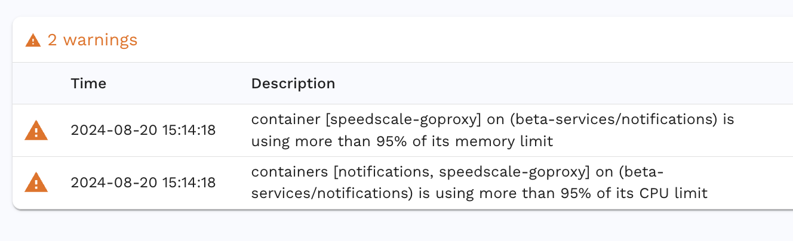

# Cluster

The Cluster section is used for setting up infrastructure-related configurations. This includes specifying the log level, build tag, and resource limits for both the Generator and Responder components.

# Container resource warnings

Speedscale introduces additional load during testing, which can lead to higher resource consumption, particularly in terms of CPU and memory.

### Impact:
- Lower throughput than expected.
- Potentially not reaching the desired Transactions Per Second (TPS) from your test configuration.

### Solution:
Increase your container's resource limits to accommodate the additional load generated by Speedscale.
