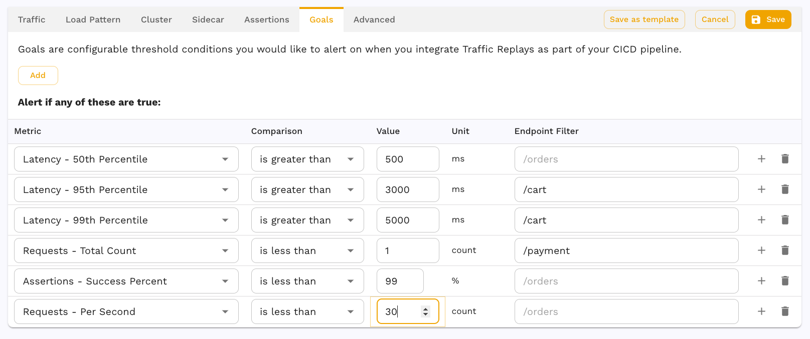

# Goals

The goals section allows you to define what a successful test run looks like. If
any of the goals defined are triggered the report will fail. If the report
fails as a part of your CI/CD integration your pipeline may stop so when using
Speedscale in CI/CD ensure your goals are set properly

The UI contains hints explaining the different metrics.

## Examples

Let's create a useful example for our application.

Reports run with this test config will fail if any of the metrics defined are
true when the replay completes.

| Metric                              | Reasoning               |
|-------------------------------------|-------------------------|
| Any location 50% latency > 500ms    | Most users should have a fast experience with responses less than 500 ms. |
| /cart location 95% latency > 3000ms | The cart is especially important and the majority of users should get a response in less than 3 seconds. |
| /cart location 99% latency > 5000ms | Virtually all users should see a cart response within 5 seconds or we risk them clicking away, losing the company money. |
| /payment requests > 1               | This replay should contain at least one call to the /payment endpoint to ensure it's tested. |
| successful assertions < 99%         | Of the assertions being run, basically all of them should pass. |
| RPS < 30                            | There is a business requirement that my application can handle at least 30 requests per second. |

