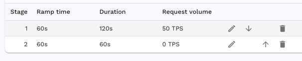

# Load Pattern

The Load Pattern tab allows you to shape the load over the course of a traffic
replay.

Let's say we want to create a load pattern that ramps up to 50 requests per
second (RPS) over the course of a minute, holds at 50 RPS for another minute,
and ramps down to 0 over a third minute.

We can actually implement this with only two stages.

The first stage will ramp from 0 to the target RPS over 60 seconds then hold
for the remainder of the stage duration. The second stage has the same total
duration as the ramp time so the full stage will be used to ramp from the
current RPS of 50 down to the target of 0.

This load pattern will result in a throughput graph like this:

