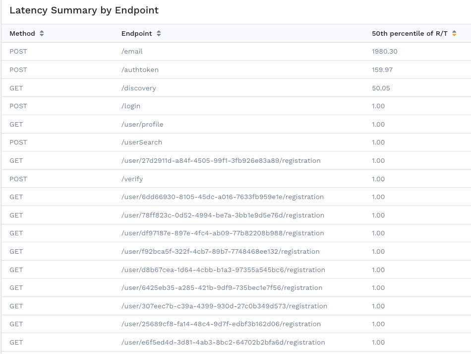
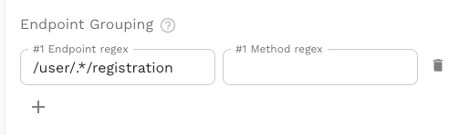
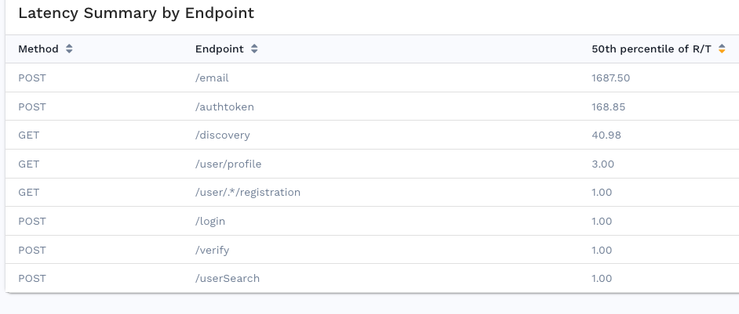
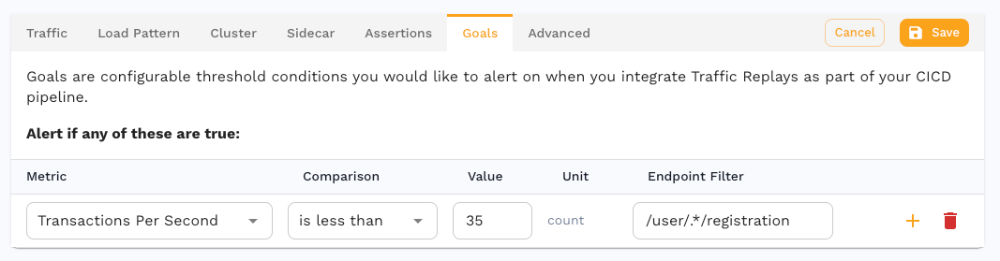

# Traffic

The traffic section contains high-level, and commonly modified, settings for
the [generator and responder](../../../concepts/replay).

The tool tip for each setting should point you in the right direction and more nuanced settings are covered here.

## Custom URL

Custom URL accepts a full or partial URL and creates transforms which will override the base URL of requests during replay.

- If a scheme is provided the scheme of the request will be replaced
- if a hostname is provided the hostname of the request will be replaced
- If a port is provided the port of the request will be replaced

If the custom URL contains a scheme a scheme transform is created.
If the custom URL contains a hostname a hostname transform is created.
If the custom URL contains a port a port transform is created.

Here are a few examples:

| Captured URL | Custom URL | Replay URL |
|--------------|------------|--------------|
| https://original.com:443/foo | http://new.com:8080 | http://new.com:8080/foo |
| https://original.com:443/foo | http://             | http://original.com:443/foo |
| https://original.com:443/foo | http://new.com      | http://new.com:443/foo |
| https://original.com:443/foo | new.com             | https://new.com:443/foo |
| https://original.com:443/foo | new.com:8080        | https://new.com:8080/foo |
| https://original.com:443/foo | :8080               | https://original.com:8080/foo |
| https://original.com:443/foo | http://:8080        | http://original.com:8080/foo |

## Endpoint Grouping

Traditionally the
[latency summary table](../../../guides/reports/performance-details/#latency-summary)
is provided with the raw endpoints observed during replay, but a common pattern
in API design involves embedding identifiers as a part of the URL.  This leads
to so many entries in the table that they are no longer useful.

Here the `/user/{id}/registration` endpoint has a new entry for each user.

By providing endpoint regex patterns in the test config we can group distinct
URLs together into what we would call a single API endpoint in an API server.

Using regular expressions (regex) we can group endpoints so they make more sense.  Here
we set the **Endpoint regex** pattern to `/user/.*/registration`.

Now replays run with this test config will provide a more concise latency summary table.

And using the exact same pattern in [goals](../goals/) will set thresholds for the endpoint group.

### Regex Troubleshooting

We recommend validating your regex by navigating to
[regex101.com](https://regex101.com/) and selecting the **Golang**
flavor on the left.

- both **Endpoint regex** and **Method regex** are optional
- an endpoint may only match 1 pattern so place more specific patterns at the top
- partial text will match, for example the pattern `cond` will match the endpoint `/first/second/third`

