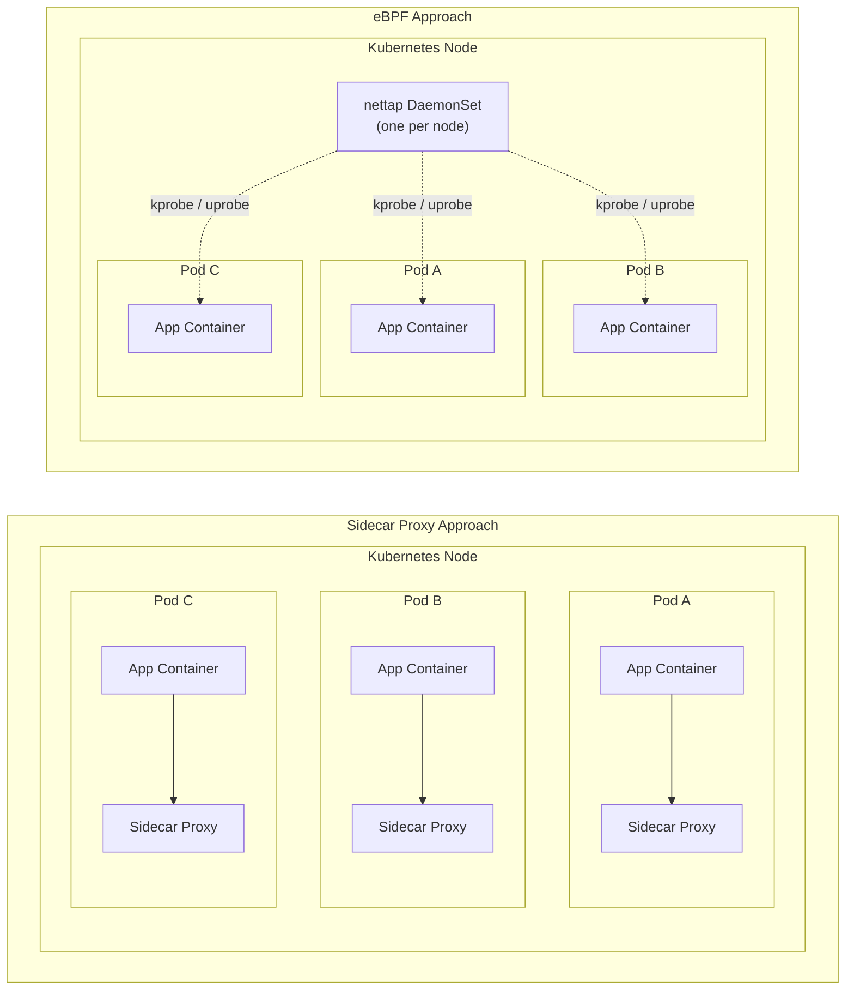

# eBPF Traffic Collection

## What is eBPF?

eBPF (extended Berkeley Packet Filter) is a Linux kernel technology that allows running sandboxed programs in
the kernel without changing kernel source code or loading kernel modules. Many Kubernetes networking tools
such as [Cilium](https://cilium.io/) use eBPF for efficient, low-overhead traffic observation.

## How Speedscale Uses eBPF

Speedscale's eBPF collector `nettap` runs as a Kubernetes **DaemonSet** on each node. It attaches lightweight
probes to the kernel and to specific user-space libraries to observe network traffic without proxies,
sidecars, or application changes.

### Plaintext TCP Traffic

Kernel-level **kprobes** attach to TCP send/receive functions to observe plaintext TCP traffic directly in the
kernel's network stack. This captures traffic for any application on the node without needing per-process
instrumentation.

### TLS Traffic

See [TLS Traffic Visibility](#tls-traffic-visibility) below for details on how encrypted traffic is
captured in plaintext.

### DNS Enrichment

`nettap` observes DNS traffic in order to build an IP-to-hostname mapping table. This enriches captured
traffic with the original hostnames so that traffic is displayed with meaningful service names rather than raw
IP addresses. This is particularly useful for non-HTTP protocols where there is no equivalent to the HTTP
`Host` header.

### Kubernetes Integration

`nettap` runs with `hostNetwork` and `hostPID` enabled, giving it visibility into all pods on the node. It
uses this ability along with the Kubernetes API in order to map connections back to specific pods, enriching
captured traffic with pod name, namespace, labels, and other metadata.

## TLS Traffic Visibility

Speedscale captures TLS-encrypted traffic in plaintext, without needing certificates, proxies, or application
changes.

### OpenSSL 3.x

**uprobes** attach to read/write functions in OpenSSL 3.x for processes that use it. `nettap`
auto-detects the OpenSSL library loaded by each process and attaches probes dynamically. This captures
plaintext data after decryption (reads) and before encryption (writes).

### Go Native TLS

For Go applications using the standard `crypto/tls` package, `nettap` attaches **uprobes** directly
to Go's TLS read and write functions. This requires:

- Go version 1.18 or later
- **Unstripped binaries** (symbol table must be present for probe attachment so binaries must be built without `-ldflags="-s"`)

### Java (JVMTI Agent)

JVM-based applications require a separate mechanism rather than eBPF probes: a **JVMTI agent** that
instruments Java's TLS layer from within the JVM. This captures plaintext traffic for any Java application
using standard TLS libraries (e.g., `javax.net.ssl`).

### PHP (OpenSSL)

For PHP applications, `nettap` attaches **uprobes** to the OpenSSL shared library used by PHP's TLS layer. This captures plaintext HTTP traffic from PHP services without any code changes. The OpenSSL library must be available as a shared object (not statically compiled).

### .NET (OpenSSL on Linux)

On Linux, .NET applications typically use OpenSSL for TLS. `nettap` attaches **uprobes** to the OpenSSL library to capture plaintext traffic. This works for ASP.NET Core and other .NET workloads running on Linux containers. Windows-based .NET using SChannel is not supported.

### Python (OpenSSL)

Python's `ssl` module uses OpenSSL under the hood. `nettap` attaches **uprobes** to the OpenSSL library loaded by the Python process. For statically compiled Python builds, you may need to set the `NETTAP_OPENSSL_STATIC` environment variable and provide the path to the OpenSSL binary.

### Node.js (Static OpenSSL)

Node.js bundles a statically linked copy of OpenSSL. To capture TLS traffic from Node.js applications, set the following environment variables on the `nettap` DaemonSet:

- `NETTAP_OPENSSL_STATIC=true`
- Set the binary path to the Node.js executable

This allows `nettap` to locate and attach probes to the statically linked OpenSSL functions within the Node.js binary.

### Language Support Matrix

| Language | Capture Method | TLS Support | Min Kernel | Notes |
|---|---|---|---|---|
| Go | eBPF uprobe (`crypto/tls`) | Native | 5.17 | Best supported; requires unstripped binaries |
| Java | JVMTI agent | JSSE hook | 5.17 | Requires nettap Java agent on classpath |
| PHP | eBPF uprobe (OpenSSL) | OpenSSL | 5.17 | Requires OpenSSL shared library |
| .NET | eBPF uprobe (OpenSSL) | OpenSSL | 5.17 | Linux only; SChannel not supported |
| Python | eBPF uprobe (`ssl` / OpenSSL) | OpenSSL | 5.17 | Static builds need `NETTAP_OPENSSL_STATIC` |
| Node.js | Static OpenSSL uprobe | OpenSSL | 5.17 | Set `NETTAP_OPENSSL_STATIC=true` and binary path |

### What This Means in Practice

- No TLS certificates to install or manage
- No proxy sidecars to deploy or configure
- No application code changes or recompilation
- Full HTTP/HTTPS request and response visibility including headers and bodies

## Requirements

- **Architecture:** `x86_64` or `arm64`
- **Linux Kernel 5.17+** with BTF (BPF Type Format) support enabled. BTF provides portable type information
  that allows the `nettap` probes to work across different kernel versions without recompilation
- **Host access:** when running in Kubernetes, the collector must be able to read host `procfs`,
  `cgroupv2`, and kernel BTF paths

### Capabilities

Speedscale's eBPF collection uses two runtime components with different capability requirements:
the `nettap` capture container needs the eBPF and cross-process inspection capabilities, while
the ingest/proxy side only needs raw socket access.

| Component | Capability | Purpose |
|---|---|---|
| `nettap` capture | `CAP_BPF` | Load eBPF programs and create/manage BPF maps, including ring buffers and hash maps |
| `nettap` capture | `CAP_PERFMON` | Attach kprobes, kretprobes, uprobes, and fentry/fexit programs |
| `nettap` capture | `CAP_NET_ADMIN` | Perform network-related BPF operations and read kernel socket state used for flow resolution |
| `nettap` capture | `CAP_SYS_ADMIN` | Access kernel BTF and handle namespace-related operations that still require a broad capability |
| `nettap` capture | `CAP_SYS_PTRACE` | Inspect other processes via `/proc/<pid>/maps` and `/proc/<pid>/root` to find TLS libraries and attach cross-process uprobes |
| `nettap` capture | `CAP_SYS_RESOURCE` | Lift `RLIMIT_MEMLOCK` so BPF maps can allocate enough locked memory |
| ingest/proxy | `CAP_NET_RAW` | Open raw sockets for low-level packet inspection and forwarding |

### Kubernetes Deployment

`nettap` runs as a **DaemonSet** with:

- `hostNetwork: true` - visibility into host-level network traffic to capture traffic for any pod scheduled on the node
- `hostPID: true` - ability to discover and attach probes to application processes for any pod scheduled on the node

## Installation

### Enabling via Helm

To enable eBPF capture, set `ebpf.enabled: true` in your Helm values and define at least one capture target:

```bash
helm install speedscale-operator speedscale/speedscale-operator \
  -n speedscale \
  --create-namespace \
  --set apiKey=<YOUR-SPEEDSCALE-API-KEY> \
  --set clusterName=<YOUR-CLUSTER-NAME> \
  --set ebpf.enabled=true \
  -f ebpf-values.yaml
```

Where `ebpf-values.yaml` contains your capture targets:

```yaml
ebpf:
  enabled: true
  configuration:
    capture:
      targets:
        - name: my-service
          namespaceSelector:
            matchLabels:
              kubernetes.io/metadata.name: my-namespace
          podSelector:
            matchLabels:
              app: my-service
```

You can define multiple targets to capture traffic from different services or namespaces. See the [Helm Values reference](../helm.md) for the full list of eBPF configuration options.

### Enabling via Annotation

You can also enable eBPF capture on a per-workload basis using Kubernetes annotations. This is useful when you want to target specific deployments without modifying the global Helm configuration:

```bash
kubectl annotate deployment my-app -n my-namespace \
  ebpf.speedscale.com/capture="true"
```

To control which ports are captured via eBPF:

```bash
kubectl annotate deployment my-app -n my-namespace \
  ebpf.speedscale.com/port-filter="8080,8443"
```

To disable eBPF capture on a workload:

```bash
kubectl annotate deployment my-app -n my-namespace \
  ebpf.speedscale.com/capture="false" --overwrite
```

:::tip
Annotation-based capture requires that `ebpf.enabled: true` is set in the Helm chart. The annotation controls which workloads are targeted, but the nettap DaemonSet must be running on the node.
:::

### Verifying Installation

After enabling eBPF, verify that the nettap DaemonSet is running:

```bash
kubectl -n speedscale get daemonset
```

You should see a `nettap` DaemonSet with pods running on each node:

```
NAME     DESIRED   CURRENT   READY   UP-TO-DATE   AVAILABLE   NODE SELECTOR   AGE
nettap   3         3         3       3             3           <none>          5m
```

Check the nettap logs to verify probe attachment:

```bash
kubectl -n speedscale logs daemonset/nettap | grep "probe attached"
```

The logs will indicate which probe type was selected for each process (kprobe, uprobe, or JVMTI) and whether attachment succeeded.

## Limitations

- **Go binaries must not be stripped** - Go native TLS capture requires preserving the ELF symbol table. Binaries
  built with `-ldflags="-s"` or otherwise stripped will not have TLS traffic captured. Plaintext
  TCP traffic is still captured.
- **Mid-stream connections** - Connections established before `nettap` attaches probes will not
  have their initial handshake or early data captured. Subsequent requests on those connections are
  captured normally.
- **TCP only** - `nettap` captures TCP traffic only. UDP is only captured for DNS resolution (port 53).
- **OpenSSL version** - TLS capture via uprobes is limited to OpenSSL 3.x. Applications using older
  OpenSSL versions, BoringSSL, or LibreSSL will not have TLS traffic captured, though plaintext TCP
  traffic is still visible.

## Overhead

eBPF-based collection is designed for minimal production impact across three dimensions:

### Latency

`nettap` observes traffic passively - it does not sit in the data path. Probes execute in-kernel
alongside normal network operations, adding no measurable latency to application requests or responses.

### CPU

eBPF programs consume a small amount of CPU for event processing and delivery to user space. Under
typical workloads, this is low single-digit percentage overhead compared to total node CPU.

### Memory

eBPF programs and their associated maps use a bounded amount of kernel memory, typically on the order
of hundreds of kilobytes per program. `nettap` avoids unbounded allocations and maintains stable
memory usage over time.

For detailed resource utilization data, see [Resource Utilization](resource-utilization.md).

## Sidecar vs eBPF

Choosing between sidecar-based and eBPF-based traffic collection depends on your environment and
requirements.



### When to Use eBPF

- You want **frictionless** traffic capture that does not require workload modifications
- You want **node-level visibility** without per-pod sidecars
- You need to capture TLS traffic **without managing certificates** or modifying deployments
- You want to **minimize resource overhead** and avoid sidecar CPU/memory costs

### When to Use Sidecars/Proxies

- Your cluster restricts the elevated permissions required to instrument eBPF probes
- Your environment requires **per-pod traffic control** with fine-grained policies
- You are using nodes with **older kernels** that don't meet eBPF requirements
- You need to capture TLS traffic from applications using TLS libraries not yet supported by the
  eBPF collector
