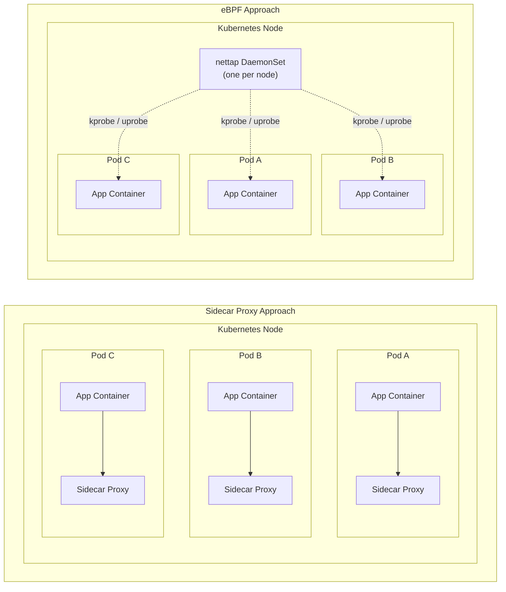

# eBPF Traffic Collection

## What is eBPF?

eBPF (extended Berkeley Packet Filter) is a Linux kernel technology that allows running sandboxed programs in
the kernel without changing kernel source code or loading kernel modules. Many Kubernetes networking tools
such as [Cilium](https://cilium.io/) use eBPF for efficient, low-overhead traffic observation.

## System Requirements

Before enabling eBPF capture, confirm your nodes meet the kernel and architecture baseline below. Nodes that
fall outside these ranges are not supported.

- **`x86_64`:** Linux kernel **5.15 or newer**.
- **`arm64` / `aarch64`:** Linux kernel **6.0 or newer**. Kernels older than 6.0 are supported on `x86_64`
  only.
- **RHEL:** RHEL **9.2 or newer** on both `x86_64` and `arm64`/`aarch64`. Anything prior to 9.2 is
  incompatible.
- **BTF (BPF Type Format):** must be enabled in the kernel. BTF provides portable type information that lets
  the `nettap` probes work across kernel versions without recompilation.
- **Host access:** when running in Kubernetes, the collector must be able to read host `procfs`, `cgroupv2`,
  and kernel BTF paths.

## How Speedscale Uses eBPF

Speedscale's eBPF collector `nettap` runs as a Kubernetes **DaemonSet** on each node. It attaches lightweight
probes to the kernel and to specific user-space libraries to observe network traffic without proxies,
sidecars, or application changes.

### Plaintext TCP Traffic

Kernel-level **kprobes** attach to TCP send/receive functions to observe plaintext TCP traffic directly in the
kernel's network stack. This captures traffic for any application on the node without needing per-process
instrumentation.

### TLS Traffic

See [TLS Traffic Visibility](#tls-traffic-visibility) below for details on how encrypted traffic is
captured in plaintext.

### DNS Enrichment

`nettap` observes DNS traffic in order to build an IP-to-hostname mapping table. This enriches captured
traffic with the original hostnames so that traffic is displayed with meaningful service names rather than raw
IP addresses. This is particularly useful for non-HTTP protocols where there is no equivalent to the HTTP
`Host` header.

### Kubernetes Integration

`nettap` runs with `hostNetwork` and `hostPID` enabled, giving it visibility into all pods on the node. It
uses this ability along with the Kubernetes API in order to map connections back to specific pods, enriching
captured traffic with pod name, namespace, labels, and other metadata.

## TLS Traffic Visibility

Speedscale captures TLS-encrypted traffic in plaintext, without needing certificates, proxies, or application
changes. There are three primary capture mechanisms: uprobes for applications/runtimes using OpenSSL 3.x
libraries, uprobes on Go's `crypto/tls`, and a JVMTI agent for the JVM.

OpenSSL support works for **both** dynamically and statically linked 3.x libraries. Processes that use this
will have uprobes attached to OpenSSL read/write functions. This allows data to be captured before
being encrypted (writes) and after decryption (reads).

Go applications are instrumented with eBPF uprobes attached to the read/write methods of the standard `crypto/tls`
package. The idea is the same as OpenSSL. Support for this requires Go versions **1.18 or newer** and requires
binaries to preserve the ELF symbol table, i.e. they must be **unstripped** and built **without** using
`-ldflags="-s"`.

JVM-based applications require a JVMTI agent, rather than eBPF uprobes, that instruments Java's TLS layer from
within the JVM. This captures plaintext traffic for any Java application using standard TLS libraries
(e.g., `javax.net.ssl`).

Language/runtime support is tied to the TLS capture mechanism mentioned above, but they all share the same
kernel and architecture baseline (see [System Requirements](#system-requirements)). The following have been
tested and verified:

| Language | Capture Method             | TLS Support | Considerations                                                    |
| -------- | -------------------------- | ----------- | ----------------------------------------------------------------- |
| Go       | eBPF uprobe (`crypto/tls`) | Native      | See above                                                         |
| Java     | JVMTI agent                | JSSE hook   | Requires `nettap` Java agent (Handled by the Speedscale Operator) |
| PHP      | eBPF uprobe (OpenSSL)      | OpenSSL 3.x |                                                                   |
| .NET     | eBPF uprobe (OpenSSL)      | OpenSSL 3.x | Linux only; SChannel not supported                                |
| Python   | eBPF uprobe (OpenSSL)      | OpenSSL 3.x | Python `ssl` module                                               |
| Node.js  | eBPF uprobe (OpenSSL)      | OpenSSL 3.x |                                                                   |

### What This Means in Practice

- No TLS certificates to install or manage
- No proxy sidecars to deploy or configure
- No application code changes or recompilation
- Full HTTP/HTTPS request and response visibility including headers and bodies

## Runtime Requirements

Beyond the [System Requirements](#system-requirements), `nettap` needs specific Linux capabilities and a
privileged deployment mode to load its probes and see host-level traffic.

### Capabilities

Speedscale's eBPF collection uses two runtime components with different capability requirements:
the `nettap` capture container needs the eBPF and cross-process inspection capabilities, while
the ingest/proxy side only needs raw socket access.

| Component        | Capability         | Purpose                                                                                                                      |
| ---------------- | ------------------ | ---------------------------------------------------------------------------------------------------------------------------- |
| `nettap` capture | `CAP_BPF`          | Load eBPF programs and create/manage BPF maps, including ring buffers and hash maps                                          |
| `nettap` capture | `CAP_PERFMON`      | Attach kprobes, kretprobes, uprobes, and fentry/fexit programs                                                               |
| `nettap` capture | `CAP_NET_ADMIN`    | Perform network-related BPF operations and read kernel socket state used for flow resolution                                 |
| `nettap` capture | `CAP_SYS_ADMIN`    | Access kernel BTF and handle namespace-related operations that still require a broad capability                              |
| `nettap` capture | `CAP_SYS_PTRACE`   | Inspect other processes via `/proc/<pid>/maps` and `/proc/<pid>/root` to find TLS libraries and attach cross-process uprobes |
| `nettap` capture | `CAP_SYS_RESOURCE` | Lift `RLIMIT_MEMLOCK` so BPF maps can allocate enough locked memory                                                          |
| ingest/proxy     | `CAP_NET_RAW`      | Open raw sockets for low-level packet inspection and forwarding                                                              |

### Kubernetes Deployment

`nettap` runs as a **DaemonSet** with:

- `hostNetwork: true` - visibility into host-level network traffic to capture traffic for any pod scheduled on the node
- `hostPID: true` - ability to discover and attach probes to application processes for any pod scheduled on the node

## Installation

:::info Helm-restricted environments
The eBPF collector is installed as Kubernetes resources, so Helm does not need to run in the cluster. You can render the Speedscale chart to plain YAML with `helm template` and manage the result directly or as a Kustomize base; see the [GitOps installation example](/getting-started/quick-start#install-speedscale-operator-optional).

If your organization cannot use Helm tooling at all, [contact Speedscale Support](mailto:support@speedscale.com), ask in the [Speedscale Community](https://slack.speedscale.com), or reach out to your account team. We can help create Kustomize-compatible or other custom manifests with the required eBPF DaemonSet, RBAC, configuration, and cluster-specific settings.
:::

### Enabling via Helm

To enable eBPF capture, set `ebpf.enabled: true` in your Helm values and define at least one capture target:

```bash
helm install speedscale-operator speedscale/speedscale-operator \
  -n speedscale \
  --create-namespace \
  --set apiKey=<YOUR-SPEEDSCALE-API-KEY> \
  --set clusterName=<YOUR-CLUSTER-NAME> \
  --set ebpf.enabled=true \
  -f ebpf-values.yaml
```

Where `ebpf-values.yaml` contains your capture targets:

```yaml
ebpf:
  enabled: true
  configuration:
    capture:
      targets:
        - name: my-service
          namespaceSelector:
            matchLabels:
              kubernetes.io/metadata.name: my-namespace
          podSelector:
            matchLabels:
              app: my-service
```

You can define multiple targets to capture traffic from different services or namespaces. See the [Helm Values reference](../helm.md) for the full list of eBPF configuration options.

### Enabling via Annotation

You can also enable eBPF capture on a per-workload basis using Kubernetes annotations. This is useful when you want to target specific deployments without modifying the global Helm configuration:

```bash
kubectl annotate deployment my-app -n my-namespace \
  capture.speedscale.com/enabled="true"
```

To control which ports are captured via eBPF:

```bash
kubectl annotate deployment my-app -n my-namespace \
  capture.speedscale.com/ignore-ports="8080,8443"
```

To disable eBPF capture on a workload:

```bash
kubectl annotate deployment my-app -n my-namespace \
  capture.speedscale.com/enabled="false" --overwrite
```

:::tip
Annotation-based capture requires that `ebpf.enabled: true` is set in the Helm chart. The annotation controls which workloads are targeted, but the nettap DaemonSet must be running on the node.
:::

### Verifying Installation

After enabling eBPF, verify that the nettap DaemonSet is running:

```bash
kubectl -n speedscale get daemonset
```

You should see a `nettap` DaemonSet with pods running on each node:

```
NAME     DESIRED   CURRENT   READY   UP-TO-DATE   AVAILABLE   NODE SELECTOR   AGE
nettap   3         3         3       3             3           <none>          5m
```

Check the nettap logs to verify probe attachment:

```bash
kubectl -n speedscale logs daemonset/nettap | grep "probe attached"
```

The logs will indicate which probe type was selected for each process (kprobe, uprobe, or JVMTI) and whether attachment succeeded.

## Limitations

- **Go binaries must not be stripped** - Go native TLS capture requires preserving the ELF symbol table. Binaries
  built with `-ldflags="-s"` or otherwise stripped will not have TLS traffic captured. Plaintext
  TCP traffic is still captured.
- **Mid-stream connections** - Connections already established before `nettap` attaches its probes miss
  the beginning of the connection. For simple request/response protocols like HTTP/1.1, later requests on
  the connection are still captured normally. For multiplexed protocols like HTTP/2 and gRPC, `nettap` needs
  the start of the stream to parse it, so connections joined mid-stream can't be reassembled and aren't
  captured until the application opens a new connection.
- **TCP only** - `nettap` captures TCP traffic only. UDP is only captured for DNS resolution (port 53).
- **OpenSSL version** - TLS capture via uprobes is limited to OpenSSL 3.x. Applications using older
  OpenSSL versions, BoringSSL, or LibreSSL will not have TLS traffic captured, though plaintext TCP
  traffic is still visible.

## Overhead

eBPF-based collection is designed for minimal production impact. The short version is below; the two pages linked at the end of this section carry the measured numbers and the sizing guidance.

### Latency

`nettap` observes traffic passively - it does not sit in the data path. There is no additional network hop, no connection termination, and no proxying. What the probes add is in-kernel work on the syscall path, averaging under two microseconds per TCP send or receive, which does not move request latency out of run-to-run noise.

### CPU

Two distinct costs are worth separating.

The collector's own containers consume CPU for event processing and forwarding, scaling roughly linearly with captured traffic volume. In a controlled benchmark this ranged from 2m at idle to 530m at 1000 QPS across both containers.

The eBPF programs themselves consume kernel CPU that the kernel charges to whichever process made the syscall, not to the collector. That cost is a function of the node's total TCP syscall rate rather than of how much traffic you have configured for capture, because probes attach node-wide and filter inside the kernel.

### Memory

The eBPF programs and their maps use a bounded amount of kernel memory and `nettap` avoids unbounded allocations, so memory usage is stable over time.

The collector pod itself is not small. The capture container loads eBPF maps and kernel BTF data at startup and holds roughly 400Mi resident from the moment it is ready, whether or not traffic is flowing. Size the memory request against that baseline rather than against traffic volume.

### Where to Go Next

- [Collector Resource Utilization](resource-utilization.md) - measured usage by request rate, sizing recommendations, and how to monitor the collector.
- [Workload Impact](workload-impact.md) - what capture does to your applications, how it behaves during canary deployments, what happens when the collector fails, and how to verify all of it yourself.

## Sidecar vs eBPF

Choosing between sidecar-based and eBPF-based traffic collection depends on your environment and
requirements.


```mermaid
graph TB
    subgraph ebpf_approach["eBPF Approach"]
        subgraph ebpf_node["Kubernetes Node"]
            subgraph epod1["Pod A"]
                eapp1["App Container"]
            end
            subgraph epod2["Pod B"]
                eapp2["App Container"]
            end
            subgraph epod3["Pod C"]
                eapp3["App Container"]
            end
            nettap["nettap DaemonSet\n(one per node)"]
        end
        nettap -. "kprobe / uprobe" .-> eapp1
        nettap -. "kprobe / uprobe" .-> eapp2
        nettap -. "kprobe / uprobe" .-> eapp3
    end

    ebpf_approach ~~~ sidecar_approach

    subgraph sidecar_approach["Sidecar Proxy Approach"]
        subgraph sc_node["Kubernetes Node"]
            subgraph spod1["Pod A"]
                direction TB
                sapp1["App Container"] --> sproxy1["Sidecar Proxy"]
            end
            subgraph spod2["Pod B"]
                direction TB
                sapp2["App Container"] --> sproxy2["Sidecar Proxy"]
            end
            subgraph spod3["Pod C"]
                direction TB
                sapp3["App Container"] --> sproxy3["Sidecar Proxy"]
            end
        end
    end
```

### When to Use eBPF

- You want **frictionless** traffic capture that does not require workload modifications
- You want **node-level visibility** without per-pod sidecars
- You need to capture TLS traffic **without managing certificates** or modifying deployments
- You want to **minimize resource overhead** and avoid sidecar CPU/memory costs

### When to Use Sidecars/Proxies

- Your cluster restricts the elevated permissions required to instrument eBPF probes
- Your environment requires **per-pod traffic control** with fine-grained policies
- You are using nodes with **older kernels** that don't meet eBPF requirements
- You need to capture TLS traffic from applications using TLS libraries not yet supported by the
  eBPF collector
