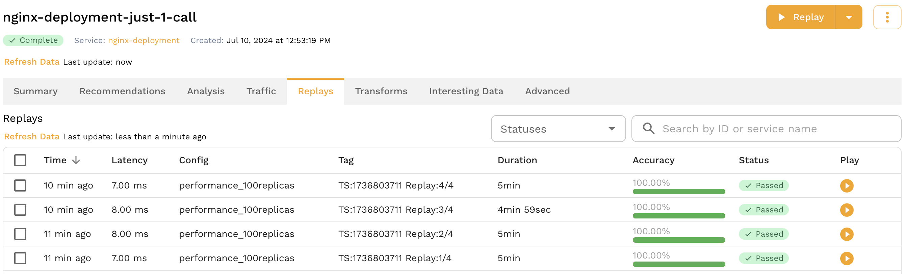

# Generator Sizing Guide

When running a load test it is helpful to understand the environmental requirements for reaching your desired
throughput.  After all, setting a target of 20,000 [RPS](/reference/glossary.md#requests-per-second) in your
[test config](/reference/glossary.md#test-config) won't be enough if the load
[generator](/reference/glossary.md#generator) only has 1 CPU to work with.

Load tests in Speedscale are driven by the generator, a process that sends requests to your service as fast as
possible. This guide will help you understand the factors that can affect generator throughput and setup your
environment accordingly.

## Factors Affecting Throughput

- The largest factor in generator throughput is available CPU. The generator is CPU bound so more CPU will
  almost always mean higher potential throughput. See sections below for specific information.

:::warning
Latency calculation is no longer reliable once the generator is using at or close to 100% CPU so it is
critical to ensure some headroom.
:::

- The second largest factor is the [SUT](/reference/glossary.md#sut), your application.  Given the same
  available CPU an application with an average response latency of 100ms will achieve higher throughput than
one with 500ms.

- Lastly, [transforms](/reference/glossary.md#transform) may also affect throughput.  The combination of
  captured traffic and transforms are what make Speedscale unique and powerful, but they also come with a
performance cost which depends on the transform being used.  [Resigning
JWTs](/transform/transforms/jwt_resign.md), for example can be a compute intensive operation
and often affects every RRPair in a [snapshot](/reference/glossary.md#snapshot).  While transforms generally
don't account for a majority of the generator's CPU time, any processing dedicated to transforming traffic
cannot be used to send requests and process results.

## Observed Throughput

While every application is unique, observations of throughput under different hardware configurations can be
helpful with initial resource allocation.

The table below contains observations made while running a replay on servers with various resources.  It shows
the number of (virtual) CPUs available to the generator, the maximum observed
[RPS](/reference/glossary.md#requests-per-second), and the number of concurrent
[vUsers](/reference/glossary.md#vuser) when that throughput was observed.  The
[SUT](/reference/glossary.md#sut) latency was a fixed 100ms for all requests and the observation was taken
when increasing the vUser count no longer yielded higher RPS.

<!-- Speedscale editor: changes to this table MUST be reflected in the kraken tests at validation_scripts/generator_perf_sla/ -->

| CPU Cores | Observed RPS | vUsers |
| --------- | ------------ | ------ |
| 2         | 800          | 100    |
| 4         | 3,300        | 400    |
| 8         | 8,000        | 1,100  |
| 16        | 16,000       | 2,500  |
| 30        | 30,000       | 3,600  |
| 60        | 45,000       | 5,000  |
<!-- Speedscale editor: changes to this table MUST be reflected in the kraken tests at validation_scripts/generator_perf_sla/ -->

:::note
Contact Speedscale support for solutions that scale beyond the observed RPS seen here.
:::

## Configuration

Load tests should always set the [test config](/reference/glossary.md#test-config) to run with [low data
mode](/reference/glossary.md#low-data-mode) enabled to avoid sending thousands or millions of
[RRPairs](/reference/glossary.md#rrpair) to the Speedscale cloud.  If the load is high enough the generator
will generate requests, and thus RRPairs, faster than they can be captured.  This can result in the generator
running out of memory and [crashing](/reference/faq.md#communication-with-the-generator-was-lost-during-replay)
as it tries to process them all. For the same reason avoid setting the log level higher than "info" during
load tests to avoid flooding the logs with millions of events which could also cause the generator to crash.

If you are looking to achieve the highest throughput possible you should define load patterns with vUsers as
opposed to setting a desired number of RPS.  This is because the RPS strategy creates artificial delays in
between requests in order to hold a desired throughput.  While this process is optimized you may experience up
to 10% higher throughput using vUsers instead of RPS.

See [load patterns](/guides/load-patterns/) for suggestions on simulating specific load patterns.

To ensure the generator has enough CPU for the task set cluster requests / limits in the test config.  This
can be configured under the "Cluster" tab.


On the cluster tab set the "Generator Resources" to set CPU requests and limits on the Speedscale generator pod.


## Best Practices

This section provides some best practices for setting up a high-throughput generator.

### CPU

Ensure the generator has ample CPU and is not saturated.  Reports will show an error if the generator is being
CPU throttled.

### Dedicated Node

Dedicate a node to the generator using a Kubernetes [taint and
toleration](https://kubernetes.io/docs/concepts/scheduling-eviction/taint-and-toleration/).

Taint the node so no workloads will be scheduled on it.

```
kubectl taint nodes <node1> dedicated-to=speedscale-generator:NoExecute
```

:::warning
Nodes given the `NoExecute` taint will evict all pods.
:::

The Speedscale generator contains a toleration that will allow it to be scheduled on the tained node.

Remove the taint when done.

```
kubectl taint nodes <node1> dedicated-to=speedscale-generator:NoExecute-
```

### Monitoring

This is tech so it's highly unlikely that everything will work exactly as expected the first time.  Your app
may not scale as you expect, or it may crash, or the generator won't reach the desired throughput.
Understanding what your application is during during the load test will help guide you towards the next steps.
Look at metrics, review logs, and monitor the environment to get the full picture.  This obviously includes
the application being tested but also databases, caches, third party services, etc.

The generator pod also exposes a endpoint on port `4145` which can be used to monitor internal metrics, provided your monitoring system is setup to support scraping short-lived workloads.

## Multiple Generators

If you want to get more throughput than a single generator can provide, you can run multiple generators. This will generate multiple reports within the Speedscale UI, and you can see them grouped together under the `Replays` section of your snapshot.

### Running Multiple Generators

First you need to copy this file and save locally, then edit the configuration section with appropriate values for your situation.

:::note
If you get an error when running the script you may need to configure permissions such as: `chmod 755 multi-gen.sh`.
:::

```
#!/usr/bin/env bash

# This script will run multiple Speedscale replays in parallel.

###################
## CONFIGURATION ##
###################

SNAPSHOT="237046ff-98a6-43a8-9f76-5a6f74f008c4"
TEST_CONFIG="performance_100replicas"
CLUSTER="miniken"
NAMESPACE="default"
WORKLOAD="nginx-deployment"
GENERATOR_COUNT="4"

############
## SCRIPT ##
############

set -e

TEST_ID=$(date +%s)

for ((i=1; i<=GENERATOR_COUNT; i++))
do
  echo "Iteration $i of $GENERATOR_COUNT: Running snapshot $SNAPSHOT"
  speedctl infra replay "$WORKLOAD" \
    --namespace "$NAMESPACE" \
    --cluster "$CLUSTER" \
    --snapshot-id "$SNAPSHOT" \
    --test-config-id "$TEST_CONFIG" \
    --build-tag "TS:${TEST_ID} Replay:$i/$GENERATOR_COUNT"
done

```



Note that the output of the `speedctl infra replay` command includes the report id for each of the reports.

## FAQ

### Why doesn't the number of TPS/RPS increase when I add more vUsers?

Generally, the more vUsers the more traffic... but not always.  The best an application can hope to scale is
linealy, as shown below.  For example, if a static webpage can handle 1000 RPS with 1 server node it will be
able to handle 10,000 with 10 because there are no shared resources to cause bottlenecks.


Unfortunately most applications are more complex than a static webpage and do not scale linearly.  Instead
they tend to increase pressure on their bottlenecks as load is increased.


This situation arises when the application cannot respond fast enough to go any higher. This can happen for a
number of reasons.

1. Requests are consistently slow because of some resource constraint.  The culprit here is usually a resource
   shared by all instances of your app, like a hot database table or shared cache key.

2. A few slow requests are limiting throughput. See below.

Unlike traditional load testing tools, the Speedscale Generator acts like a real client which means it waits
for responses. As a result, each vUser "blocks" for a period of time waiting for the application's response
before moving on to the next request.  Imagine what happens to overall throughput when every request is 100
milliseconds except one that takes 5 seconds.  Throughput will suffer severely as the next 100ms request will
wait 5s to execute. That means it's possible for all vUsers to be fully utilized but the app simply can't go
any faster. This shows up as TPS/RPS topping out lower number than expected.

The solution to this problem is usually to increase the resources allocated to the SUT. If you give it more
head room and the TPS/RPS goes up then the app may be CPU/Memory limited. If that doesn't work then it may be
blocking on a call to a backend system like a database that is slowing down the overall request.

