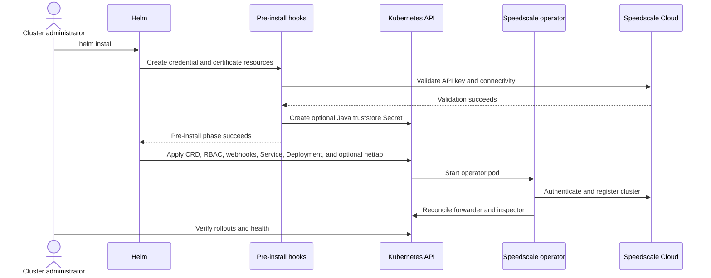
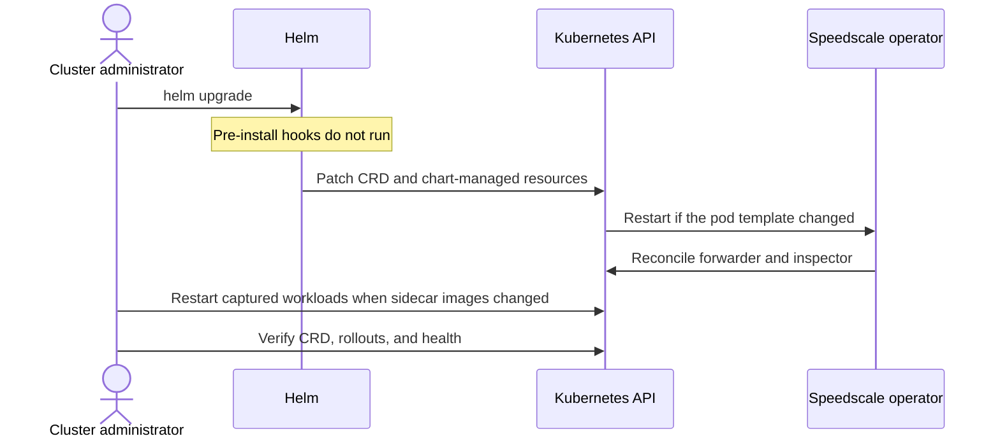
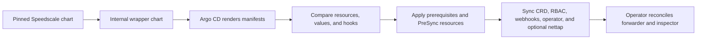

# Helm Values

This document describes the configuration options available for the Speedscale Operator Helm [chart](https://github.com/speedscale/operator-helm). The Speedscale Operator is a Kubernetes operator that watches for deployments and can inject proxies to capture traffic or set up isolation test environments.

:::info Alternative manifest workflows
If cluster policy prevents direct Helm deployments, render the chart to plain Kubernetes YAML with `helm template`, then manage that output directly or as a Kustomize base. The [GitOps quick-start example](/getting-started/quick-start#install-speedscale-operator-optional) shows this workflow.

If Helm tooling is prohibited entirely, [contact Speedscale Support](mailto:support@speedscale.com), ask in the [Speedscale Community](https://slack.speedscale.com), or reach out to your account team for help creating Kustomize-compatible or other custom manifests.
:::

## Table of Contents

- [Prerequisites](#prerequisites)
- [Quick Start](#quick-start)
- [Install and Upgrade Lifecycle](#install-and-upgrade-lifecycle)
  - [Resource Ownership](#resource-ownership)
  - [Install Flow](#install-flow)
  - [Upgrade Flow](#upgrade-flow)
  - [CRD Lifecycle](#crd-lifecycle)
  - [Rendered Manifests and GitOps](#rendered-manifests-and-gitops)
    - [Repackaging the Chart for Argo CD](#repackaging-the-chart-for-argo-cd)
- [Configuration Reference](#configuration-reference)
  - [Authentication](#authentication)
  - [Core Settings](#core-settings)
  - [Image Configuration](#image-configuration)
    - [Bring your own Redis and Java runtime images](#bring-your-own-redis-and-java-runtime-images)
    - [Private registry example](#private-registry-example)
  - [Resource Management](#resource-management)
  - [Network Configuration](#network-configuration)
  - [Security Settings](#security-settings)
  - [Advanced Configuration](#advanced-configuration)
- [Examples](#examples)
- [Troubleshooting](#troubleshooting)

## Prerequisites

- Kubernetes 1.17+
- Helm 3+
- Appropriate network and firewall configuration for Speedscale cloud and webhook traffic

## Quick Start

```bash
# Add the Speedscale Helm repository
helm repo add speedscale https://speedscale.github.io/operator-helm/
helm repo update

# Install the chart with required values
helm install speedscale-operator speedscale/speedscale-operator \
  -n speedscale \
  --create-namespace \
  --set apiKey=<YOUR-SPEEDSCALE-API-KEY> \
  --set clusterName=<YOUR-CLUSTER-NAME>
```

## Install and Upgrade Lifecycle

The Helm chart installs the operator and the Kubernetes resources it needs to start. The operator then creates and reconciles runtime components such as the forwarder and inspector. This split matters during security review and troubleshooting because a successful Helm release does not mean every operator-managed component is ready yet.

### Resource Ownership

| Owner | Resources and actions |
|-------|-----------------------|
| Helm | The `TrafficReplay` CRD, operator ServiceAccount and RBAC, operator ConfigMap, admission webhook configurations, operator Service and Deployment, and the optional nettap DaemonSet and its RBAC |
| Pre-install chart hooks | API key Secret when `apiKey` is supplied, TLS and webhook certificate Secrets, API-key and connectivity validation, and the optional Java truststore Secret |
| Kubernetes | Runs hook Jobs and workloads, stores the CRD and Secrets, serves admission webhooks, and performs Deployment or DaemonSet rollouts |
| Speedscale operator | Registers the cluster, starts controllers and webhooks, and reconciles runtime components such as the forwarder and inspector from the installed configuration |

Resources created during a replay, including generator, responder, and Redis workloads, are also reconciled by the operator. They are not part of the Helm release manifest.

Inspect the exact chart and values before approving a change:

```bash
helm repo update
helm show chart speedscale/speedscale-operator
helm show values speedscale/speedscale-operator > speedscale-default-values.yaml
helm template speedscale-operator speedscale/speedscale-operator \
  --namespace speedscale \
  -f values.yaml > speedscale-rendered.yaml
```

The rendered file contains sensitive Secret data if `apiKey` is set in `values.yaml`. Store and share it according to your secret-handling policy.

### Install Flow



The install proceeds in these phases:

1. **Helm renders the release.** Templates resolve the selected chart version and values, including image references, RBAC scope, webhook configuration, and optional eBPF resources.
2. **Pre-install hooks prepare and validate the installation.** The chart creates or references the API key Secret, creates the TLS Secrets, validates the API key and Speedscale Cloud connectivity, and creates the Java truststore Secret when `createJKS` is enabled. If a required hook fails, Helm stops before applying the regular release resources.
3. **Helm applies the release resources.** These include the `TrafficReplay` CRD, operator RBAC, admission webhook configurations, the operator ConfigMap, Service, and Deployment, plus nettap resources when eBPF is enabled.
4. **Kubernetes starts the operator.** The operator authenticates with Speedscale Cloud, registers the cluster, starts its controllers and admission webhooks, and reconciles the forwarder and inspector.
5. **The administrator verifies both layers.** Check the Helm release and operator Deployment first, then confirm the operator-managed components are ready.

```bash
helm -n speedscale status speedscale-operator
kubectl get crd trafficreplays.speedscale.com
kubectl -n speedscale rollout status deployment/speedscale-operator
kubectl -n speedscale get deployment,daemonset,pods
speedctl check operator -n speedscale
```

`speedctl check operator` should end with `All checks were successful`. A successful Helm status with a failed operator check usually means the chart resources were accepted but the operator could not finish registration or runtime reconciliation.

### Upgrade Flow

Use the same values file on every upgrade. Review release notes before a major chart version change because a major version can require manual migration steps.

```bash
helm repo update
helm -n speedscale get values speedscale-operator -o yaml > current-values.yaml
helm -n speedscale upgrade speedscale-operator speedscale/speedscale-operator \
  -f current-values.yaml
```


`current-values.yaml` can contain the API key and other sensitive settings. Protect or delete the file according to your secret-handling policy. Rotate an externally managed `apiKeySecret` through your secret manager; `helm upgrade` does not rerun the install-only hook that creates `speedscale-apikey`.


During an upgrade:

1. **Helm renders the new chart with the supplied values.** Omitted values can fall back to new chart defaults, so prefer a reviewed values file over a command that depends on implicit defaults.
2. **Pre-install hooks do not run.** The API-key preflight, certificate generation, and Java truststore Job are `pre-install` hooks. Changing `apiKey`, `jks.image`, or certificate-related values during `helm upgrade` does not rerun those hooks or regenerate their Secrets.
3. **Helm patches chart-managed resources.** This includes the `TrafficReplay` CRD, RBAC, operator configuration, admission webhooks, Service, Deployment, and optional nettap resources.
4. **Kubernetes rolls workloads whose pod templates changed.** An operator image or pod-template change recreates the operator pod. A ConfigMap-only change may require `kubectl -n speedscale rollout restart deployment/speedscale-operator`; follow the setting-specific documentation when it calls for a restart.
5. **The operator reconciles its runtime components.** After it is ready, it updates the forwarder and inspector when their desired configuration has changed. Existing application pods keep their current injected sidecar image until the application workload rolls.

Verify the result before restarting application workloads:

```bash
helm -n speedscale status speedscale-operator
kubectl get crd trafficreplays.speedscale.com \
  -o jsonpath='{.spec.versions[?(@.storage==true)].name}{"\n"}'
kubectl -n speedscale rollout status deployment/speedscale-operator
speedctl check operator -n speedscale
```

If the upgrade changes a goproxy sidecar image or injection configuration, restart each captured workload after the operator is healthy:

```bash
kubectl -n <application-namespace> rollout restart deployment/<deployment-name>
kubectl -n <application-namespace> rollout status deployment/<deployment-name>
```

Do not restart all deployments in a namespace unless every deployment is intended to receive the same rollout.

### CRD Lifecycle

The current chart renders `trafficreplays.speedscale.com` from `templates/crds/trafficreplays.yaml`. It is a normal Helm release resource, not a file in Helm's special top-level `crds/` directory. As a result:

- `helm install` creates the CRD before the operator begins processing `TrafficReplay` objects.
- `helm upgrade` patches the CRD schema with the version included in the selected chart.
- Existing `TrafficReplay` objects remain in the cluster during an upgrade.
- Kubernetes begins validating new and updated objects against the upgraded schema as soon as the CRD patch succeeds.

Do not delete the CRD before an upgrade. Deleting it also deletes every `TrafficReplay` custom resource in the cluster. Apply or sync the CRD before creating objects that use fields introduced by the new chart, then wait for the upgraded operator to become ready.

Confirm that an existing release contains the chart-managed CRD:

```bash
helm -n speedscale get manifest speedscale-operator | \
  grep -A2 'kind: CustomResourceDefinition'
kubectl get crd trafficreplays.speedscale.com \
  -o jsonpath='{.spec.versions[*].name}{"\n"}'
```

If an older or customized installation manages the CRD outside Helm, compare the live CRD with the CRD rendered by the target chart and update it before the operator. Contact Speedscale Support before changing ownership between deployment systems.

### Rendered Manifests and GitOps

`helm template` renders the same objects but does not execute Helm's lifecycle. Hook annotations remain in the YAML, and a plain `kubectl apply` does not honor Helm hook weights, wait for hook Jobs, or delete successful hook resources. Template rendering also cannot use live-cluster lookups to preserve generated certificates.

GitOps controllers handle Helm and Argo CD hook annotations differently. Argo CD uses Helm to render manifests, then Argo CD owns the application lifecycle. The chart marks the operator ConfigMap and admission webhook configurations as Argo CD `PreSync` resources, while credential validation and certificate resources use Helm `pre-install` hooks.

Argo CD's [Helm hook behavior](https://argo-cd.readthedocs.io/en/stable/user-guide/helm/#helm-hooks) has an important consequence for this chart: when rendered manifests include any native Argo CD hook, Argo CD does not translate Helm hook annotations into Argo CD phases. Do not assume the Speedscale `pre-install` resources will retain their Helm ordering after Argo CD renders the chart.

Before enabling automated sync, verify that your controller or wrapper chart:

- Applies the CRD and prerequisite Secrets before the operator Deployment.
- Waits for the API-key preflight and optional Java truststore Job to succeed.
- Preserves existing TLS and webhook certificate Secrets during re-render and sync.
- Allows the cluster-scoped CRD, admission webhook, and RBAC resources required by the selected `namespaceSelector` configuration.

Re-render the complete chart for every upgrade. Do not copy only the operator Deployment or image tag because the chart can include matching CRD, RBAC, webhook, and configuration changes. If your GitOps engine cannot reproduce the hook ordering, manage the prerequisite Secrets and CRD as explicit earlier sync stages or contact Speedscale Support for a reviewed manifest layout.

#### Repackaging the Chart for Argo CD

Some platform teams import the Speedscale chart into an internal wrapper chart before Argo CD deploys it. Keep the upstream chart version pinned and preserve the full resource set. A wrapper that copies only Deployments or image values can miss a matching CRD, RBAC, webhook, Secret, or hook change.



Use this review sequence for every imported chart version:

1. **Pin the upstream version.** Record the Speedscale chart version in the wrapper chart dependency or import metadata. Do not track an unbounded latest version.
2. **Render both charts.** Render the upstream Speedscale chart and the internal wrapper with equivalent values, then compare the outputs. Account for intentional platform labels, annotations, registry rewrites, and Secret references.
3. **Compare the inventory.** Confirm that the wrapper still contains the `TrafficReplay` CRD, RBAC, webhook configurations, Service, operator Deployment, optional nettap resources, and every prerequisite Secret and Job.
4. **Translate lifecycle behavior.** Define explicit Argo CD sync phases and waves for resources whose Helm hook behavior is not preserved. Make prerequisite Jobs idempotent because Argo CD treats each deployment as a sync, not as a distinct Helm install or upgrade.
5. **Sync and verify in layers.** Check the Argo CD phase first, then Kubernetes rollout status, then operator-managed components. This identifies which system owns the failure before changing the chart.

Render the two inputs with the same values before committing a wrapper update:

```bash
helm template speedscale-upstream speedscale/speedscale-operator \
  --version <CHART-VERSION> \
  --namespace speedscale \
  -f values.yaml > upstream-rendered.yaml
helm template speedscale-wrapper ./path/to/internal-chart \
  --namespace speedscale \
  -f values.yaml > wrapper-rendered.yaml
diff -u upstream-rendered.yaml wrapper-rendered.yaml
```

Expected platform-specific differences should be documented in the wrapper repository. Investigate missing resources, changed hook annotations, unexpected value overrides, or generated Secret changes before Argo CD syncs them.

| Failure boundary | First checks |
|------------------|--------------|
| Chart rendering | Wrapper dependency version, values precedence, missing templates, registry rewrites |
| Argo CD `PreSync` | Hook annotations, sync waves, API key Secret, certificate Secrets, Job logs and RBAC |
| Argo CD `Sync` | CRD acceptance, cluster-scoped RBAC permissions, admission webhook configuration, operator Service and Deployment |
| Kubernetes rollout | Pod events, image pulls, Secret mounts, readiness probes, operator logs |
| Operator reconciliation | Cluster registration, forwarder and inspector Deployments, operator-managed ConfigMaps, `speedctl check operator` |

## Configuration Reference

### Authentication

| Parameter | Type | Default | Description |
|-----------|------|---------|-------------|
| `apiKey` | string | `""` | **Required.** API key to connect to Speedscale cloud. Email support@speedscale.com if you need a key. |
| `apiKeySecret` | string | `""` | Alternative to `apiKey`. Reference a Kubernetes secret containing the API key. The secret must have the format:<br/>```yaml<br/>type: Opaque<br/>data:<br/>  SPEEDSCALE_API_KEY: <base64-encoded-key><br/>  SPEEDSCALE_APP_URL: <base64-encoded-app-url><br/>``` |

### Core Settings

| Parameter | Type | Default | Description |
|-----------|------|---------|-------------|
| `appUrl` | string | `"app.speedscale.com"` | Speedscale domain to use for the service. |
| `clusterName` | string | `"my-cluster"` | **Required.** The name of your Kubernetes cluster. Used for identification in the Speedscale dashboard. |
| `logLevel` | string | `"info"` | Log level for Speedscale components. Valid values: `debug`, `info`, `warn`, `error`. |
| `namespaceSelector` | list | `[]` | List of namespace names to be watched by the Speedscale Operator. If empty, all namespaces are watched. |
| `dashboardAccess` | bool | `true` | Instructs the operator to deploy resources necessary to interact with your cluster from the Speedscale dashboard. |
| `filterRule` | string | `"standard"` | Filter rule to apply to the Speedscale Forwarder. |

### Image Configuration

| Parameter | Type | Default | Description |
|-----------|------|---------|-------------|
| `image.registry` | string | `"gcr.io/speedscale"` | Container registry for Speedscale components. |
| `image.tag` | string | `"v2.3.709"` | Image tag for Speedscale components. |
| `image.pullPolicy` | string | `"Always"` | Image pull policy. Valid values: `Always`, `IfNotPresent`, `Never`. |

#### Bring your own Redis and Java runtime images

Use these values when your organization already approves Redis and Java runtime images in a private registry. Choose a chart version whose `helm show values speedscale/speedscale-operator` output includes these options; older charts do not support them.

| Parameter | Type | Default | Description |
|-----------|------|---------|-------------|
| `replayComponents.redis.image` | string | `""` | Full Redis image reference, including its tag or digest. Empty uses `image.registry/redis:7.4`. |
| `jks.image` | string | `""` | Full Java 11+ runtime image reference, including its tag or digest. Empty uses `image.registry/amazoncorretto:23`. Applies when `createJKS` is enabled. |
| `jks.truststorePath` | string | `""` | Path to the source truststore inside the Java image. Empty uses the runtime's `java.home/lib/security/cacerts`. |
| `image.pullSecrets` | list | `[]` | Existing registry credentials, for example `[{name: artifactory-regcred}]`. Create the Secret in the installation namespace and every namespace that receives sidecars or replay components. |

Explicit image references are used as supplied: `image.registry` and `image.tag` are not prepended or appended. The Redis and Java defaults have their own tags, independent of `image.tag`. Both use `image.pullPolicy` and `image.pullSecrets`.

**Redis requirements.** Supply a standard Redis 7.x server image with `redis-server` on its executable path. The operator starts it directly with `--appendonly no --save "" --port 6379`; it does not run the image's entrypoint or supply image-specific initialization environment variables. The image must support those arguments and the configured security context. This selects the image for operator-managed Redis deployments, rather than an external Redis service.

**Java requirements.** Supply a Java 11+ runtime with `java` on its executable path and a readable CA truststore using the password `changeit`. Eclipse Temurin and other Java 11+ JREs are supported; the integration tests cover `eclipse-temurin:11-jre` as well as Corretto 23. A JDK, shell, `curl`, and `kubectl` are not required in the image.

The pre-install hook mounts a small truststore provisioner from a ConfigMap, runs it on that runtime, copies the source CA certificates, adds the Speedscale CA, and writes the `speedscale-jks` Secret through the Kubernetes API. It does not modify the image's own truststore. The Job uses the chart's global security contexts and supports a non-root user and a read-only root filesystem; the source truststore must be readable by the configured UID.

Set `jks.truststorePath` only if the image keeps its CA truststore elsewhere, for example `/etc/company/java/cacerts`. This is the source path inside the image, not the destination of the generated JKS. The hook runs on installation, so changing `jks.image` or `jks.truststorePath` during a Helm upgrade does not regenerate an existing `speedscale-jks` Secret.

#### Private registry example

Mirror the required Speedscale component images into your registry and make your approved Redis and Java images available at the paths below. Replace the example host and repository paths with your own. Add this configuration to your installation values file, keeping your existing authentication and cluster settings:

```yaml
image:
  registry: artifactory.example.com/speedscale
  pullSecrets:
    - name: artifactory-regcred

replayComponents:
  redis:
    image: artifactory.example.com/approved/redis:7.4

createJKS: true
jks:
  image: artifactory.example.com/approved/eclipse-temurin:11-jre
  truststorePath: ""
```

Create `artifactory-regcred` before installation using your registry's credentials. It must exist in `speedscale` for the pre-install hook and in any namespace where Redis or other replay components run. Changing the registry does not remove the operator's need to connect to Speedscale cloud.

Render the chart with your values to inspect the Java hook's image before installing:

```bash
helm repo update
helm template speedscale-operator speedscale/speedscale-operator \
  -n speedscale -f values.yaml > rendered.yaml
```

In the `speedscale-operator-create-jks` Job, confirm the `create-jks` container has:

```yaml
image: "artifactory.example.com/approved/eclipse-temurin:11-jre"
```

The rendered operator ConfigMap's `REDIS_CONFIG` should contain `"image":"artifactory.example.com/approved/redis:7.4"`. Redis deployments are created by the operator at runtime, so they do not appear in the rendered chart. Rendering confirms the configured references; it does not test registry authentication or image pulls.

Install using the same values file:

```bash
helm install speedscale-operator speedscale/speedscale-operator \
  -n speedscale --create-namespace -f values.yaml
speedctl check operator -n speedscale
```

A successful operator check ends with `All checks were successful`. It checks persistent resources, including `speedscale-jks`, and excludes installation hooks deleted after success. It does not print or validate the custom image references.

After the operator creates a Redis deployment, inspect its image in the replay namespace:

```bash
kubectl -n <replay-namespace> get deployments \
  -l replay.speedscale.com/component=speedscale-redis \
  -o jsonpath='{range .items[*]}{.metadata.name}{": "}{.spec.template.spec.containers[0].image}{"\n"}{end}'
```

Each returned image should be `artifactory.example.com/approved/redis:7.4`. If a pod reports `ImagePullBackOff`, inspect its events with `kubectl describe pod` and check the image path, registry access, and pull Secret in that namespace. If Java provisioning fails after the image starts, inspect `kubectl -n speedscale logs job/speedscale-operator-create-jks` and verify the Java version, truststore path, password, and file permissions.

### Resource Management

| Parameter | Type | Default | Description |
|-----------|------|---------|-------------|
| `operator.resources.limits.cpu` | string | `"500m"` | CPU limit for the operator pod. |
| `operator.resources.limits.memory` | string | `"512Mi"` | Memory limit for the operator pod. |
| `operator.resources.requests.cpu` | string | `"100m"` | CPU request for the operator pod. |
| `operator.resources.requests.memory` | string | `"128Mi"` | Memory request for the operator pod. |
| `operator.test_prep_timeout` | string | `"10m"` | Timeout for waiting for the System Under Test (SUT) to become ready. |
| `operator.control_plane_timeout` | string | `"5m"` | Timeout for deploying and upgrading control plane components. |

### Network Configuration

| Parameter | Type | Default | Description |
|-----------|------|---------|-------------|
| `hostNetwork` | bool | `false` | If true, the operator pod and webhooks will run on the host network. Only needed if the control plane cannot connect directly to pods (e.g., when using Calico as EKS's default networking). |
| `http_proxy` | string | `""` | HTTP proxy URL for outbound connections. Translates to `HTTP_PROXY` environment variable. |
| `https_proxy` | string | `""` | HTTPS proxy URL for outbound connections. Translates to `HTTPS_PROXY` environment variable. |
| `no_proxy` | string | `""` | Comma-separated list of hosts that should not use the proxy. Translates to `NO_PROXY` environment variable. |

### Security Settings

| Parameter | Type | Default | Description |
|-----------|------|---------|-------------|
| `privilegedSidecars` | bool | `false` | Controls whether sidecar init containers should run with privileged mode enabled. |
| `createTLSCerts` | bool | `true` | Creates the `speedscale-certs` and `speedscale-webhook-certs` Secrets. Set to `false` when your PKI or secret manager provisions them. |
| `secretAccessList` | list | `[]` | Restricts the operator to the named Kubernetes Secrets plus required Speedscale internal Secrets. An empty list permits access to all Secrets in a managed namespace. |
| `createJKS` | bool | `true` | Controls the pre-install job that creates the `speedscale-jks` Secret using the selected Java runtime. Supports non-root execution and a read-only root filesystem. Disable when JKS is unnecessary or the Secret is pre-provisioned. |
| `disableSidecarSmartReverseDNS` | bool | `false` | Controls whether the sidecar should disable the smart DNS lookup feature (requires `NET_ADMIN` capability). |

See [Kubernetes Security Requirements](/security/kubernetes-permissions) for the operator RBAC, admission webhook, replay certificate, and eBPF runtime permission summary.

### Advanced Configuration

| Parameter | Type | Default | Description |
|-----------|------|---------|-------------|
| `deployDemo` | string | `"java"` | Deploy a demo app at startup. Valid values: `"java"` or `""` (empty string to disable). |
| `globalAnnotations` | object | `{}` | Set of annotations to be applied to all Speedscale-related deployments, services, jobs, pods, etc. |
| `globalLabels` | object | `{}` | Set of labels to be applied to all Speedscale-related deployments, services, jobs, pods, etc. |
| `affinity` | object | `{}` | Full affinity object for pod scheduling. See [Kubernetes affinity documentation](https://kubernetes.io/docs/tasks/configure-pod-container/assign-pods-nodes-using-node-affinity). |
| `tolerations` | list | `[]` | List of tolerations for pod scheduling. See [Kubernetes tolerations documentation](https://kubernetes.io/docs/concepts/scheduling-eviction/taint-and-toleration/). |
| `nodeSelector` | object | `{}` | Node selector object for pod scheduling. See [Kubernetes node selector documentation](https://kubernetes.io/docs/tasks/configure-pod-container/assign-pods-nodes/). |

### eBPF Traffic Collection

| Parameter | Type | Default | Description |
|-----------|------|---------|-------------|
| `ebpf.enabled` | bool | `false` | Enable eBPF-based traffic capture via the nettap DaemonSet. When enabled, nettap is deployed to all nodes in the cluster. |
| `ebpf.configuration.capture.targets` | list | `[]` | List of capture targets. Each target specifies which workloads nettap should monitor using label selectors. |
| `ebpf.configuration.capture.targets[].name` | string | `""` | A descriptive name for this capture target. |
| `ebpf.configuration.capture.targets[].namespaceSelector.matchLabels` | object | `{}` | Label selector to match namespaces for this target. Example: `kubernetes.io/metadata.name: my-namespace`. |
| `ebpf.configuration.capture.targets[].podSelector.matchLabels` | object | `{}` | Label selector to match pods within the selected namespaces. Example: `app: my-service`. |

**Example — enable eBPF and target a specific service:**

```yaml
ebpf:
  enabled: true
  configuration:
    capture:
      targets:
        - name: payments-service
          namespaceSelector:
            matchLabels:
              kubernetes.io/metadata.name: payments
          podSelector:
            matchLabels:
              app: payments-api
```

**Example — capture all traffic in a namespace:**

```yaml
ebpf:
  enabled: true
  configuration:
    capture:
      targets:
        - name: all-staging
          namespaceSelector:
            matchLabels:
              kubernetes.io/metadata.name: staging
          podSelector:
            matchLabels: {}
```

For eBPF requirements (kernel version, capabilities, supported languages), see the [eBPF Traffic Collection reference](./ebpf-traffic-collection/README.md).

### Data loss prevention (DLP)

| Parameter | Type | Default | Description |
|-----------|------|---------|-------------|
| `dlp.enabled` | bool | `false` | Instructs the operator to enable data loss prevention features. |
| `dlp.config` | string | `"standard"` | Configuration for data loss prevention. |

### Sidecar Configuration

| Parameter | Type | Default | Description |
|-----------|------|---------|-------------|
| `ensureMinimumEphemeralStorage` | bool | `false` | Adds a `100Mi` ephemeral-storage request and limit to the Java Agent init container. Set to `true` on GKE Autopilot. Available in chart `2.5.828` and later. Restart the operator after changing this value on chart `2.5.828`. |
| `sidecar.resources.limits.cpu` | string | `"500m"` | CPU limit for sidecar containers. |
| `sidecar.resources.limits.memory` | string | `"512Mi"` | Memory limit for sidecar containers. |
| `sidecar.resources.limits.ephemeral-storage` | string | `"100Mi"` | Ephemeral storage limit for sidecar containers. |
| `sidecar.resources.requests.cpu` | string | `"10m"` | CPU request for sidecar containers. |
| `sidecar.resources.requests.memory` | string | `"32Mi"` | Memory request for sidecar containers. |
| `sidecar.resources.requests.ephemeral-storage` | string | `"100Mi"` | Ephemeral storage request for sidecar containers. |
| `sidecar.ignore_src_hosts` | string | `""` | Comma-separated list of source hosts to ignore. |
| `sidecar.ignore_src_ips` | string | `""` | Comma-separated list of source IP addresses to ignore. |
| `sidecar.ignore_dst_hosts` | string | `""` | Comma-separated list of destination hosts to ignore. |
| `sidecar.ignore_dst_ips` | string | `""` | Comma-separated list of destination IP addresses to ignore. |
| `sidecar.insert_init_first` | bool | `false` | Whether to insert the init container first in the pod. |
| `sidecar.tls_out` | bool | `false` | Whether to enable TLS outbound traffic interception. |
| `sidecar.reinitialize_iptables` | bool | `false` | Whether to reinitialize iptables rules. |

### Forwarder Configuration

| Parameter | Type | Default | Description |
|-----------|------|---------|-------------|
| `forwarder.resources.limits.cpu` | string | `"500m"` | CPU limit for forwarder containers. |
| `forwarder.resources.limits.memory` | string | `"500M"` | Memory limit for forwarder containers. |
| `forwarder.resources.requests.cpu` | string | `"300m"` | CPU request for forwarder containers. |
| `forwarder.resources.requests.memory` | string | `"250M"` | Memory request for forwarder containers. |

## Examples

### Basic Installation

```yaml
# values-basic.yaml
apiKey: "your-api-key-here"
clusterName: "production-cluster"
logLevel: "info"
```

```bash
helm install speedscale-operator speedscale/speedscale-operator \
  -n speedscale \
  --create-namespace \
  -f values-basic.yaml
```

### Production Configuration

```yaml
# values-production.yaml
apiKey: "your-api-key-here"
clusterName: "production-cluster"
logLevel: "warn"
namespaceSelector:
  - "app-namespace"
  - "api-namespace"

# Resource limits
operator:
  resources:
    limits:
      cpu: "1000m"
      memory: "1Gi"
    requests:
      cpu: "200m"
      memory: "256Mi"

# Security settings
privilegedSidecars: false
createJKS: true
disableSidecarSmartReverseDNS: false

# Network settings
hostNetwork: false
dashboardAccess: true

# Global annotations and labels
globalAnnotations:
  environment: "production"
  team: "platform"
globalLabels:
  app.kubernetes.io/part-of: "speedscale"
  app.kubernetes.io/component: "operator"
```

### Development Configuration

```yaml
# values-development.yaml
apiKey: "your-api-key-here"
clusterName: "dev-cluster"
logLevel: "debug"
deployDemo: "java"

# Resource limits (lower for development)
operator:
  resources:
    limits:
      cpu: "250m"
      memory: "256Mi"
    requests:
      cpu: "50m"
      memory: "64Mi"

# Enable demo app
deployDemo: "java"

# Global labels
globalLabels:
  environment: "development"
  team: "dev"
```

### Custom sidecar configuration

```yaml
# values-sidecar.yaml
apiKey: "your-api-key-here"
clusterName: "my-cluster"

# Custom sidecar settings
sidecar:
  resources:
    limits:
      cpu: "750m"
      memory: "1Gi"
      ephemeral-storage: "200Mi"
    requests:
      cpu: "50m"
      memory: "128Mi"
      ephemeral-storage: "100Mi"
  ignore_src_hosts: "internal-service.example.com,metrics.example.com"
  ignore_dst_hosts: "external-api.example.com"
  ignore_src_ips: "10.0.0.1,10.0.0.2"
  ignore_dst_ips: "8.8.8.8,1.1.1.1"
  insert_init_first: true
  tls_out: true
  reinitialize_iptables: false
```

## Troubleshooting

### Common Issues

#### Pre-install Job Failure

If the pre-install job fails during installation, you'll see:

```
Error: INSTALLATION FAILED: failed pre-install: job failed: BackoffLimitExceeded
```

**Solution:**
1. Inspect the logs:
   ```bash
   kubectl -n speedscale logs job/speedscale-operator-pre-install
   ```

2. Uninstall and retry:
   ```bash
   helm -n speedscale uninstall speedscale-operator
   kubectl -n speedscale delete job speedscale-operator-pre-install
   helm install speedscale-operator speedscale/speedscale-operator \
     -n speedscale \
     --create-namespace \
     --set apiKey=<YOUR-API-KEY> \
     --set clusterName=<YOUR-CLUSTER-NAME>
   ```

#### API Key Issues

- Ensure your API key is valid and active
- Check that the `clusterName` is unique across your Speedscale account
- Verify network connectivity to `app.speedscale.com`

#### Resource Constraints

If pods are failing to start due to resource constraints:

1. Check available resources on your nodes
2. Adjust resource requests/limits in the values
3. Consider scaling your cluster

#### Network Issues

If using Calico networking on EKS:

```yaml
hostNetwork: true
```

### Upgrading

Follow the [upgrade flow](#upgrade-flow) to update the chart-managed CRD and operator resources, verify operator health, and identify any ConfigMap changes that require an operator restart.

After the operator is healthy, restart captured workloads that need to pick up a new sidecar image or injection configuration:

```bash
kubectl -n <namespace> rollout restart deployment/<deployment-name>
```

### Support

- Documentation: [docs.speedscale.com](https://docs.speedscale.com)
- Community: [Speedscale Community Slack](https://join.slack.com/t/speedscalecommunity/shared_invite/zt-x5rcrzn4-XHG1QqcHNXIM~4yozRrz8A)
- Support: support@speedscale.com

## Related Documentation

- [Speedscale Operator Overview](https://github.com/speedscale/operator-helm)
- [Kubernetes Operator Pattern](https://kubernetes.io/docs/concepts/extend-kubernetes/operator/)
- [Helm Best Practices](https://helm.sh/docs/chart_best_practices/)
- [Kubernetes Resource Management](https://kubernetes.io/docs/concepts/configuration/manage-resources-containers/)
