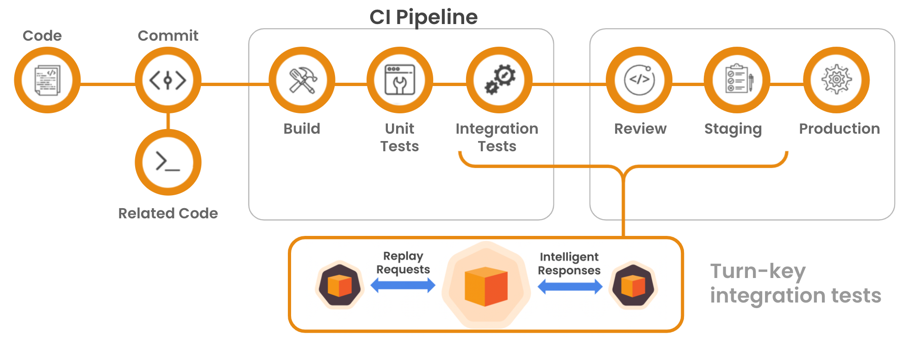

# CICD Overview

Speedscale Cookbook

### CI/CD Integration 

Speedscale provides tools and resources that make integration to your CI/CD and automation workflow a straightforward process with many valuable use-cases:

* Empower engineering teams and prevent problematic code changes from entering master branches by adding validations in pull request workflows
* Ensure adherence to engineering SLOs and stop risky deployments in their tracks by making Speedscale part of release automation

The general process for meaningful workflow integration is to run Speedscale snapshot after any build or unit test process, but before any actual deployment or other action that may yield downstream consequences. For example:

Because of the fact that Speedscale test-runs happen asynchronously after applying deployment yaml, the biggest hurdle in integrating within CI/CD systems is blocking pipelines until snapshot have completed and results are ready to be consumed. As a reminder, kubernetes custom resources are created for Speedscale invocations and are available as soon as a snapshot begins execution. However, report IDs are non-deterministic and therefore cannot be accurately predicted at apply time. It is highly encouraged to use a tag annotation, which can more deterministically identify a particular invocation, as well as provide traceability back to the original commit or branch.

