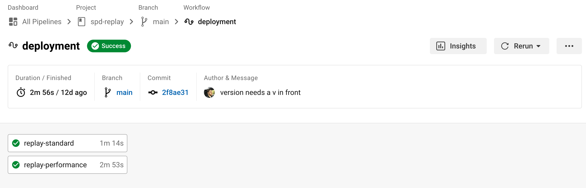
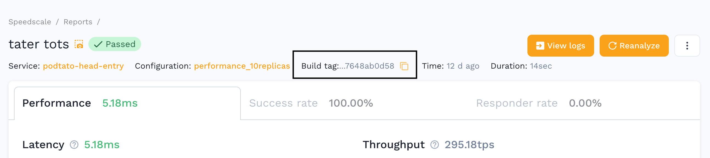

# CircleCI

One of the most popular networked CI/CD solutions is CircleCI, a workflow oriented system with great built-in support for containers. Please see this [GitHub Repository](https://github.com/kenahrens/spd-replay) for a full working example with CircleCI. 

## Prerequisites

In order to integrate Speedscale into your CICD, there are few steps that needs to be taken before the implementation

- Kubernetes (k8s) cluster with Speedscale installed (see Install section in Docs)
- Speedscale Snapshot ID (e.g. `ea42cb28-f7e7-4bef-9655-0034fd42ed52`)
- Speedscale Test config ID (e.g. standard, performance_10replicas)

## Integration

This integration utilizes the [Kubernetes ORB](https://circleci.com/developer/orbs/orb/circleci/kubernetes) from CircleCI. Add it to the top of your pipeline like so:

```
version: 2.1
orbs:
  kubernetes: circleci/kubernetes@1.3
```

The specific implementation details are found in the `tools/deploy-replays.sh` script in the example repository. Copy that script to your project. The integration is done primarily through `kubectl` which is supplied by the Kubernetes ORB. Put your manifest files into `k8s/replays` and then you can reference the specific replay directory in your pipeline (ex: `performance` directory below):

```
    steps:
      - checkout
      - kubernetes/install-kubectl:
          kubectl-version: << parameters.kubectl-version >>
      - run:
          command: |
            tools/deploy-replays.sh performance
```

Inside the `k8s/replays/performance` directory you will need a patch file that is added to a workload using kustomization. The patch file will add the following annotations with the appropriate `snapshot-id` and `testconfig-id`:

```
apiVersion: apps/v1
kind: Deployment
metadata:
  name: <<WORKLOAD>>
  annotations:
    sidecar.speedscale.com/inject: "false"
    replay.speedscale.com/snapshot-id: <<SNAPSHOT>>
    replay.speedscale.com/testconfig-id: <<TESTCONFIG>>
    replay.speedscale.com/mode: "full-replay"
```

## Customizing

If you have a different directory structure for your manifests or want to further customize the workflow, just edit the shell script found in `tools/deploy-replays.sh`.

## Results

Depending upon how many replays you configure in your workflow, you should see them run and show up in the CircleCI interface. If a replay fails, the entire pipeline can be configured to fail.



Note that this integration will automatically use the Workflow ID from CircleCI so that you can associate the specific pipeline workflow with a specific Speedscale report.


