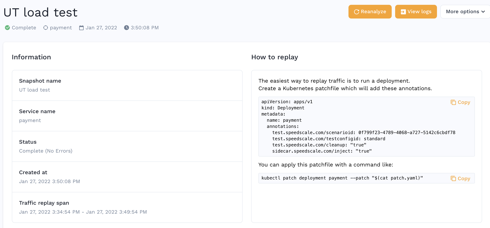

# GitHub Actions

Our workflow template provides a way for you to build your code, deploy it to Kubernetes and then run a traffic replay against it with whatever testing parameters you’d like. This means you could run a load test, a chaos test, a simple regression test, a backwards compatibility test or any combination of these all available through our editable test configs.

## How to use the template

Here is an [Example Workflow](https://github.com/speedscale/example-config/blob/master/ci/github-actions.yaml). There are two high level jobs specified in the workflow, **build** and **test**.

### Build

1. The build job in the example does a git checkout, you definitely want to keep this step.
1. Add any test steps you want to run in your pipeline such as `go test`
1. The next section does a Docker build and push. For eg. here you would replace `gcr.io/myimage:latest` with your image name and tag.

```
    # You'll probably want to build, unit test, push image, etc. here
    - name: Build
      run: docker build -t gcr.io/myimage:latest .  && docker push gcr.io/myimage:latest
```

### Test

Setup `kubectl` and `speedctl`. You should populate the secret `speedctl_config` which should be the file generated during your CLI setup as documented [here](../../../install/cli-speedctl) and is installed by default to `~/.speedscale/config`. Your `kubectl` setup will vary based on what cloud provider you use and how you configure authentication. For eg. if you use GKE, you’ll replace the `aws eks ...` line with `echo $KUBE_CONFIG >> ~/.kubectl/config`

```
      # This installs the necessary speedctl binary but also does some AWS/EKS specific things you will replace.
      - name: Setup cluster
        run: |
          curl -sL https://downloads.speedscale.com/speedctl/install | sh
          echo "${{ secrets.speedctl_config }}" > ~/.speedscale/config.yaml
          aws eks update-kubeconfig --name $CLUSTER_NAME
          kubectl apply -f k8s/
          echo "~/.speedscale" >> ${GITHUB_PATH}
``` 

Set these variables:

| Variable | Description |
| -------- | ----------- |
| SCENARIO_ID | This variable determines which subset of traffic will be sent against your service |
| TESTCONFIG_ID | The test config will control things like how fast load should be generated, how many concurrent requests will be played, what success rate is passing and so on. |
| CLEANUP | You may want to keep your deployment around after running a Speedscale replay just in case you want to debug it later. Set this flag to true or false accordingly. |
| TAG | This is a tag you’ll probably want to use for your docker image push as well as the report generated by Speedscale so you can keep track of which report matches with which one of your CI runs. |
| DEPLOYMENT | This is just the name of your deployment which we need so we can patch it and add the annotations. |

These environment variables are identical to the parameters found in the How To instructions found for your existing snapshot in the dashboard. 



To customize your replay even more, you can add more parameters to the `patch.yml` generated in the test step as specified here: [replay-snapshot](../../../replay/replay-snapshot).

### Questions?

If you have a question about this CICD workflow, please let us know on our [Community](http://slack.speedscale.com).
