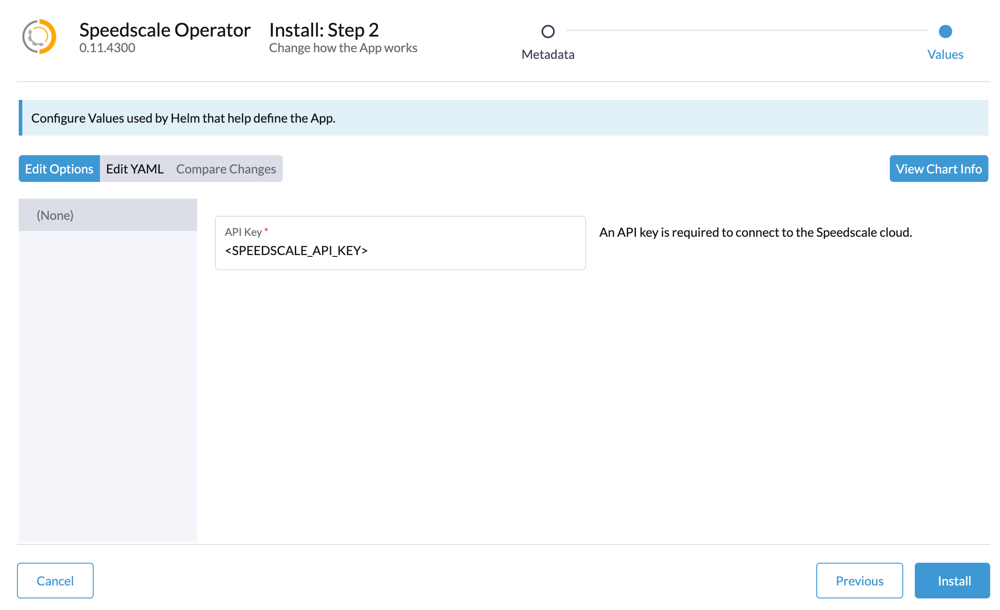

# SUSE Rancher Labs

Speedscale is compatible with SUSE Rancher Kubernetes distributions, and has a helm chart available in the Rancher Marketplace which can be found in the UI console.

### Operator Support

The Speedscale operator is compatible with:

* Rancher Desktop
* Rancher K3S
* Rancher RKE2

### Rancher Marketplace

Speedscale can be installed on RKE2 clusters through the Marketplace with a simple UI-based installer, all you need to know is your API Key, and the rest of the installation is automated.

