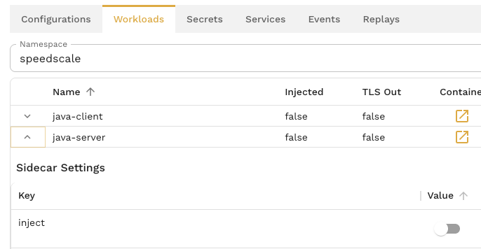
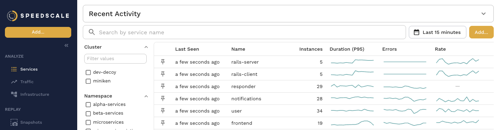
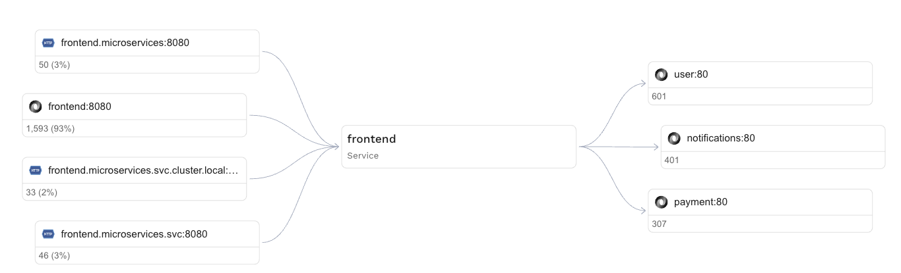
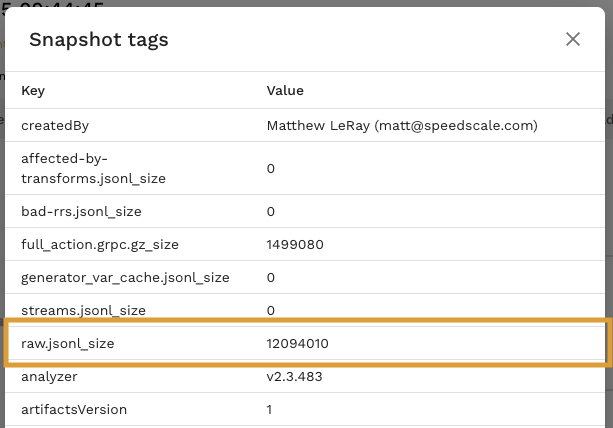

import PricingDashboard from './pricing-faq/pricing-dashboard.png'

# Pricing FAQ

Speedscale's pricing is based on the amount of data ingested, measured in gigabytes (GB). Below are answers to common questions about how billing works, how to avoid surprises, and how to optimize your usage.

---

## 💡 How does Speedscale’s usage-based pricing work?

Speedscale charges based on the total amount of data ingested to Speedscale Cloud, measured in GB per month. You can view your usage within Usage section of the [Speedscale UI](https://app.speedscale.com/tenant#tenant-tab-usage).


## 🔍 What counts toward my monthly data usage?

Data usage includes:

- Request and response payloads  
- Headers and metadata  
- Enriched context added during transformation  
- Internal Speedscale replay orchestration traffic (if enabled)  

The follow two metrics on the usage dashboard capture these items:

1. **Tenant Ingest Current Month**: - How much you've used in the current billing period (so far)
1. **Tenant Ingest Last Month**: - How much you used in the last billing period

:::note
Speedscale provides various usage metrics for visibility, but only data ingest is relevant for pricing.
:::


## ⚠️ What are some common causes of unexpected overages?

1. **High-traffic services**: If you deploy the sidecar to high-throughput services without filtering, usage can spike quickly.  
1. **Background or noisy traffic**: Health checks, polling endpoints, or verbose internal service calls can add significant overhead.  
1. **Unfiltered ingress**: Without filters, *all* incoming/outgoing traffic is captured by default, including irrelevant or duplicate traffic.  
1. **Replays and load tests**: Running tests with high concurrency can multiply the amount of data ingested. Use Low Data Mode when you run performance tests.


## 💰 How can I control or limit ingest costs?

Here are several strategies to avoid surprises:

### ✅ 1. Use traffic filters
Apply [traffic filters](/guides/creating-filters) to only capture data from specific endpoints, headers, or service patterns. This reduces noise and focuses ingest on meaningful interactions. The most common "noisy" traffic patterns include heartbeats, monitoring systems and database keepalives. Common systems like Datadog and New Relic are filtered out in the default `standard` filter set (for example). To do that, check out the [ignore-src-ips](/setup/sidecar/annotations/#sidecarspeedscalecomignore-src-ips) and [ignore-src-hosts](/setup/sidecar/annotations/#sidecarspeedscalecomignore-src-hosts) annotations.

### 🛑 2. Turn off the sidecar during idle periods
You can disable the Speedscale sidecar dynamically via your deployment configuration or control plane. Use automation to stop ingesting traffic outside of business hours or test windows.

:::tip
By default, Speedscale enables Remote Control which lets you turn the sidecar on and off manually, or using the scheduler. To turn on/off a sidecar, visit the main navigation -> Infrastructure -> Workloads -> (select namespace) -> inject (toggle on/off using the slider)


:::

### ⚙️ 3. Enable sidecar only during recording windows
Use Kubernetes lifecycle hooks or cronjobs to activate Speedscale only during performance testing, CI/CD workflows, or specific test events. Speedscale also provides an automated [scheduler](https://app.speedscale.com/schedules) if you have remote control enabled.

### 🎯 5. Scope deployments
Limit sidecar injection to namespaces, clusters, or services with active testing or observability needs. Avoid deploying universally unless necessary.

## 🧪 Can I test while limiting ingest costs?

Yes. Speedscale offers the ability to:

- **Record once, replay many times**: Replays of previously recorded traffic do not count as new ingest, although the test artifacts will cause some minor ingest.
- **Use local Proxymock recordings**: Capture and replay traffic locally during development without involving the sidecar or ingesting data into the Speedscale cloud. Limits apply but this is a good option for quick local regressions.


You can see current and historical usage by navigating to **Settings > Usage** in the Speedscale UI. Detailed breakdowns by service and namespace are available for the last seven days to help identify cost centers. Click on the main navigation -> Services for a list of services that have reported traffic in the last seven days.



Click on a service to see more detail.  In the traffic viewer you can adjust traffic filters to isolate high volume requests. For instance, you might want to filter for the `/heartbeat` endpoint to see if that is the source of your traffic. The service map will show total transaction counts by service, with the current filters applied.



The number in each box is the number of transactions for the particular inbound or outbound service. Calculating the exact volume in bytes of a particular set of traffic requires creating a snapshot. Press the *Save* button to create a snapshot. 

Select the three dot menu in the top right of the snapshot summary and select "View tags." The *raw.jsonl_size* contains the amount of ingest in bytes used by this specific traffic set.



## 🚨 Can I set usage limits?

Speedscale now supports setting a **monthly usage limit** to help you control ingest costs proactively. When your usage exceeds the threshold you set, Speedscale will automatically send an email alert. Here’s how it works:

- **Monthly reset**: The usage counter resets on the first day of each month.
- **Single alert recipient**: Only one email address can be entered for usage alerts. The email must match the domain of the admin user who sets the threshold.
- **One threshold per tenant**: Each tenant can have only one usage alert and one threshold level at a time. You can update or remove the threshold at any time using the same process.
- **Alert delivery**: When your monthly usage exceeds the set threshold, an email is sent to the configured address.

You can set or modify your usage threshold in two ways:

### Using the Speedscale Dashboard

Go to **Settings > [Usage](https://app.speedscale.com/tenant#tenant-tab-usage)** and scroll down to set your monthly usage threshold and alert email.

### Using the Command Line (`speedctl`)

You can also configure the usage alert via the `speedctl` CLI:

```bash
speedctl config set-usage-threshold
```

## 🧠 Are there best practices for managing ingest-based pricing?

Absolutely. Here are a few customer-tested techniques:

| Practice                     | Description                                                                  |
|-----------------------------|------------------------------------------------------------------------------|
| Inject sidecars selectively | Use namespace or label-based injection controls                              |
| Add smart filters           | Only capture what’s needed for test coverage or debugging                    |
| Use test scheduling         | Automate sidecar activation only during CI/CD jobs or staging rollouts       |
| Monitor billing data weekly | Watch for anomalous spikes before they turn into bill surprises              |
| Reuse traffic recordings    | Reduce ingest by replaying stored traffic scenarios instead of re-recording  |

## 📞 Still have questions?

If you’re unsure about your usage or need help tuning your deployment for cost efficiency, [contact Speedscale Support](mailto:support@speedscale.com), contact us on the [Speedscale Community](https://slack.speedscale.com) or reach out to your account manager.