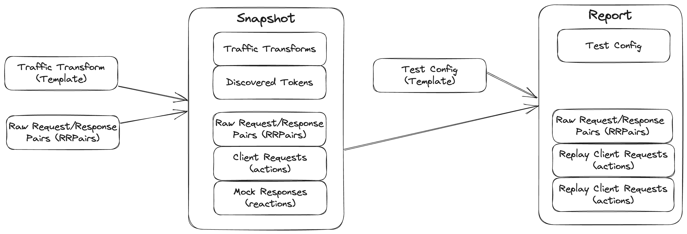

# Replay Data Model

### What happens when a snapshot is created?

Creating a snapshot requires putting together three components:
1. Raw Traffic (RRpairs) - the undifferentiated requests and responses

Traffic can be recorded, imported or constructed manually via JSON. Raw traffic can include requests from a variety of sources and is treated as one big bucket to pull from. The raw traffic is what you see in the Traffic Viewer. It is not used directly during replay but it is the source material for the load generator and mock server.

2. Traffic Transforms - the set of rules that will run in the load generator and mock server to ensure proper replay

Typically, these rules are created from a template but once they are applied to a snapshot they are no longer joined to the snapshot. For instance, your snapshot could be created using the `standard` transform rules but once the snapshot is created it has it's own unique rules. Modifying the snapshot will not modify the original template. You can modify the snapshot with transform rules as needed and then save them to a new template, but the snapshot itself stores its own rules separately.

3. Discovered Tokens - a collection of data items pulled from the RRPairs that will be automatically modified (like a JWT)

When the snapshot is created, Speedscale will create two additional artifacts: 1) client requests and 2) mock responses. During replay these artifacts are used by the load generator and the mock responses are used by the mock server. Transform rules are applied before the generation of these artifacts and will affect the outcome.

### What happens when a report is created?

Running a replay generates a report that can be viewed in the UI. Replays run tests against your application and provide dowstream mock responses. This requires a number of configuration items to come together:
1. Snapshot - this is the source for client requests and mock responses to be used during replay

Many replays can be run using the same snapshot. The snapshot is not modified in any way by the report.

2. Test Config - the environmental setup, assertion set and other setup to be used during replay

The specific test config used during the replay is copied from a template and modified before replay. For instance, let's say you use the `standard` test config for a replay. All the settings in that template will be the starting point for your replay but can be further modified in the wizard or command line. If you make a modification (like turning off the responder) in the replay wizard it will apply to the current replay but will not modify the original template. The report contains the complete test config and modifying it will not modify the original template.

A large variety of outputs are also stored in the report once it is run including data graphs, assertions and more. Most of these artifacts are created from the recorded traffic captured during the replay. It is compared against what was recorded in the snapshot for assertions, etc.