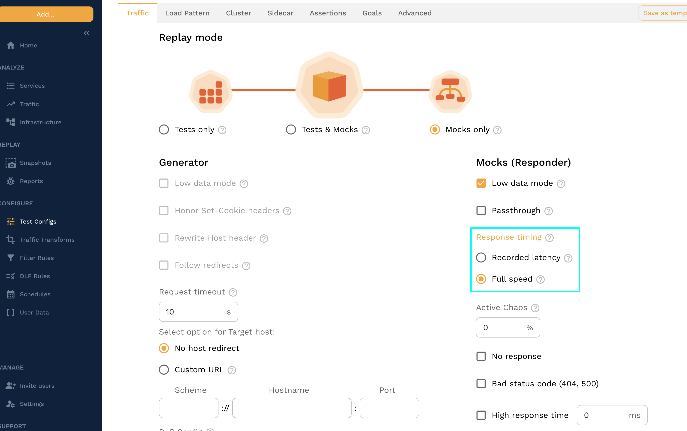
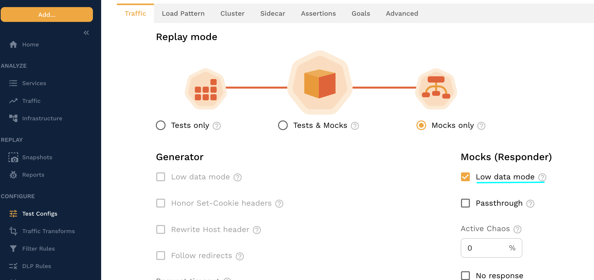
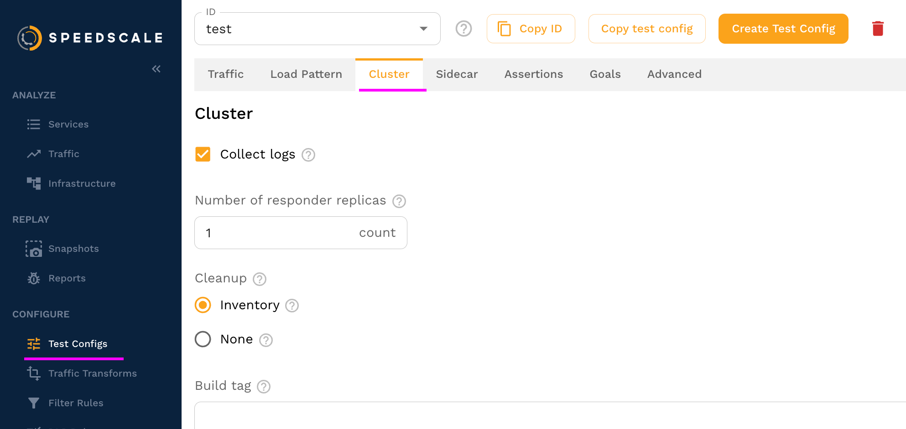
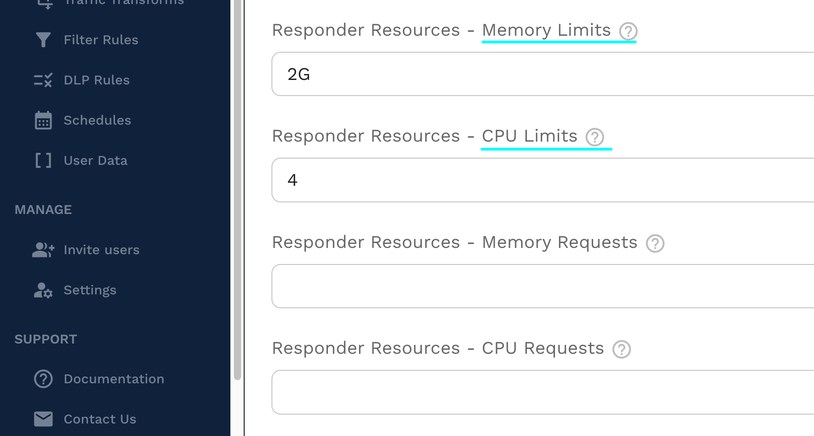

# Responder Sizing Guide

When using the [responder](/reference/glossary.md#responder) mock server under high load it is helpful to understand the environmental requirements.

This guide will help you understand the factors that affect responder throughput and how to configure your environment accordingly.

## Factors Affecting Throughput

- The largest factor affecting throughput of a single responder is available CPU across all available responder instances. Luckily the responder scales well with multiple instances so prefer scaling up the number of responders under high load. The only shared component when running multiple responders is a shared Redis database, which is very fast and rarely becomes a bottleneck.

:::tip
Use more responders to split the load between them. See [configuration](#configuration) for more information.
:::

- [Transforms](/reference/glossary.md#transform) may also affect throughput. The combination of captured traffic and transforms are what make Speedscale unique and powerful, but they also come with a performance cost which depends on the transform being used. While transforms generally don't account for a majority of the responder's CPU time, any processing dedicated to transforming traffic cannot be used to respond to requests.

## Observed Throughput

The table below contains responder throughput observations made while running responders configured with various CPU limits.

| Number of Responders | CPU Cores | Observed RPS |
| -------------------- | --------- | ------------ |
| 1                    | 1         | 490          |
| 1                    | 2         | 950          |
| 1                    | 4         | 1.8k         |
| 1                    | 8         | 3.5k         |
| 4                    | 4         | 7.5k total   |
| 10                   | 4         | 16.5k total  |

:::note
Contact Speedscale support for solutions that scale beyond the observed throughput seen here.
:::

Memory usage remained consistent for all tests at around 700 MB per responder, but this is highly dependent on the number of active connections. Each responder here was handling around 1k connections. While memory usage does not scale linearly with the number of connections, more connections means more memory used. The observed memory usage for a single responder with 15k active connections was over 2.2 GB.

## Configuration

Responder configuration can be managed through the [test config](/reference/glossary.md#test-config) when running the responder inside a Speedscale-managed cluster.

:::info
Long-running responders deployed in a Kubernetes cluster by the Speedscale Operator will need to be re-deployed to apply changes after the test config is modified.
:::

### Response Timing

Ensure your application gets responses from the responder immediately by setting the response timing to "Full speed".  This isn't as realistic as using the recorded latency, but it ensures a much faster response.

### Low Data Mode

The responder should always set the test config to run with [low data mode](/reference/glossary.md#low-data-mode) enabled when running under high load to avoid sending thousands or millions of [RRPairs](/reference/glossary.md#rrpair) to the Speedscale cloud.  If the load is high enough without low data mode the responder may generate RRPairs faster than they can be captured which can result in an out-of-memory crash. For the same reason avoid setting the log level higher than "info" to avoid flooding the logs with millions of events.

### Multiple Responders

To configure responder resources, navigate to the "Cluster" tab in your [test config](/reference/glossary.md#test-config).

### CPU and Memory

On the cluster tab you can set both the CPU/memory resources and the number of responder replicas.

## Best Practices

Follow these recommendations for the best experience under high load.

### Multiple Responders

It is better to run multiple responders with lower resources than to run a single responder with high resources. Running multiple responders also removes the need to run large, expensive server types.

### CPU

Ensure responders have adequate CPU and are not saturated, estimating CPU requirements based on the throughput table above. Containers running at or near 100% utilization cannot use their resources as efficiently.

Minimize mock transforms to only what's needed so that CPU is used to respond to requests rather than to transform them.

### Connections

Ensure your application has enough connections to communicate with multiple responders, but not so many that memory usage becomes a bottleneck. High connection counts have a much larger impact on memory usage than high request rates.

Expect that memory usage will climb with the number of active connections.

### Monitoring

Monitor your responders CPU under load to understand how they are performing. Watch for CPU throttling to indicate that more CPU is needed to handle the load.

Get access to internal responder metrics with the Prometheus endpoint on port `4145`, provided your monitoring system is setup to support scraping short-lived workloads.

