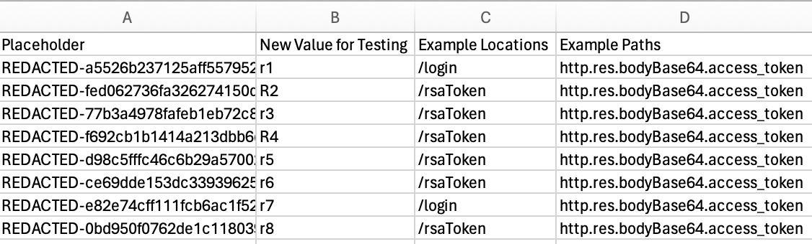

# train_csv

### Purpose

**train_csv** tells Speedscale AI to replace data in your traffic using a CSV of key=value pairs as a lookup table. The new values will be set wherever they appear in all future requests. By default, the first column is the original value and the second column is the replacement. No further action is required for replacements to happen in future requests, Speedscale will make the mapping automatically. Think of this like an unstructured global find/replace powered by a CSV lookup table.

As an example, let's assume the following CSV:


If we fed this CSV into `train_csv` it would cause all future occurrences of the `REDACTED-...` strings to be replaced with corresponding value in the `New Value for Testing` column on the same row. It does not matter where in your recorded traffic the values occur, they will be replaced. That includes query parameters, headers, SQL parameters, request bodies, etc.

### Usage

```json
"type": "train_csv",
"config": {
    "headers": "<boolean>",
    "existing": "<string or number depending on the value of header>",
    "new": "<string or number depending on the value of header>"
}
```

- **headers** - optional, set to false if no column headers are present, defaults to true
- **existing** - optional, for headers=true: name of the column to use as the existing value to serve as key, for headers=false: zero indexed column number, defaults to 0
- **new** - optional, for headers=true: name of the column to use as the existing value to serve as key, for headers=false: zero indexed column number, defaults to 1

### Example

#### Configuration

```json
"type": "train_csv",
"headers": "false",
"existing": "2",
"new": "5"
```

This will train Speedscale to replace any value found in column 2 with the corresponding value in column 5 in all future requets. Remember the column numbers are zero indexed.