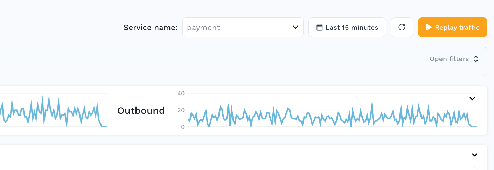
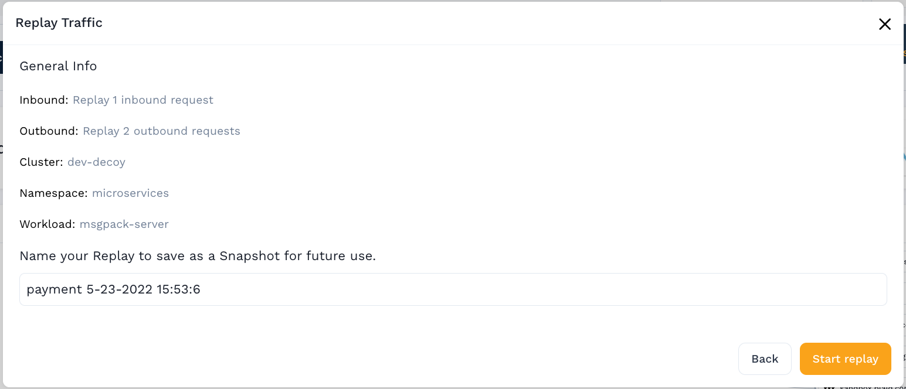
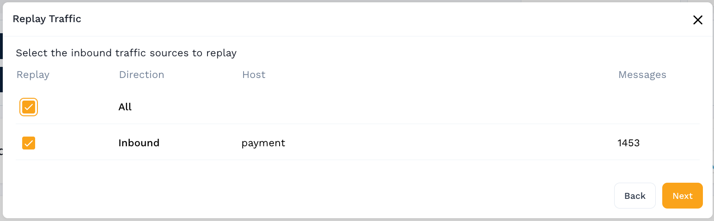
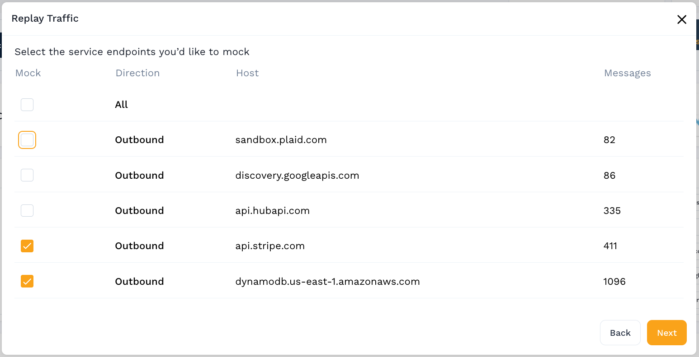
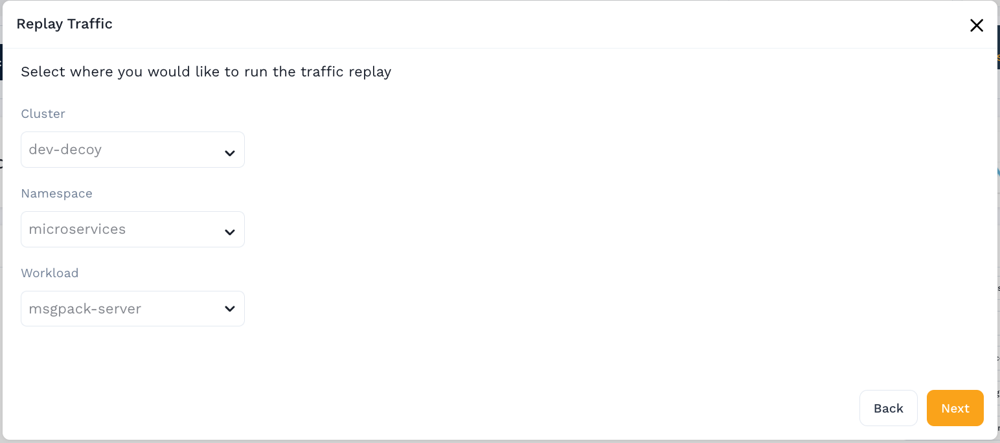

# Dashboard

A replay takes your captured traffic and replays it against a current version
of your application. This may be a load / chaos test, contract validation, or
even a Speedscale Responder to provide your application with valid responses
without making a real request to one of your external dependencies.

Start a replay by clicking "Replay traffic" from the [traffic viewer](../../analyze/traffic-viewer).

A summary will show details like the targeted service, time range, and filters.

Select the inbound traffic to be included in the replay, the set of requests
which will be made targeting your application.

Select the outbound traffic to be "mocked" by a responder, the set of outbound
requests that Speedscale will respond to instead of the real dependency.

For example, during traffic capture your service may have made a request to your
DynamoDB instance or api.stripe.com, but during the test you would like to get the
same response without calling the real service.

Select the cluster, namespace, and workload where the replay should run. This is
usually, but not necessarily, running the latest version of your application and
not actively receiving requests.

In the final step confirm your choices and optionally name the snapshot.  The snapshot
can be used to run the same replay later.

