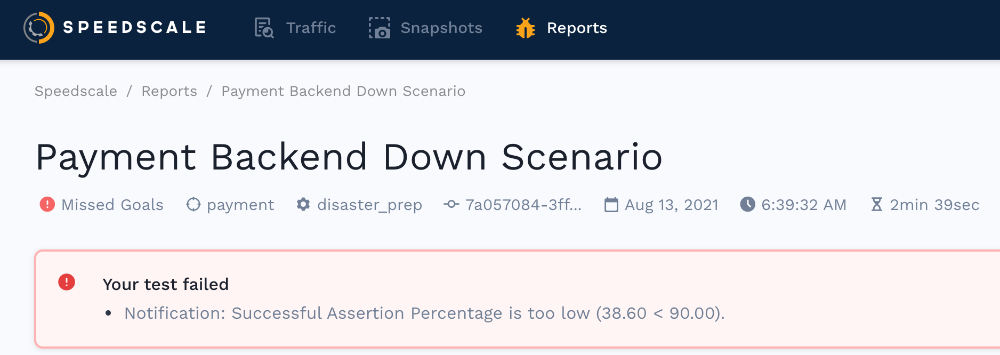

# Report Summary

At the top of the report are several key pieces of information.

## Replay Summary 

At a glance you should be able to see:

* What was the result of the replay? (Passed, Missed Goals, Running, Error)
* Which service did the traffic replay against?
* What replay configuration was used?
* What was the tag or commit hash from source control?
* When did the replay complete?
* How long did the replay take?
* If goals did were not met, what were they?

