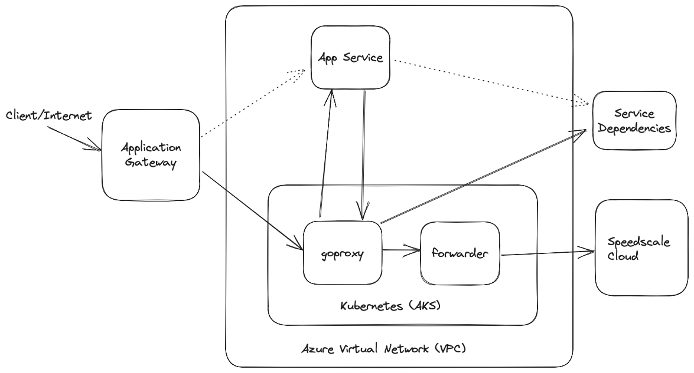
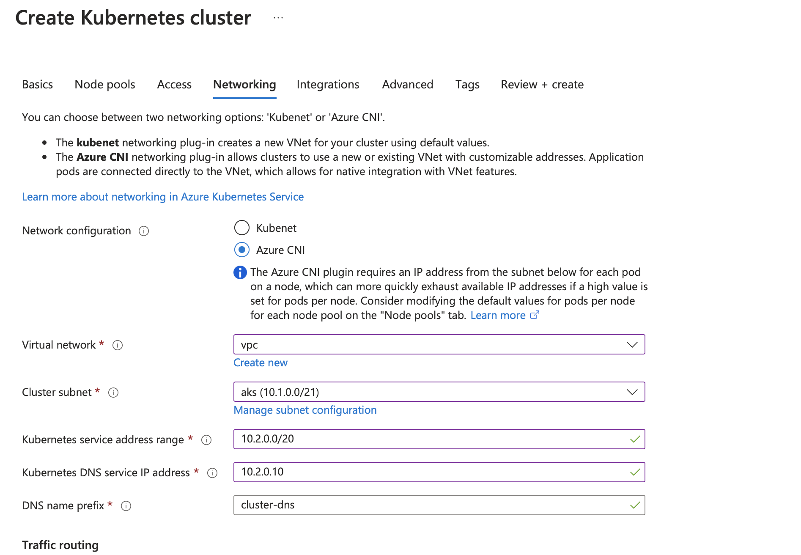
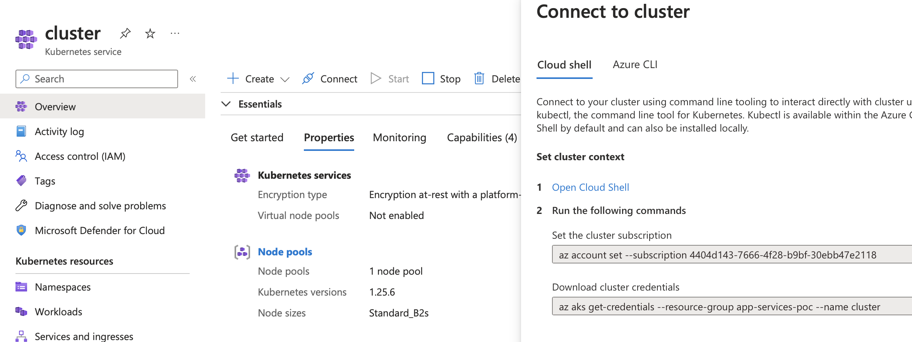
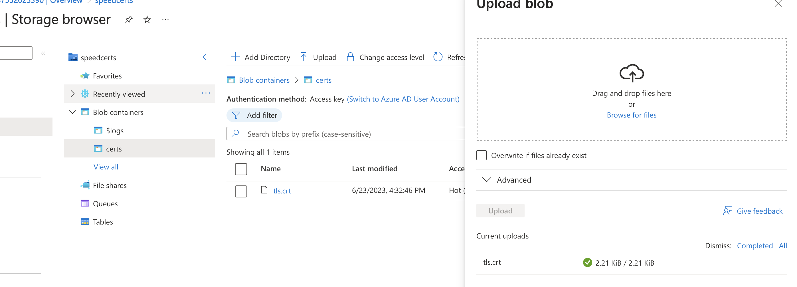
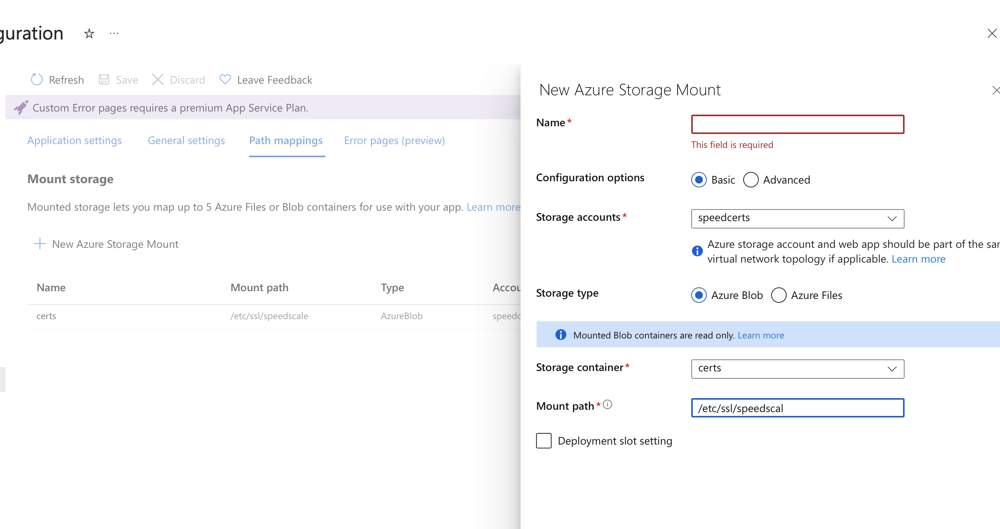
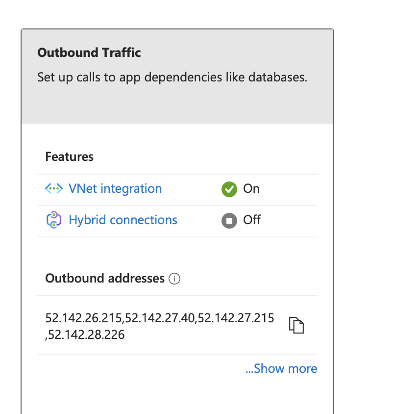
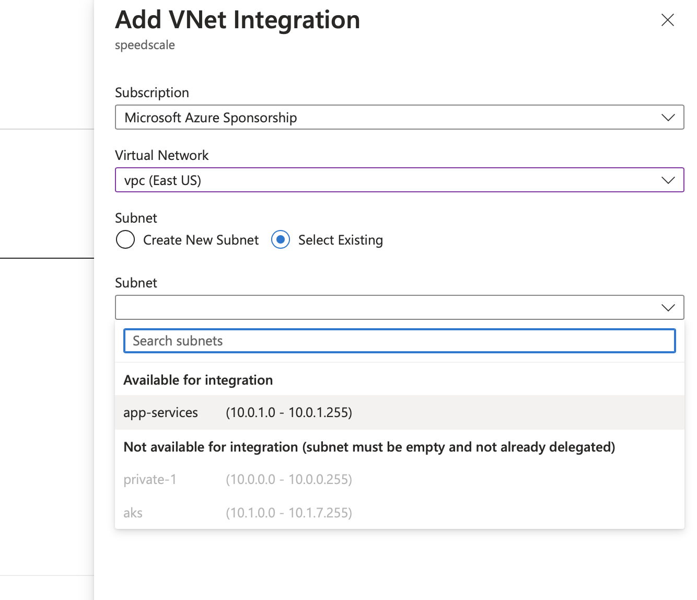
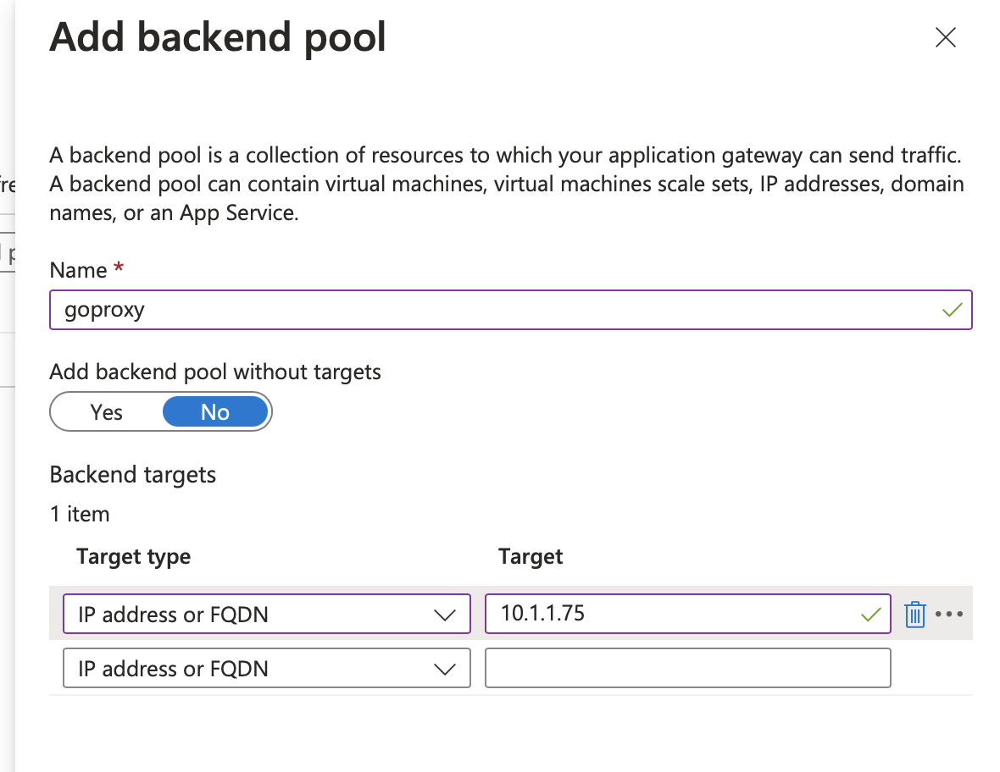
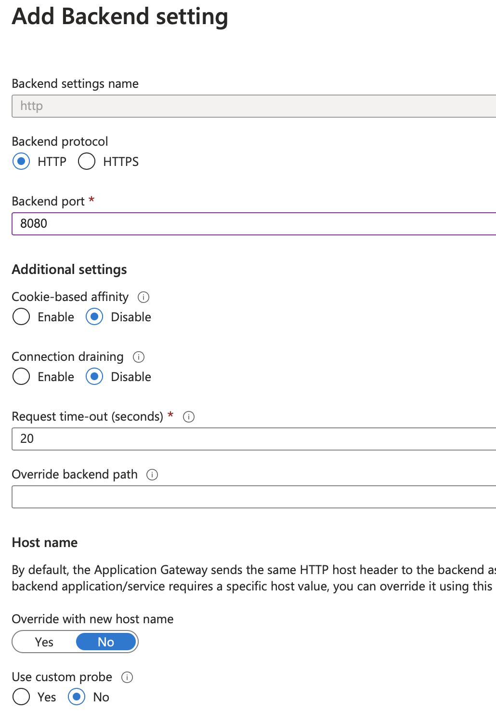
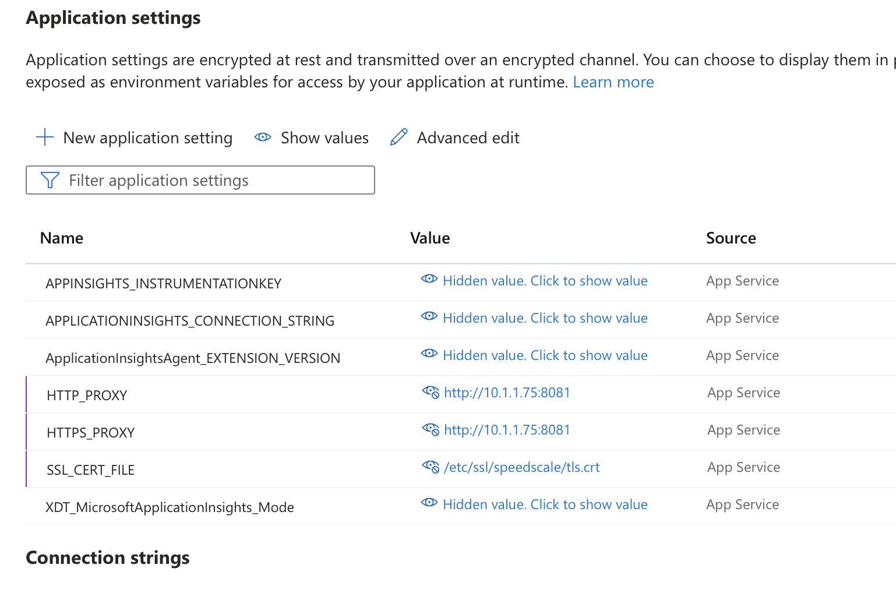

:::caution
This workflow is currently in preview status. Please provide feedback in our [slack community](https://slack.speedscale.com).
:::

## Prerequisites
1. [Speedctl is installed](../../setup/install/cli.md)

## Working with Azure App Services



In order to capture traffic from App Services, we need to set up a few components shown in the diagram above.

### Create a cluster

We need to create an AKS cluster in order to run our proxy and forwarding components. We're going to create this cluster in the same Virtual Network as our App Service as shown below. If the App Service has no existing VNet Integration then you can create a new virtual network and subnet.



Once the cluster is created, connect to it using the instructions on the created cluster in the `Connect` Tab shown below.



### Deploy Speedscale components

Now that the cluster is set up, deploy the needed components by applying the provided manifests. We'll need to modify the manifests with custom values from `~/.speedctl/config`. Replace the following values in the [capture.yaml](#manifest):

* `APP_LABEL`, `APP_POD_NAME`, `APP_POD_NAMESPACE` with your app name
* `REVERSE_PROXY_HOST` with the full URL of your cloud run app

Then run
```
kubectl create ns speedscale
speedctl deploy operator -e <cluster-name>
kubectl create ns capture
kubectl -n speedscale get secret speedscale-certs -o json | jq -r '.data["tls.crt"]' | base64 -D >> tls.crt
kubectl -n speedscale get secret speedscale-certs -o json | jq -r '.data["tls.key"]' | base64 -D >> tls.key
kubectl -n capture create secret tls tls-certs --cert=tls.crt --key=tls.key
kubectl apply -f capture.yaml
```

Now you'll need the IP of the goproxy instance you just created which you can get by running
```
kubectl -n capture get svc goproxy
NAME      TYPE           CLUSTER-IP    EXTERNAL-IP      PORT(S)                         AGE
NAME              TYPE           CLUSTER-IP   EXTERNAL-IP   PORT(S)                         AGE
goproxy-capture   LoadBalancer   10.2.4.180   10.1.1.75     8080:30116/TCP,8081:31841/TCP   101m
```

Grab the external IP (10.1.1.75 here). It may take some time to show up as a Load Balancer is provisioned when you deploy the manifests.

### Create Blob Container

In a new or existing Storage Account, create a new blob called `certs` and upload the `tls.crt` file we created above.



We're going to mount this file share to our App Services app so that it can access this cert file.



### Connect Virtual Network

When creating our cluster, we either used or created a Virtual Network to ensure our App Service could connect to `goproxy` directly. If you created a new one, make sure to add it to the App Service under `Networking/VNet Integration` as shown below. You may need to create a new subnet in the same vnet for this as well.






### Start Capturing

For our inbound capturing, we're going to configure our Application Gateway to start routing requests to `goproxy`. Create a new backend pool for the gateway and use the external IP from the Kubernetes service to use for the pool.



Then configure whatever existing routing rules to use this new backend pool instead of the App Service from before. Note that the backend traffic should be http and using port 8080 as shown below.



For outbound capturing, we're going to tell the app to use `goproxy` as an http proxy. We add `HTTP_PROXY`, `HTTPS_PROXY` settings with the same `goproxy` IP as before but with a different port `http://10.1.1.75:8081` and we add `SSL_CERT_FILE` to point at the file we mounted in the previous section.

The environment variables depend on the language of your app so refer to [proxy server configuration](/setup/sidecar/proxy-modes/#configuring-your-application-proxy-server)
and [trusting TLS certificates](/setup/sidecar/tls.md/#trusting-tls-certificates).



And that's it! Now your inbound and outbound traffic is being collected.

## Running Replays

Replays can be run against the service through the Kubernetes cluster as detailed [here](../../guides/replay/README.md). The HTTP Proxy settings and TLS settings set on the Cloud Run service above need to remain as is. It's recommended to set the `collect-logs` option to `false` since the Kubernetes service logs are not relevant in this setup.

:::info
Note that the CPU and memory graphs displayed in the report will be those for the proxy container and not the actual cloud run service.
:::

:::danger
Do not set the cleanup mode setting (`replay.speedscale.com/cleanup`) to `all` as this will delete the proxy container which is acting as the entrypoint and HTTP Proxy for your Cloud Run app.
:::


## Manifest

```yaml
apiVersion: apps/v1
kind: Deployment
metadata:
  labels:
    app: goproxy-capture
  name: goproxy-capture
  namespace: capture
spec:
  progressDeadlineSeconds: 600
  replicas: 1
  revisionHistoryLimit: 10
  selector:
    matchLabels:
      app: goproxy-capture
  template:
    metadata:
      labels:
        app: goproxy-capture
    spec:
      containers:
      - image: gcr.io/speedscale/goproxy:v1.3
        imagePullPolicy: Always
        name: goproxy-capture
        env:
        - name: APP_LABEL
          value: payment
        - name: APP_POD_NAME
          value: payment
        - name: APP_POD_NAMESPACE
          value: payment
        - name: CAPTURE_MODE
          value: proxy
        - name: FORWARDER_ADDR
          value: speedscale-forwarder.speedscale.svc:80
        - name: PROXY_TYPE
          value: dual
        - name: PROXY_PROTOCOL
          value: http
        - name: TLS_OUT_UNWRAP
          value: "true"
        - name: TLS_CERT_DIR
          value: /etc/ssl/capture
        - name: REVERSE_PROXY_HOST
          value: 'https://speedscale.azurewebsites.net'
        - name: REVERSE_PROXY_PORT
          value: '443'
        - name: PROXY_IN_PORT
          value: "8080"
        - name: PROXY_OUT_PORT
          value: "8081"
        - name: LOG_LEVEL
          value: info
        ports:
        - containerPort: 8080
          name: proxy-in
          protocol: TCP
        - containerPort: 8081
          name: proxy-out
          protocol: TCP
        volumeMounts:
        - mountPath: /etc/ssl/capture
          name: tls-out
          readOnly: true
        resources: {}
        securityContext:
          readOnlyRootFilesystem: false
          runAsGroup: 2102
          runAsUser: 2102
        terminationMessagePath: /dev/termination-log
        terminationMessagePolicy: File
      volumes:
      - name: tls-out
        secret:
          defaultMode: 420
          optional: false
          secretName: tls-certs
---
apiVersion: v1
kind: Service
metadata:
  labels:
    app: goproxy-capture
  name: goproxy-capture
  namespace: capture
  annotations:
    service.beta.kubernetes.io/azure-load-balancer-internal: "true"
spec:
  ports:
  - name: in
    port: 8080
    protocol: TCP
    targetPort: 8080
  - name: out
    port: 8081
    protocol: TCP
    targetPort: 8081
  selector:
    app: goproxy-capture
  type: LoadBalancer
```
