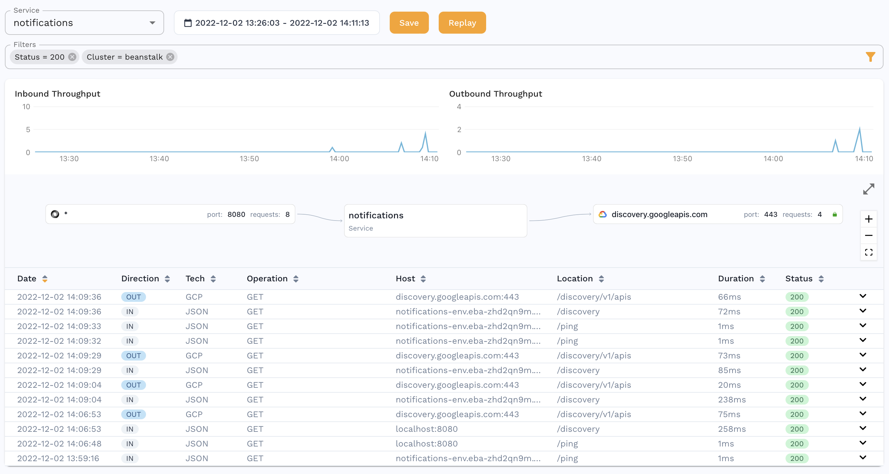

:::caution
This workflow is currently in preview status. Please provide feedback in our [slack community](https://slack.speedscale.com).
:::

## Prerequisites

1. [Speedctl is installed](../../quick-start.md)
1. Access to the client application to configure proxy settings and trust certificates.
1. Application is using Beanstalk with [Docker Platform (ECS managed or otherwise)](https://docs.aws.amazon.com/elasticbeanstalk/latest/dg/create_deploy_docker.html)


## Working with Beanstalk

This guide uses a `docker-compose.yml` and not a [Dockerrun.aws.json](https://docs.aws.amazon.com/elasticbeanstalk/latest/dg/create_deploy_docker_v2config.html#create_deploy_docker_v2config_dockerrun) file although it is quite easy to convert between the two formats. We'll set up a forwarder and goproxy container alongside your existing application in order to capture traffic and then optionally add a one time generator container to run a replay test.

We'll use a simple service called `notifications` as our sample app that serves on port `8080`.

```yaml
version: "3"
services:
  notifications:
    image: gcr.io/speedscale-demos/notifications
    ports:
      - 80:8080
```

### Create TLS secrets

To capture outbound TLS calls, we need to setup TLS certs to be used by the services. Create a directory called `certs` and run this command

```bash
openssl genrsa -out tls.key 4096
openssl req -new -key tls.key -x509 -days 365 -out tls.crt -subj "/C=US/ST=Georgia/L=Atlanta/O=Speedscale/CN=speedscale.com"
```

### Environment Prep

Using the [manifests](#manifests)

- Populate the values inside `.env` from your `~/.speedscale/config.yaml` file
- Edit your `docker-compose.yml` and add the `forwarder` and `goproxy` sections:
    - `APP_LABEL` and `APP_POD_NAME`  if you want to change the service name that will be shown in the Speedscale Traffic Viewer.
    - `CLUSTER_NAME` and `APP_POD_NAMESPACE` so that you can filter by namespace and cluster as you would for a Kubernetes installation.
    - `REVERSE_PROXY_{HOST/PORT}` will be the name of service in the compose file and the port it's running on
    - Remove the port binding of `80:{YOUR_APP_PORT}` (commented out in the manifest) from your app. Goproxy will become the new entrypoint for incoming requests.

We're also configuring our app to use `goproxy` as an outbound http proxy so that we can capture outbound requests. Our example `notifications` app uses Golang so the variables are set accordingly in the manifest. The environment variables depend on the language of your app so refer to [proxy server configuration](/setup/sidecar/proxy-modes/#configuring-your-application-proxy-server)
and [trusting TLS certificates](../../setup/sidecar/tls/#trusting-tls-certificates).

### Analyze Traffic



You should be able to see traffic in the Speedscale UI after a few minutes and now you can using this traffic to [create a snapshot](../../guides/creating-a-snapshot.md).

### Replaying traffic

If you've created a snapshot, you can replay it in Beanstalk as well. Take the ID of the snapshot you created (something like `b973b5e2-651f-4a30-8c69-7bd62a678544`) and fill it in the `SCENARIO_ID` variable shown in the [generator snippet](#manifests). This container has `restart: no` so that it only runs once. You can also run this same generator snippet locally against your deployment by changing the `CUSTOM_URL` to your internet facing Beanstalk URL.

You can also change the `TEST_CONFIG_ID` to a [custom config](../../reference/configuration/README.md) you may have created. Paste that snippet into your `docker-compose.yaml` file and run `docker compose up -d` again to start the test.

This will generate a report which you can find more details for [here](../../guides/reports/README.md).

## Manifests
Zip structure (`.ebextensions` are optional but usually present for Beanstalk apps)
```
├── .ebextensions
│   └── options.config
├── .env
├── certs
│   ├── tls.crt
│   └── tls.key
└── docker-compose.yaml
```

.env
```conf
LOG_LEVEL=info
SPEEDSCALE_API_KEY=
SPEEDSCALE_APP_URL=app.speedscale.com
SUB_TENANT_NAME=default
SUB_TENANT_STREAM=
TENANT_REGION=us-east-1
TENANT_BUCKET=
TENANT_ID=
TENANT_NAME=
```

docker-compose.yaml
```yaml
version: "3"
services:
  notifications:
    image: gcr.io/speedscale-demos/notifications
    # ports:
    #   - 80:8080
    env_file:
      - .env
    environment:
      - SSL_CERT_FILE=/etc/ssl/capture/tls.crt
      - HTTP_PROXY=http://goproxy:4140
      - HTTPS_PROXY=http://goproxy:4140
    volumes:
      - ./certs:/etc/ssl/capture
  goproxy:
    image: gcr.io/speedscale/goproxy:v1.2
    ports:
      - 80:4143
    volumes:
      - ./certs:/etc/ssl/capture
    env_file:
      - .env
    environment:
      - FORWARDER_ADDR=forwarder:8888
      - TLS_OUT_UNWRAP=true
      - TLS_CERT_DIR=/etc/ssl/capture
      - CAPTURE_MODE=proxy
      - PROXY_TYPE=dual
      - PROXY_PROTOCOL=tcp:http
      - REVERSE_PROXY_HOST=notifications
      - REVERSE_PROXY_PORT=8080
      - APP_LABEL=notifications
      - APP_POD_NAME=notifications
      - APP_POD_NAMESPACE=notifications
  forwarder:
    image: gcr.io/speedscale/forwarder:v1.2
    env_file:
      - .env
    environment:
      - CLUSTER_NAME=beanstalk
```

generator snippet
```yaml
  generator:
    image: gcr.io/speedscale/generator:v1.2
    restart: "no"
    env_file:
      - .env
    environment:
      - SCENARIO_ID=8d64d9cf-92b9-455f-9d78-24af52ddd17e
      - TEST_CONFIG_ID=standard
      - CUSTOM_URL=http://notifications:8080
      - LOCAL_REPLAY_MODE=true
```
