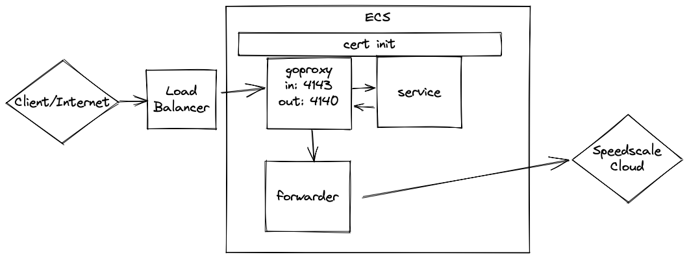
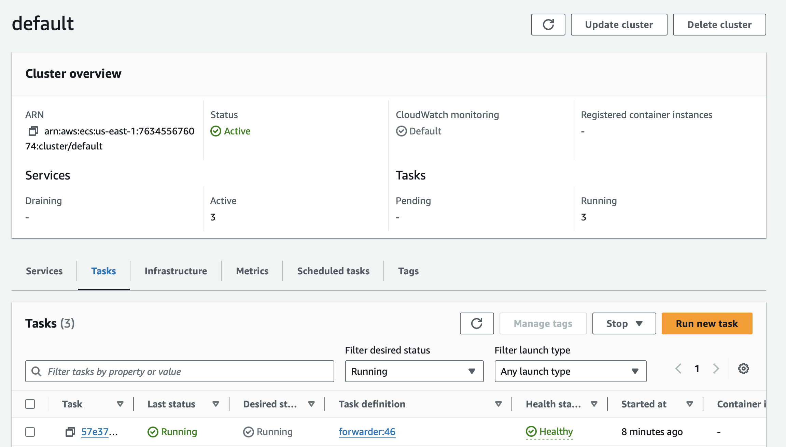
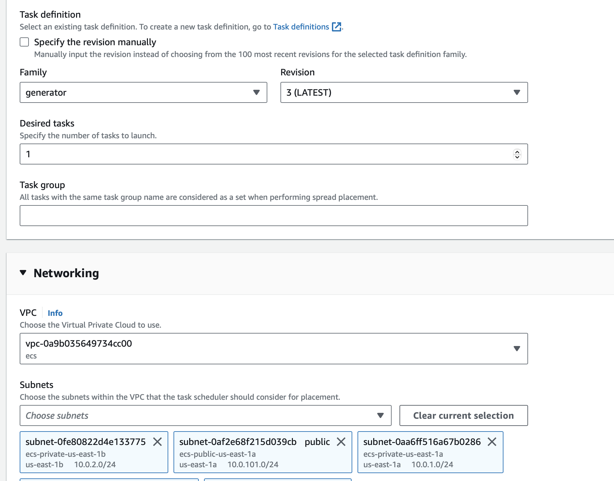

:::caution
This workflow is currently in preview status. Please provide feedback in our [slack community](https://slack.speedscale.com).
:::

## Prerequisites

1. [Speedctl is installed](../../quick-start.md)
2. [ECS Service Discovery is setup](https://docs.aws.amazon.com/AmazonECS/latest/developerguide/service-discovery.html)

## Working with ECS



To capture traffic for a service running in ECS, we need to setup some components shown above. The examples snippets in this guide will be in the form of Terraform but all the parameters used have equivalents in CloudFormation, the AWS CLI, the AWS console, etc.

### Setup the forwarder

The forwarder handles sending captured traffic up to Speedscale cloud and only a single forwarder is needed regardless of the number of services being captured. The Terraform below creates an ECS task definition, an ECS service and adds it to a private hosted zone for service discovery. Make sure to replace `SPEEDSCALE_API_KEY`, `TENANT_BUCKET`, `TENANT_NAME`, etc. with values from `~/.speedctl/config` which should have been populated during `speedctl` setup.

The service discovery hosted zone used for our example is `ecs.local` and our ECS service discovery block will setup `forwarder.ecs.local` which will be used in the next step.

```
resource "aws_ecs_task_definition" "forwarder" {
  family                   = "forwarder"
  execution_role_arn       = aws_iam_role.exec.arn
  requires_compatibilities = ["FARGATE"]
  network_mode             = "awsvpc"
  cpu                      = 256
  memory                   = 512

  container_definitions = jsonencode([
    {
      name      = "forwarder"
      image     = "gcr.io/speedscale/forwarder:v1.2"
      essential = true
      healthCheck = {
        command = [
          "CMD-SHELL",
          "curl -v localhost:8888 2>&1 | grep Connected"
        ]
      }
      portMappings = [
        {
          containerPort = 8888
        }
      ],
      environment = [
        {
          name  = "CLUSTER_NAME"
          value = "ecs"
        },
        {
          name  = "SPEEDSCALE_API_KEY"
          value = "yourkey"
        },
        {
          name  = "SPEEDSCALE_APP_URL"
          value = "app.speedscale.com"
        },
        {
          name  = "SUB_TENANT_NAME"
          value = "default"
        },
        {
          name  = "SUB_TENANT_STREAM"
          value = "sstenant-tenant"
        },
        {
          name  = "TENANT_BUCKET"
          value = "sstenant-tenant"
        },
        {
          name  = "TENANT_NAME"
          value = "sstenant-tenant"
        },
        {
          name  = "TENANT_ID"
          value = "uuid"
        },
        {
          name  = "TENANT_REGION"
          value = "us-east-1"
        },
      ],
    },
  ])
}


resource "aws_service_discovery_service" "forwarder" {
  name         = "forwarder"
  namespace_id = aws_service_discovery_private_dns_namespace.cluster.id

  dns_config {
    namespace_id = aws_service_discovery_private_dns_namespace.cluster.id

    dns_records {
      ttl  = 10
      type = "A"
    }
  }
}

resource "aws_ecs_service" "forwarder" {
  name                 = "forwarder"
  cluster              = aws_ecs_cluster.cluster.id
  task_definition      = aws_ecs_task_definition.forwarder.arn
  force_new_deployment = true
  desired_count        = 1
  launch_type          = "FARGATE"

  service_registries {
    registry_arn   = aws_service_discovery_service.forwarder.arn
    container_name = "forwarder"
  }

  network_configuration {
    subnets         = data.aws_subnet_ids.private.ids
    security_groups = [var.sg_id]
  }
}
```

### Create TLS secrets

To capture outbound TLS calls, we need to setup TLS certs to be used by the services. These certs will be placed in AWS Secrets Manager and then used by the ECS tasks. We will get the TLS certs generated from an existing deployment of the Speedscale Operator in a Kubernetes cluster. If you have not installed the Operator anywhere, you can generate these certs with `openssl`.

:::info
You can also use S3 instead of Secrets Manager here
:::

```bash
openssl genrsa -out tls.key 4096
openssl req -new -key tls.key -x509 -days 365 -out tls.crt -subj "/C=US/ST=Georgia/L=Atlanta/O=Speedscale/CN=speedscale.com"

OR

kubectl -n speedscale get secret speedscale-certs -o json | jq -r '.data["tls.crt"]' | base64 -D >> tls.crt
kubectl -n speedscale get secret speedscale-certs -o json | jq -r '.data["tls.key"]' | base64 -D >> tls.key

THEN

aws secretsmanager create-secret --name tls.crt --secret-string file://tls.crt
aws secretsmanager create-secret --name tls.key --secret-string file://tls.key
```

### Create new Task Definition

In the example below, the service we want to capture is called `notifications` and it serves on port `8080`. Here are the pieces added to the task:

1. An init container that populates the task volume with the TLS certs we created in Secrets Manager in the previous step.
2. TLS configuration for the `notifications` service with the environment variables for `SSL_CERT_FILE`, `HTTP_PROXY` and `HTTPS_PROXY`. These
   variables depend on the language of your app so refer to [proxy server configuration](/setup/sidecar/proxy-modes/#configuring-your-application-proxy-server)
   and [trusting TLS certificates](/setup/sidecar/tls/#trusting-tls-certificates).
3. A `goproxy` sidecar that will capture inbound and outbound traffic. The environment variables for this container need to be edited per environment. `APP_LABEL`, `APP_POD_NAME` and `APP_POD_NAMESPACE` can be set to whatever values you want to differentiate different captured traffic by. `REVERSE_PROXY_PORT` must be the port on which the app being captured serves. `FORWARDER_ADDR` needs to be whatever the service discovery name for the forwarder we setup previously is, in this case `forwarder.ecs.local:8888`.

:::info
The role used by your task needs to have `secretsmanager:GetSecretValue` and `kms:Decrypt` permissions in order to access the TLS secrets.
:::

```
resource "aws_ecs_task_definition" "with-speedscale" {
  family                   = "notifications-capture"
  execution_role_arn       = aws_iam_role.exec.arn
  task_role_arn            = aws_iam_role.exec.arn
  network_mode             = "awsvpc"
  requires_compatibilities = ["FARGATE"]
  cpu                      = 256
  memory                   = 512

  container_definitions = jsonencode([
    {
      entrypoint = ["bash"]
      command    = ["-c", "aws secretsmanager get-secret-value --secret-id tls.crt --query SecretString --output text >> /etc/ssl/speedscale/tls.crt && aws secretsmanager get-secret-value --secret-id tls.key --query SecretString --output text >> /etc/ssl/speedscale/tls.key"],
      mountPoints = [
        {
          containerPath = "/etc/ssl/speedscale",
          sourceVolume  = "speedscale"
        }
      ],
      image     = "amazon/aws-cli:2.8.4",
      essential = false,
      name      = "init"
    },
    {
      name      = "notifications"
      image     = "gcr.io/speedscale-demos/notifications"
      essential = true
      environment = [
        {
          name  = "SSL_CERT_FILE"
          value = "/etc/ssl/speedscale/tls.crt"
        },
        {
          name  = "HTTP_PROXY"
          value = "http://localhost:4140"
        },
        {
          name  = "HTTPS_PROXY"
          value = "http://localhost:4140"
        },
      ],
      dependsOn = [
        {
          containerName = "init",
          condition     = "SUCCESS"
        },
        {
          containerName = "goproxy",
          condition     = "START"
        },
      ]
      portMappings = [
        {
          containerPort = 8080
        }
      ]
      mountPoints = [
        {
          containerPath = "/etc/ssl/speedscale",
          sourceVolume  = "speedscale"
        }
      ],
    },
    {
      name      = "goproxy"
      image     = "gcr.io/speedscale/goproxy:v1.2"
      essential = true
      logConfiguration = {
        logDriver = "awslogs",
        options = {
          awslogs-create-group  = "true",
          awslogs-group         = "ecs/goproxy"
          awslogs-region        = "us-east-1",
          awslogs-stream-prefix = "ecs"
        },
      },
      dependsOn = [
        {
          containerName = "init",
          condition     = "SUCCESS"
        }
      ]
      mountPoints = [
        {
          containerPath = "/etc/ssl/speedscale",
          sourceVolume  = "speedscale"
        }
      ],
      portMappings = [
        {
          containerPort = 4143
        },
        {
          containerPort = 4140
        }
      ]
      environment = [
        {
          name  = "LOG_LEVEL"
          value = "info"
        },
        {
          name  = "APP_LABEL"
          value = "notifications"
        },
        {
          name  = "APP_POD_NAME"
          value = "notifications"
        },
        {
          name  = "APP_POD_NAMESPACE"
          value = "ecs"
        },
        {
          name  = "CAPTURE_MODE"
          value = "proxy"
        },
        {
          name  = "PROXY_TYPE"
          value = "dual"
        },
        {
          name  = "PROXY_PROTOCOL"
          value = "tcp:http"
        },
        {
          name  = "TLS_OUT_UNWRAP"
          value = "true"
        },
        {
          name  = "REVERSE_PROXY_PORT"
          value = "8080"
        },
        {
          name  = "FORWARDER_ADDR"
          value = "forwarder.ecs.local:8888"
        },
      ]
    },
    ],
  )
  volume {
    name = "speedscale"
  }
}
```

### Modify the ECS service

Now the ECS service needs to be modified to use the new task definition and the load balancer configuration needs to point to `goproxy:4143` instead of what was in our case `notifications:8080`.

```
resource "aws_ecs_service" "notifications" {
  name                 = "notifications"
  cluster              = aws_ecs_cluster.cluster.id
  task_definition      = aws_ecs_task_definition.with-speedscale.arn
  force_new_deployment = true
  desired_count        = 1
  launch_type          = "FARGATE"

  load_balancer {
    target_group_arn = aws_lb_target_group.default.arn
    container_name   = "goproxy"
    container_port   = 4143
  }

   network_configuration {
    subnets         = data.aws_subnet_ids.private.ids
    security_groups = [var.sg_id]
  }
}
```

### Verification

Now if you send requests to your app as you did previously through the load balancer, they will be captured and sent to Speedscale.

## Running a test

After capturing traffic and creating a snapshot, we can run a test against our service. We'll do the following:

1. Create a task definition for a `generator` which is the Speedscale component that will generate load against the service.
2. Run this as a one off task.

This task will have a set of environment variables to be filled from your `~/.speedctl/config` just like we did when setting up the `forwarder` as well as three additional ones: `SNAPSHOT_ID` which comes from the snapshot created with traffic, a `TEST_CONFIG_ID` which specifies the behavior of your test and `CUSTOM_URL` which will is the URL of the service to be tested. In this case it's `http://notifications.ecs.local` because we've setup ECS service discovery for our `notifications` service.

```
resource "aws_ecs_task_definition" "generator" {
  family                   = "generator"
  execution_role_arn       = aws_iam_role.exec.arn
  requires_compatibilities = ["FARGATE"]
  network_mode             = "awsvpc"
  cpu                      = 256
  memory                   = 512

  container_definitions = jsonencode([
    {
      name      = "generator"
      image     = "gcr.io/speedscale/generator:v1.4"
      essential = true
      logConfiguration = {
        logDriver = "awslogs",
        options = {
          awslogs-create-group  = "true",
          awslogs-group         = "ecs/generator"
          awslogs-region        = "us-east-1",
          awslogs-stream-prefix = "ecs"
        },
      },
      environment = [
        {
          name  = "SNAPSHOT_ID"
          value = "3420b3cd-35dc-4d37-8ce1-587afe0b2adb"
        },
        {
          name  = "TEST_CONFIG_ID"
          value = "regression"
        },
        {
          name  = "CUSTOM_URL"
          value = "http://notifications.ecs.local"
        },
        {
          name  = "LOCAL_REPLAY_MODE"
          value = "true"
        },
        {
          name  = "SPEEDSCALE_API_KEY"
          value = "yourkey"
        },
        {
          name  = "SPEEDSCALE_APP_URL"
          value = "dev.speedscale.com"
        },
        {
          name  = "SUB_TENANT_NAME"
          value = "default"
        },
        {
          name  = "SUB_TENANT_STREAM"
          value = "dev-sstenant-external"
        },
        {
          name  = "TENANT_BUCKET"
          value = "dev-sstenant-external"
        },
        {
          name  = "TENANT_REGION"
          value = "us-east-1"
        },
      ],
    },
  ])
}
```

### Launch task

You can launch this `generator` task from the AWS console or the CLI.



You'll need to specify the same networking and scheduling parameters as the rest of your ECS Services through the wizard shown here.



This will create a test reprt that you can view in the Speedscale dashboard.

## Using Mocks

After capturing traffic and creating a snapshot, we can use a snapshot to create mocks for our service. We're going to do the following:

1. Setup an init container and configure our app to trust certs just like [above](#create-new-task-definition)
2. Add a `responder` sidecar that will provide mocks for your app. This sidecar will have a set of environment variables to be filled from your `~/.speedctl/config` just like we did when setting up the `forwarder` as well as two additional ones: `SNAPSHOT_ID` which comes from the snapshot created before and a `TEST_CONFIG_ID` which specifies the behavior of your mocks.
3. We're also adding a `redis` sidecar that's needed by the `responder`.

```
resource "aws_ecs_task_definition" "with-responder" {
  family                   = "notifications-with-responder"
  execution_role_arn       = aws_iam_role.exec.arn
  task_role_arn            = aws_iam_role.exec.arn
  network_mode             = "awsvpc"
  requires_compatibilities = ["FARGATE"]
  cpu                      = 256
  memory                   = 512

  container_definitions = jsonencode([
    {
      entrypoint = ["bash"]
      command    = ["-c", "aws secretsmanager get-secret-value --secret-id tls.crt --query SecretString --output text >> /etc/ssl/speedscale/tls.crt && aws secretsmanager get-secret-value --secret-id tls.key --query SecretString --output text >> /etc/ssl/speedscale/tls.key"],
      mountPoints = [
        {
          containerPath = "/etc/ssl/speedscale",
          sourceVolume  = "speedscale"
        }
      ],
      logConfiguration = {
        logDriver = "awslogs",
        options = {
          awslogs-create-group  = "true",
          awslogs-group         = "ecs/init"
          awslogs-region        = "us-east-1",
          awslogs-stream-prefix = "ecs"
        },
      },
      image     = "amazon/aws-cli:2.8.4",
      essential = false,
      name      = "init"
    },
    {
      name      = "notifications"
      image     = "gcr.io/speedscale-demos/notifications"
      essential = true
      logConfiguration = {
        logDriver = "awslogs",
        options = {
          awslogs-create-group  = "true",
          awslogs-group         = "ecs/notifications"
          awslogs-region        = "us-east-1",
          awslogs-stream-prefix = "ecs"
        },
      },
      environment = [
        {
          name  = "SSL_CERT_FILE"
          value = "/etc/ssl/speedscale/tls.crt"
        },
        {
          name  = "HTTP_PROXY"
          value = "http://localhost:4140"
        },
        {
          name  = "HTTPS_PROXY"
          value = "http://localhost:4140"
        },
      ],
      dependsOn = [
        {
          containerName = "init",
          condition     = "SUCCESS"
        }
      ]
      portMappings = [
        {
          containerPort = 8080
        }
      ]
      mountPoints = [
        {
          containerPath = "/etc/ssl/speedscale",
          sourceVolume  = "speedscale"
        }
      ],
    },
    {
      name      = "responder"
      image     = "gcr.io/speedscale/responder:v1.4"
      essential = true
      healthCheck = {
        command = [
          "CMD-SHELL",
          "curl -v localhost:4140/speedscale/ready || exit 1"
        ]
      }
      logConfiguration = {
        logDriver = "awslogs",
        options = {
          awslogs-create-group  = "true",
          awslogs-group         = "ecs/responder"
          awslogs-region        = "us-east-1",
          awslogs-stream-prefix = "ecs"
        },
      },
      environment = [
        {
          name  = "SNAPSHOT_ID"
          value = "77a8279e-79b0-4140-b585-9e36b78818bb"
        },
        {
          name  = "TEST_CONFIG_ID"
          value = "regression"
        },
        {
          name  = "SPEEDSCALE_API_KEY"
          value = "yourkey"
        },
        {
          name  = "SPEEDSCALE_APP_URL"
          value = "app.speedscale.com"
        },
        {
          name  = "SUB_TENANT_NAME"
          value = "default"
        },
        {
          name  = "SUB_TENANT_STREAM"
          value = "sstenant-tenant"
        },
        {
          name  = "TENANT_BUCKET"
          value = "sstenant-tenant"
        },
        {
          name  = "TENANT_REGION"
          value = "us-east-1"
        },
        {
          name  = "SERVICE_HTTP_PORT"
          value = "4140"
        },
        {
          name  = "REDIS_SERVICE_HOST"
          value = "localhost"
        },
        {
          name  = "REDIS_SERVICE_PORT"
          value = "6379"
        },
        {
          name  = "REDIS_SERVICE_PASS"
          value = "redis-pass"
        },
        {
          name  = "PASSTHROUGH"
          value = "true"
        },
      ]
      dependsOn = [
        {
          containerName = "init",
          condition     = "SUCCESS"
        },
      ]
      portMappings = [
        {
          containerPort = 4140
        },
        {
          containerPort = 8443
        },
        {
          containerPort = 27017
        },
        {
          containerPort = 5432
        },
        {
          containerPort = 5672
        },
      ]
      mountPoints = [
        {
          containerPath = "/etc/ssl/speedscale",
          sourceVolume  = "speedscale"
        }
      ],
    },
    {
      name      = "redis"
      image     = "gcr.io/speedscale/redis"
      essential = true
      logConfiguration = {
        logDriver = "awslogs",
        options = {
          awslogs-create-group  = "true",
          awslogs-group         = "ecs/redis"
          awslogs-region        = "us-east-1",
          awslogs-stream-prefix = "ecs"
        },
      },
      portMappings = [
        {
          containerPort = 6379
        }
      ]
      environment = [
        {
          name  = "ALLOW_EMPTY_PASSWORD"
          value = "no"
        },
        {
          name  = "REDIS_AOF_ENABLED"
          value = "no"
        },
        {
          name  = "REDIS_PORT"
          value = "6379"
        },
        {
          name  = "REDIS_PASSWORD"
          value = "redis-pass"
        }
      ]
    },
    ],
  )
  volume {
    name = "speedscale"
  }
}
```

### Modify the ECS service

Now the ECS service needs to be modified to use the new task definition and the load balancer configuration needs to point to `notifications:8080` again instead of `goproxy` as it did during capture.

```
resource "aws_ecs_service" "notifications" {
  name                 = "notifications"
  cluster              = aws_ecs_cluster.cluster.id
  task_definition      = aws_ecs_task_definition.with-speedscale.arn
  force_new_deployment = true
  desired_count        = 1
  launch_type          = "FARGATE"

  load_balancer {
    target_group_arn = aws_lb_target_group.default.arn
    container_name   = "notifications"
    container_port   = 8080
  }

   network_configuration {
    subnets         = data.aws_subnet_ids.private.ids
    security_groups = [var.sg_id]
  }
}
```

### Verification

Now if you send requests to your app as you did previously through the load balancer, your app will use mocks provided by Speedscale instead of making external API calls.
