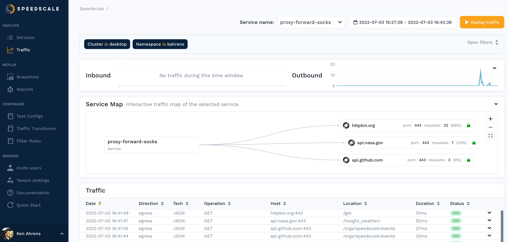

import Tabs from '@theme/Tabs';
import TabItem from '@theme/TabItem';
import AWSNetworking from './\_vm_aws.mdx'
import GCPNetworking from './\_vm_gcp.mdx'

## Prerequisites

1. [Speedctl is installed](../../quick-start.md)

## Setting up local capture

Run:

```bash
speedctl capture <service_name> <service_port> --daemon
```

This will setup Speedscale proxies for both inbound and outbound capture.

To test out the inbound capture mechanism, you can make requests as you normally would but using `localhost:4143` instead of the port your app is serving on.

To configure outbound capture, configure your application to use the socks
[proxy](../../reference/glossary.md#proxy) running on `*:4140` on your server, and
configure it to [trust the local certificates](/setup/sidecar/tls/#trusting-tls-certificates).

## Setting up global capture

The steps above setup an inbound proxy on port `4143` that forwards requests to your app but so far we've only captured request explicitly going to that port. To capture all existing traffic going into your app, you'll need to edit your load balancer.

<Tabs>

<TabItem value="aws" label="AWS">

<AWSNetworking/>

</TabItem>

<TabItem value="gcp" label="Google Cloud">

<GCPNetworking/>

</TabItem>

</Tabs>

## Analyze Traffic



You should be able to see traffic in the Speedscale UI after a few minutes and
now you can using this traffic to [create a snapshot](../../guides/creating-a-snapshot.md).

## Replaying Traffic

Replaying traffic is similar to the capture step
above. Run `speedctl replay <snapshot_id>`

This will generate a [report](../../reference/glossary.md#report) which you can find on the [reports page](../../guides/reports/README.md).
