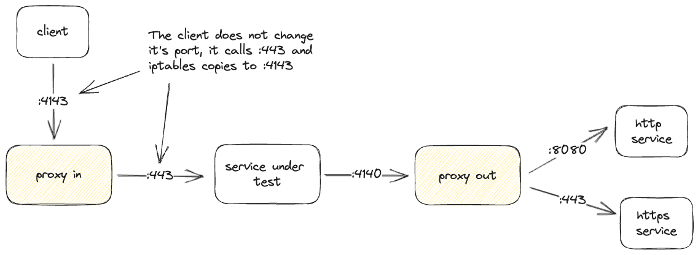

import Tabs from '@theme/Tabs';
import TabItem from '@theme/TabItem';

In Kubernetes, Speedscale employs a sidecar (also known as `goproxy`) to capture network level traffic for individual services. The sidecar uses two server sockets to capture traffic:

- Port 4143 - used to capture inbound traffic
- Port 4140 - used to capture outbound traffic

The sidecar or init container uses these ports "intercept" traffic transparently. Here is a basic diagram that shows a client making a call to a service under test, and that service makes subsequent calls to other backend systems. Of course some calls may use an http port like 80 or 8080 (or pick your favorite port), other times the service may use https on port 443 and be using TLS traffic.


The Speedscale sidecar proxy, [goproxy](/reference/glossary.md#goproxy), is
used to collect data from an existing application.  To capture
[traffic](/reference/glossary.md#traffic), requests to and from your
application will need to be routed through the proxy.

:::info
Speedscale also supports alternate data collectors including log scraping and even a pre-GA eBPF option (contact support for more information). Envoy WASM plug-ins are not supported because of limitations in the current WASM implementation. WASM plug-ins present limitations for this use case including lack of complete data visibility, lack of support for non-HTTP protocols and a challenging configuration experience.
:::


<iframe src="https://player.vimeo.com/video/986454551?badge=0&amp;autopause=0&amp;player_id=0&amp;app_id=58479" width="640" height="582" frameborder="0" allow="autoplay; fullscreen; picture-in-picture" allowfullscreen></iframe>
<p><a href="https://vimeo.com/986454551">Bootstrapping Traffic Capture</a> from <a href="https://vimeo.com/speedscale">Speedscale</a> on <a href="https://vimeo.com">Vimeo</a>.</p>

:::tip
The [envoy](https://www.envoyproxy.io/docs/envoy/latest/intro/arch_overview/listeners/listeners#tcp) proxy (aka Istio) uses the same architecture to redirect traffic. Your platform or security team may already be familiar with this approach.
:::

## Installation

There are several ways to install the sidecar in your cluster.  See the [proxy
configuration reference](/reference/proxy_config.mdx) for proxy configuration
outside of a cluster.

<Tabs>

<TabItem value="webapp" label="Web App">

From the [Speedscale web app](https://app.speedscale.com/) click on `Add
service` to launch the add service wizard which will walk you through
configuration and verification tailored to your environment.

</TabItem>

<TabItem value="annotation" label="Kubernetes Annotation">

With cluster access you can add the sidecar with an annotation on your
workload.

Please ensure the [Kubernetes Operator](../install/kubernetes-operator.md) is
running in your cluster before moving on.

Select the workload (daemonset, deployment, statefulset, job or replicaset)
you'd like to monitor and add the following annotation:

```yaml
annotations:
  sidecar.speedscale.com/inject: "true"
```

That's it. Next time you deploy you can check the pods with get pods.

```
kubectl -n <namespace> get pods
```

You should notice your container count increases by one and data should be flowing.

```
NAME                            READY   STATUS    RESTARTS   AGE
carts-xxxxxxxxxx-xxxxx          2/2     Running   0          38d
```

By default, the Speedscale init container starts after any existing init
containers in the workload.

</TabItem>

</Tabs>

## Removal

If you already have the sidecar installed, but you need for it to be removed,
you may either set the `sidecar.speedscale.com/inject` annotation to `false`,
or remove it:

```yaml
annotations:
  sidecar.speedscale.com/inject: "false"
```

After deploying or patching your deployment, you should notice your container
count decrease by one and the sidecar is no longer attached.

Use `speedctl uninstall` to remove all Speedscale components.

