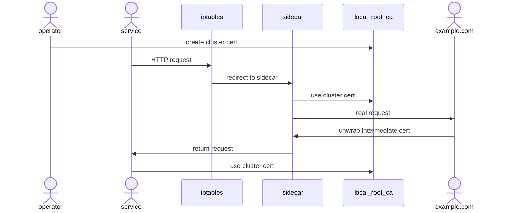

import Mermaid from '@theme/Mermaid';

# TLS Support

TLS interception and unwrapping is not enabled by default, but can be done so with annotations to your workload.

:::tip Remember
When using the annotation examples below, be sure to _add_ them to any existing annotations on your workload. It's common to delete existing annotations or add the annotations in the wrong place (like on the pod instead of the deployment) in this step.
:::
<iframe src="https://player.vimeo.com/video/1035399678?badge=0&amp;autopause=0&amp;player_id=0&amp;app_id=58479" width="640" height="582" frameborder="0" allow="autoplay; fullscreen; picture-in-picture" allowfullscreen></iframe>
<p><a href="https://vimeo.com/1035399678">How Speedscale reads TLS requests</a> from <a href="https://vimeo.com/speedscale">Speedscale</a> on <a href="https://vimeo.com">Vimeo</a>.</p>


## TLS Inbound Interception

The sidecar will be listening for incoming requests, and must present to the client the correct
certificate. Because you already have TLS configured, the cert files you are using must be provided to the
sidecar. There are three available settings:

- `tls-in-secret` (required) is the name of the Kubernetes secret
- `tls-in-private` (optional) is the filename of the private key inside the secret (default: `tls.key`)
- `tls-in-public` (optional) is the filename of the public cert inside the secret (default: `tls.crt`)

When your deployment is injected, the sidecar will have an extra environment variable `TLS_IN_UNWRAP=true`,
`TLS_IN_PUBLIC_KEY`, `TLS_IN_PRIVATE_KEY` and a volume mount to access the files from the provided secret.

```yaml
annotations:
  sidecar.speedscale.com/inject: "true"
  sidecar.speedscale.com/tls-out: "true"
  sidecar.speedscale.com/tls-in-secret: "my-tls-secret"
  sidecar.speedscale.com/tls-in-private: "tls.key"
  sidecar.speedscale.com/tls-in-public: "tls.crt"
```

## TLS Outbound Interception

To unwrap outbound TLS calls there are multiple steps required:

- Configure the sidecar to enable outbound TLS interception
- Configure your application to trust the new TLS Certificates

When your deployment is injected, the sidecar will have an extra environment variable `TLS_OUT_UNWRAP=true`
and a volume mount to access the files from the `speedscale-certs` secret. The operator will automatically
create a secret named `speedscale-certs` and put into the namespace. All that is required is to add this
annotation to your deployment:

```yaml
annotations:
  sidecar.speedscale.com/inject: "true"
  sidecar.speedscale.com/tls-out: "true"
```

## Mutual Authentication for Outbound Calls

If your backend system requires [Mutual Authentication](https://tools.ietf. Org/html/rfc8120) (aka Mutual
TLS or 2-Way TLS), this requires configuring the sidecar with an additional X509 key pair. During the TLS
handshake, the backend system will request a Client Certificate. This is the certificate that goproxy will
present. There are three available settings:

- `tls-mutual-secret` (required) is the name of the Kubernetes secret
- `tls-mutual-private` (optional) is the filename of the private key inside the secret (default: `tls.key`)
- `tls-mutual-public` (optional) is the filename of the public cert inside the secret (default: `tls.crt`)

When your deployment is injected, the sidecar will have extra environment variables `TLS_MUTUAL_PUBLIC_KEY`
and `TLS_MUTUAL_PRIVATE_KEY` and a volume mount to access the files from the provided secret. You must
provide a Kubernetes secret that has the TLS private key and public cert. The name of the secret and the names
of the files can be provided to `operator` to inject automatically.

```yaml
annotations:
  sidecar.speedscale.com/inject: "true"
  sidecar.speedscale.com/tls-out: "true"
  sidecar.speedscale.com/tls-mutual-secret: "my-tls-secret"
  sidecar.speedscale.com/tls-mutual-private: "tls.key"
  sidecar.speedscale.com/tls-mutual-public: "tls.crt"
```

## Trusting TLS Certificates

Now that TLS outbound calls are intercepted by goproxy, you must configure your application to trust the
speedscale-certs from your cluster. If you skip this step you will get errors in your application.

Speedscale will attempt to use the Root CA Cert in the `speedscale-certs` secret. Intercepted TLS calls will
have a new cert that is generated from this Root CA. So your application needs to trust this Root CA for TLS
calls to be handled automatically.

:::danger
Configuring TLS trust is, in most cases, language specific. Every runtime language has different characteristics and if you do
not configure this correctly you will get TLS/SSL errors. Always configure this in a controlled environment
first.
:::

### TLS Trust for macOS

For desktop capture and replay add the Speedscale TLS certificate to your
macOS keychain to allow your applications to make TLS requests to Speedscale
components.

After using [speedctl](/reference/glossary.md#speedctl) certificates will be
created in your home directory. Use [this Apple user
guide](https://support.apple.com/guide/keychain-access/add-certificates-to-a-keychain-kyca2431/mac)
to add the certificate located at `~/.speedscale/certs/tls.crt` to your
keychain.

Once added double click the **Speedscale** certificate, expand the **Trust** section,
and set **When using this certificate:** to **Always Trust**.

### TLS Trust for golang

Go applications honor the environment variable `SSL_CERT_FILE` which is automatically injected by the
operator. This will point to the location where the speedscale cert volume mount is placed.

### TLS Trust for NodeJS

NodeJS applications newer than v7.3.0 can be customized with an environment variable `NODE_EXTRA_CA_CERTS`
which is automatically injected by the operator. This will point to the location where the speedscale cert
volume mount is placed.

### TLS Trust for Ruby

Ruby applications honor the environment variable `SSL_CERT_FILE` which is automatically injected by the
operator. This will point to the location where the speedscale cert volume mount is placed.

### TLS Trust for .NET

.NET applications honor the environment variable `SSL_CERT_FILE` which is automatically injected by the
operator. This will point to the location where the speedscale cert volume mount is placed.

:::info
.NET Core uses OpenSSL on Linux and Mac which respects these default settings. The default Microsoft .NET Docker base images are Linux based which means these settings apply, however running Windows based workloads may require additional configuration
:::

### TLS Trust for Java

Java applications utilize a truststore to determine which certificates will be trusted. During Operator
installation a secret called `speedscale-jks` will be created that contains the `speedscale-certs` root CA
along with a standard set of CA certs used by `openjdk`. This secret is automatically mounted when the
`tls-out` setting is configured as shown below. The Java app itself needs to be configured to use this secret
as well which requires configuring your JVM to use the truststore with these settings:

- `-Djavax.net.ssl.trustStore=/etc/ssl/speedscale/jks/cacerts.jks`
- `-Djavax.net.ssl.trustStorePassword=changeit`

These flags are also surfaced as `SPEEDSCALE_JAVA_OPTS` for reference.

Here is an example of a patch file that configures TLS Out and configures the Java app to use the mounted
trust store. You will likely have to customize this for your environment.

:::caution
Applying patches that set `JAVA_OPTS`, like the ones below, are **not** additive. If your workload already has
`JAVA_OPTS` environment settings, be sure to include those as well or they will be overwritten.
:::

```yaml
apiVersion: apps/v1
kind: Deployment
metadata:
  name: sprint-boot-app
  annotations:
    sidecar.speedscale.com/inject: "true"
    sidecar.speedscale.com/tls-out: "true"
spec:
  template:
    spec:
      containers:
        - name: sprint-boot-app
          env:
            - name: JAVA_OPTS
              value: >-
                -Djavax.net.ssl.trustStore=/etc/ssl/speedscale/jks/cacerts.jks
                -Djavax.net.ssl.trustStorePassword=changeit
```

## How Does It Work?

The following explanations are provided for engineers seeking a deeper understanding of how TLS unwrapping takes place. Tools like [envoy](https://www.envoyproxy.io/docs/envoy/latest/intro/arch_overview/listeners/listeners#tcp) follow an almost identical procedure with their sidecars and this is not Speedscale-specific knowledge. Also keep in mind that Speedscale supports alternative ingest mechanisms including HTTP file and Postman collection import. See the [integrations](/integration/import/http_wire/) section for more information.

### Inbound

Your application is already presenting a public TLS certificate to clients, and the clients must trust this certificate. That means they are either “real” certificates signed by a public CA (certificate authority) or they are otherwise managed certificates using a tool like cert-manger in Kubernetes. Since the certificates are already present in the cluster and your app presents them to clients as trustworthy, Speedscale simply needs to know where the certificates are located so it can decode a copy of the traffic in the same way the service does. Conceptually, it looks like this:


In this mode, the sidecar is acting as a passthrough. It copies the traffic to the Speedscale forwarder, but does not modify the traffic itself.

### Outbound



- The application makes it’s call as normal for instance to `https://example.com:443`
- The iptables rule modifies the intended destination and changes the port to `4140` where the sidecar is listening, and the sidecar initiates the outbound call transparently to the application (no code change required).
- The sidecar checks the application client request to determine if the TLS handshake is starting and finds the intended destination.
- The sidecar generates a TLS certificate for the SNI hostname ( [`example.com`](http://example.com) in our case) that will expire in 1 hour and signs with the Cluster Root CA that was created as part of the operator installation. The certificate is stored in the sidecar local cache which it will use for the next hour.
- As long as the application is properly configured to trust the Cluster Root CA, the certificate will match both the domain being accessed as well as be a trusted certificate.
- After this successful handshake, the sidecar has access to all of the details of the request and the response. Note that because this is at the transport layer it works for non-HTTP protocols like databases and queue systems as well.

In this mode, the sidecar is actively re-signing traffic so that your service is interacting with the Speedscale sidecar and the sidecar is then interacting with the external service. This is similar to tools like [mitmproxy](https://mitmproxy.org/).

:::tip BETA
Sidecar proxies are slowly being replaced by eBPF-based collections but platform support is not wide enough for enterprise full adoption yet. If you're interesting in an eBPF-based collector please reach out to [support](https://slack.speedscale.com).
:::