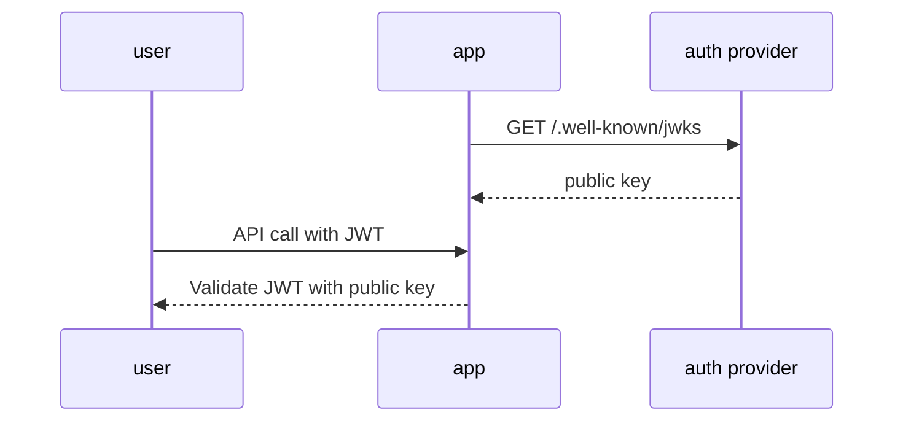
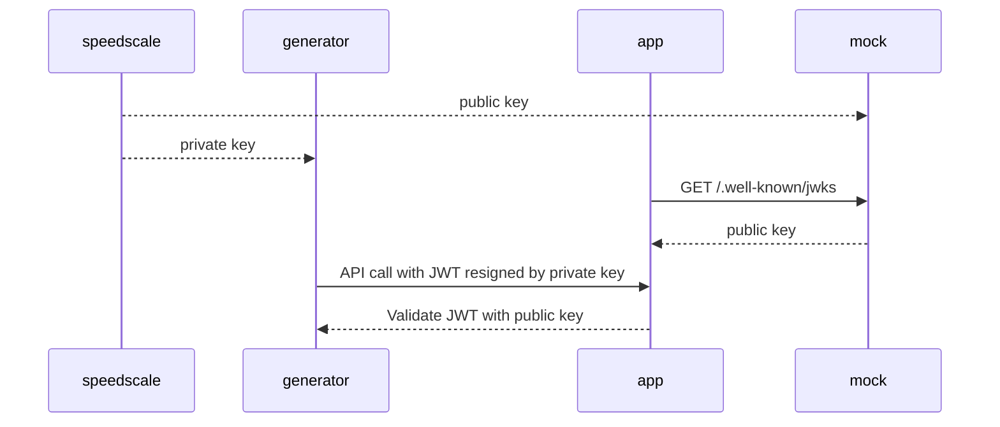

# JSON Web Key Sets (JWKS)

## The Problem

When a snapshot of traffic is capture, it most likely has [expired JWTs](../../guides/replay/resign-jwt.md). When replaying this traffic, we need to resign the JWTs so that the app being tested doesn't reject requests as unauthorized. If your app follows the JWKS pattern, Speedscale has a way to resign these JWTs without needing access to your private key.

## What is JWKS?

JSON Web Key Set (JWKS) is a standardized format for publishing public cryptographic keys used to verify JSON Web Tokens (JWTs). It provides a way for applications to discover and retrieve the public keys needed to validate JWT signatures without hardcoding them. This is a common pattern with auth providers such as Auth0, Keycloak, Okta, etc. and you can read more about this pattern [here](https://auth0.com/docs/secure/tokens/json-web-tokens/json-web-key-sets).

## Normal Flow

1. Your app asks your auth provider for the JWKS.
1. The app stores this public key information from the JWKS.
1. Any requests coming into your app must have a JWT that is signed with the corresponding private key for the JWKS.

# With Speedscale

When using the JWKS discovery option, at replay time Speedscale can intercept both sides of the conversation to ensure JWTs are resigned and verified by the app.

1. Speedscale generates a keypair and gives the mock the public key and the generator the private key.
1. Now when your app requests the auth provider for the JWKS, our mock returns the public key.
1. When the generator sends a request to the app, it finds any JWTs in the request and resigns them with the private key.
