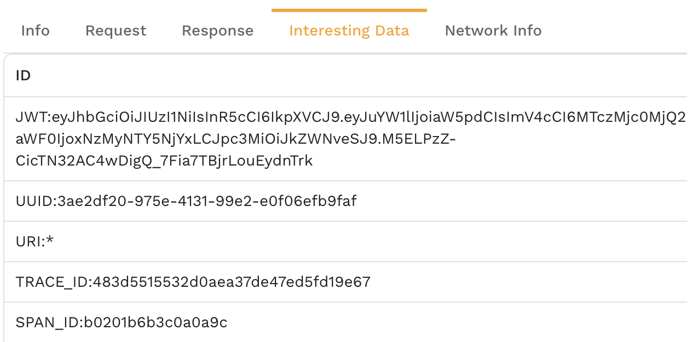

# Non-Idempotent Requests

Non-idempotent requests, or requests that change the backend database (for non-Computer Science professors), pose an almost insurmountable problem for traditional service mocking or virtualization techniques. These transactions change backend systems in some way that causes simplistic service mocks to maybe respond correctly or the first request, but not subsequent requests. Many traffic replay efforts stall at testing basic GETs because the environment can't tolerate change. Most service mocks are hard coded to return one response per request and do not attempt to interpret the logic as an actual backend system would. Fortunately, Speedscale has a set of algorithms and techniques that eliminate many of these headaches. 

## Challenges of Change

The principal challenges that make non-idempotent transactions so challenging to simulate include:

* Parameterization - how do you know what data needs to be modified in order to replay?
* Trace-through data integrity - if the client requests a data item then will the database mock realize it needs to contain that data?
* Mid-session recording - what if you only get part of a client-server session mid-stream?
* Mutating responses - what happens if there is more than one possible response for a particular request signature?

In the past, it would be up to the engineer writing the mock to try and handle these issues.

## Parameterization

The first step in creating consistent and repeatable replication is to parameterize fields and decide what modifications may need to be made. Speedscale calls this `Interesting Data` and it is discovered automatically during the analysis process. Your data will vary wildly but you know it's working when you see this type of data:

## Trace-Through

Let's imagine we have a request with an HTTP header `name=sabrina`. THe service you are working on may take that data and insert it into a database query like `SELECT balance WHERE name IS sabrina`. If you want to run the same scenario with a variety of users then the database mock must know what names are expected to be in the database and which are not. In many cases Speedscale will automatically determine the correct pattern for replication but constructing a transform chain to replace these values usually involves following a pattern like the one in this [guide](../guides/smart_replace.md).

## Mid-session Recording

Some client-server connections are very long lived. As a result, you may record a snapshot where authentication never takes place and you don't know how to log into the service. Fortunately, this problem is rare because Speedscale retains data for days and you can go back to find the login and merge it into a larger snapshot (see [example](../guides/replay/multi-service-replay/#merge-snapshots)). You also can manually build the authorization request and import from Postman in a similar workflow.

## Mutating Responses

Most complex APIs reply with a different response depending on their internal state. For example, you may request a list of attendees in a database, add an attendee in the next call and then get a different response now that the table is populated. Speedscale automatically determines these flows of requests based on signature pattern and connects them. No manual configuration is required.