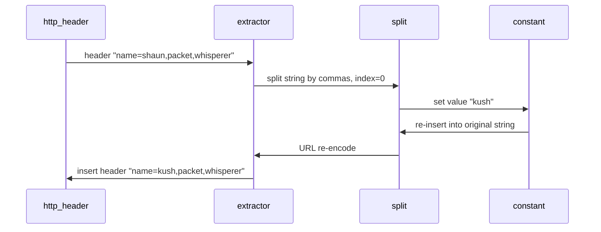
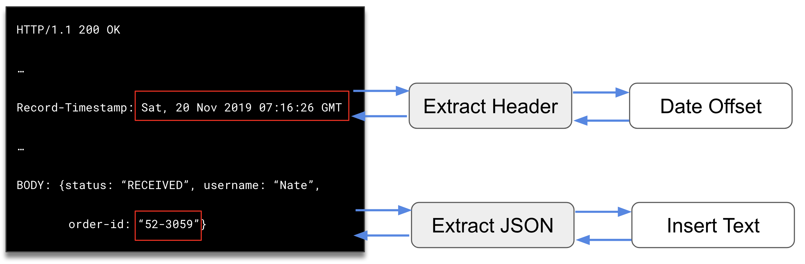
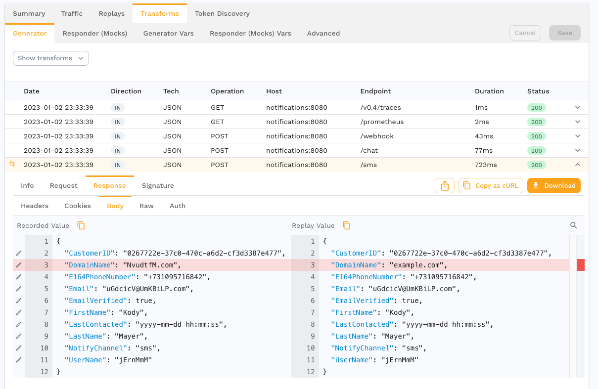
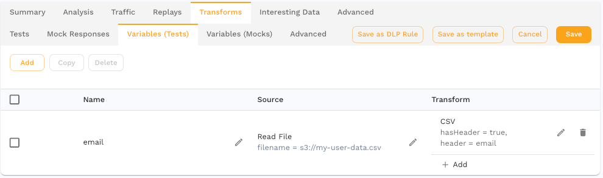

import Mermaid from '@theme/Mermaid';

# Overview

This section describes how to modify traffic before replay. Most of the examples in this section are written for the generator before it sends requests. The same system and principles work with service mocks. You can learn about how to apply transforms to mocks in the [mocking](../mocks/mocks.md) section.

## Process of Traffic Transformation

Once a set of traffic has been recorded, it most likely will require some type of modification to replay correctly. When testing a service this is obvious because inbound `Accuracy` in your report will be less than 100%. If your outbound mocks are inaccurate it will show as a less than 100% match accuracy rate. These numbers indicate how closely your app behavior is consistent between original recording and replay.

To test whether a snapshot is ready for replay, you can start with the following procedure:

1. Run a simple 1x regression report against your application (see the [tutorial](../tutorial.md) for a refresher on how to run a replay)
2. If report Accuracy < 100%, investigate what calls don't return the expected result by clicking on the individual requests. Typically this means looking at the data returned by the app during replay and looking for error codes, incorrect responses, etc.
3. Apply data transformations to the snapshot to modify the data to make it acceptable for replay.
4. Re-run from step 1 until inbound report accuracy is acceptable.
3. Run a simple 1x regression *with mocks*
4. If report Match Rate < 100%, modify [signatures](../mocks/signature.md) on the RRPairs until all necessary service mocks match.

Finding the right data transformations often times involves an iterative process of checking the Accuracy %, making a modification based on what the app returns and then running another replay. Once the accuracy and mock match percentage are high enough, more sophisticated tests can be attempted like 100x performance.

## Extractors and Transforms

Speedscale provides a general purpose data transformation system designed to provide automated data modification without scripting. The Speedscale transform system works similarly to Unix pipes. Data is modified and then handed down a chain of mini-scripts called transforms. These miniature script components when combined form a "transform chain" that make micro-changes to a request/response pair (RRPair). For example, let's assume we wanted to take an RRPair with an HTTP Header value `name=shaun` and covert it to `kush`. The transform chain to affect this modification might look like this:

```
http_header("name")<->split(",",index=0)<->constant("kush")
```



First, data is extracted from the [RRPair](/reference/glossary.md#rrpair) using an **Extractor**. All transform chains start with an extractor because it tells Speedscale what data token or "string" should be modified in the RRPair. For example, an extractor might pull the value of a particular HTTP Query Parameter in an request. Extractors always produce a string that can be further transformed. The extracted string is called a **token** throughout this documentation.

Next, the token is mutated or further isolated using a **Transform**. Transforms can do simple things like change the data to a hard coded text value. They can also do more complex things like parse and shift a date or insert a value selectively like a switch statement in a programming language. Transforms are always executed sequentially.

Transforms also have a data cache where **variables** can be stored. Variables function as named short term storage for the life of the request, just like in a programming language hashmap.

Last, the transformed data is re-inserted into the RRPair in exactly the same location. Each transform runs in reverse order to re-encode the new **token** and place it back in its correct place.



## Where to Transform Traffic

Modify traffic and see the effects with the transform editor.



Data can be transformed at several points during a replay:

- **generator**
  - **RRPair request** - modify data before the [generator](/reference/glossary.md#generator) sends it to the [SUT](/reference/glossary.md#sut)
  - **RRPair response** - extract data from the response the generator receives from the SUT
- **responder**
  - **RRPair request** - modify a request received by the [responder](/reference/glossary.md#responder) before attempting to pattern match a response
  - **RRPair response** - modify captured response data before the responder sends it back to the SUT

Variable caches store data extracted from traffic in one location and apply it in another:



- **Variables (Tests)** - used to pre-load the variable cache when the generator starts up
- **Variables (Mocks)** - used to pre-load the variable cache when the responder starts up

:::note
Test variables are scoped to the [vUser](/reference/glossary.md#vuser). For example, a random string variable would be new and different for each VU, but the same for all requests within the same VU.
:::

How can the request and response both use the same transforms? Because each transform chain starts with an extractor that specifically targets the request or the response. In the generator, that means if the extractor references the HTTP Request Body, then the request will be modified before it is sent to the SUT. If an HTTP Request Body is extracted in a responder chain, then the request is modified before signature matching (response lookup) is run.

A complete set of traffic transformation configuration is stored as a Traffic Transform Template (TTT). You can view and edit these in the main [UI](https://app.speedscale.com/trafficTransforms). Although TTT's can be edited graphically, they are stored as JSONs for easy portability.

## Traffic Transform Templates

Traffic Transform Templates allow you to save transform configurations from one snapshot and reuse them in subsequent snapshots. This enables you to:

- **Save Time**: Once you've perfected transforms for a particular API or service, save them as a template to apply instantly to future recordings
- **Ensure Consistency**: Apply the same data modifications across multiple test scenarios without manual reconfiguration
- **Share Knowledge**: Export templates as JSON files to share with team members or across environments

### How to Use Transform Templates

<iframe src="https://player.vimeo.com/video/1109642612" width="640" height="360" frameborder="0" allow="autoplay; fullscreen; picture-in-picture" allowfullscreen></iframe>

1. **Create a Template**: After configuring transforms in a snapshot that achieve your desired accuracy, save them as a template
2. **Apply to New Snapshots**: When working with new traffic recordings, select and apply your saved template
3. **Customize as Needed**: Templates provide a starting point - you can further modify transforms for specific test scenarios

Templates are particularly useful for:
- APIs with consistent authentication patterns
- Services that require similar data sanitization
- Test scenarios that need identical transform chains across multiple snapshots

