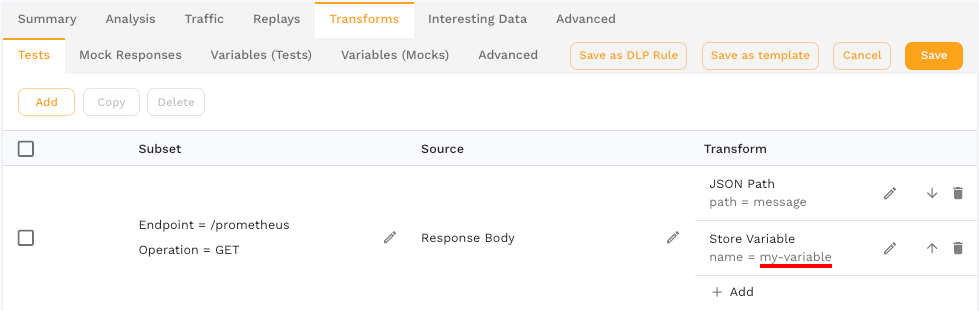
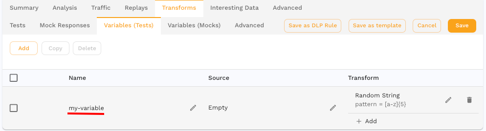
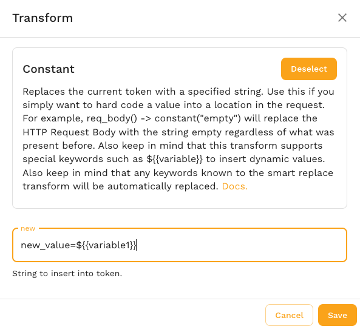
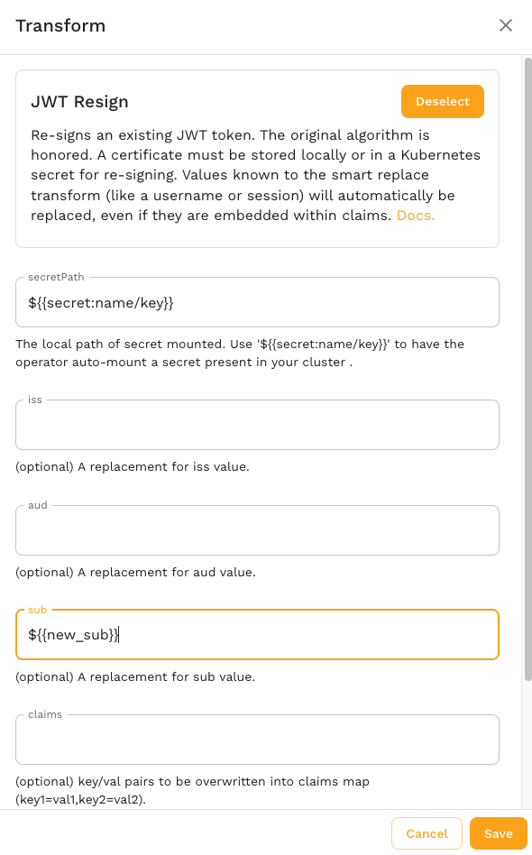

# Variables

Variables allow you to store a piece of data persistently across requests. Variables are stored using a key and value and can be loaded at any time.

## Variables

Transform variables provide a way to share data between requests.  For example, you may want to store an ID from the response body of one request and use it in the URL of another.

Variables can be thought of as a map of key=value pairs. Once set, they can be retrieved and modified using a set of transforms including:

- **[var_store](/transform/transforms/variable_store)** - Assign a new value to a variable
- **[var_load](/transform/transforms/variable_store)** - Replace current value with the value of a variable

This is the simplest way to interact with the variable storage system, but not necessarily the most powerful. Keep in mind that [smart replace](/transform/transforms/smart_replace.md) transforms are independent of the variable cache and changes made in one will not be reflected in the other. Variables are for custom use cases. Smart replace is for more automated use cases and is a better starting place for most users.

### Scope

Variables created in the Tests tab are scoped to the current [vUser](/reference/glossary.md#vuser) or "thread" within the load generator, which runs through the snapshot traffic at most 1 time. Each vUser has a separate variable cache, just like HTTP clients talking to the same server don't share information.



If you need more of a "global replace" functionality you should use variables from the Variables tab.  Transforms created here are run once at the start of each vUser.



### Embedded

Variable values can be embedded within other transforms with the following format:

```
${{variable1}}
```

This string will be replaced with the value of that variable (if known) wherever it is found in the transform configuration. For example, you may want to embed a variable inside of another constant to produce the result `new_value=<some new value from variable 1>`:



This also works inside of configuration fields in other transforms, like `jwt_resign`:



By understanding these scoping rules, engineers using the Speedscale transform system can effectively replicate some aspects of scripting languages.

