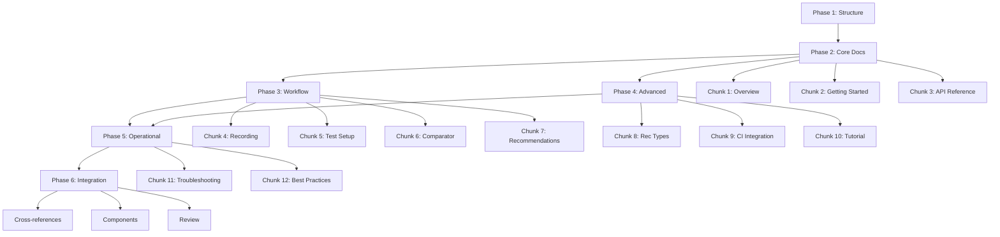

# QABot Documentation Implementation Plan

**Project:** QABot Feature Documentation
**Date:** 2025-12-12
**Documentation Structure:** Docusaurus
**Approach:** Dedicated QABot Section (Option 1)

## Executive Summary

This plan outlines the implementation of comprehensive technical documentation and tutorials for the QABot feature. QABot automates the creation of realistic and reliable tests and service mocks using traffic replay comparison and automatic Recommendations generation.

## Directory Structure

```
docs/qabot/
├── _category_.json
├── index.md                          # Overview & What is QABot
├── getting-started.md                # Quick-start guide
├── workflow/
│   ├── _category_.json
│   ├── 01-recording-snapshots.md
│   ├── 02-test-application-setup.md
│   ├── 03-running-comparator.md
│   └── 04-recommendations.md
├── recommendations/
│   ├── _category_.json
│   └── types.md                      # OAuth, timestamps, rotating IDs
├── integration/
│   ├── _category_.json
│   └── ci-pipeline.md
├── tutorials/
│   ├── _category_.json
│   └── end-to-end.md
├── best-practices.md
├── troubleshooting.md
└── reference/
    ├── _category_.json
    └── configuration.md
```

## Implementation Phases

### Phase 1: Foundation & Structure Setup

**Deliverables:**
- Create directory structure
- Configure sidebar navigation
- Set up category metadata files

**Conventions (Verified):**
- Top-level label: "QABOT" (all caps, matching existing pattern)
- Subdirectory labels: Title Case (e.g., "Workflow", "Recommendations")
- _category_.json format: Simple {label, position} structure (no generated-index link)
- No "collapsed" property in _category_.json files
- Sidebar placement: Before TRANSFORM section (explicit ordering)

**Tasks:**

1. **Create Directory Structure**
   ```bash
   mkdir -p docs/qabot/{workflow,recommendations,integration,tutorials,reference}
   ```

2. **Create Category Metadata Files**

   File: `docs/qabot/_category_.json`
   ```json
   {
     "label": "QABOT",
     "position": 5
   }
   ```

   File: `docs/qabot/workflow/_category_.json`
   ```json
   {
     "label": "Workflow",
     "position": 2
   }
   ```

   File: `docs/qabot/recommendations/_category_.json`
   ```json
   {
     "label": "Recommendations",
     "position": 3
   }
   ```

   File: `docs/qabot/integration/_category_.json`
   ```json
   {
     "label": "Integration",
     "position": 4
   }
   ```

   File: `docs/qabot/tutorials/_category_.json`
   ```json
   {
     "label": "Tutorials",
     "position": 5
   }
   ```

   File: `docs/qabot/reference/_category_.json`
   ```json
   {
     "label": "Reference",
     "position": 6
   }
   ```

3. **Update Sidebar Configuration**

   File: `sidebars.js` (insert BEFORE TRANSFORM section, after tutorial)
   ```javascript
   {
     type: "category",
     label: "QABOT",
     items: [{ type: "autogenerated", dirName: "qabot" }],
     collapsed: true,
   },
   ```

### Phase 2: Core Documentation (Agent Group 1)

**Agent Assignment:** Foundation Documentation Agent
**Estimated Files:** 3
**Dependencies:** Phase 1 complete

#### Chunk 1: QABot Overview and Conceptual Documentation

**File:** `docs/qabot/index.md`

**Content Requirements:**
- Frontmatter with title, description, sidebar_position
- What is QABot and why it exists
- Problem statement: data integrity issues in CI pipelines
- Solution approach: replay comparison + Recommendations
- High-level architecture diagram (mermaid)
- Key concepts: Snapshots, Comparator, Recommendations, MockBot
- How QABot fits into the Speedscale ecosystem
- Link to getting-started guide
- Target audience: Decision makers, architects, new users

**Related Images:**
- Architecture diagram showing recording → replay → comparison → recommendations flow
- Before/after comparison showing improved test reliability

**Cross-references:**
- Link to /concepts/capture.md for snapshot background
- Link to /concepts/replay.md for replay basics
- Link to /concepts/service_mocking.md for mock context

#### Chunk 2: Getting Started with QABot

**File:** `docs/qabot/getting-started.md`

**Content Requirements:**
- Frontmatter with sidebar_position: 1
- Prerequisites (Speedscale installed, CLI access, existing snapshot)
- Quick-start steps (30 minutes or less)
- Minimal example with expected output
- Success criteria (what good results look like)
- Next steps and links to detailed workflow
- Common first-time issues and solutions
- Target audience: Developers getting started

**Code Examples:**
- CLI commands for basic QABot run
- Example output showing Recommendations
- Sample configuration file

**Cross-references:**
- Link to /setup/install/cli.md for prerequisites
- Link to workflow/01-recording-snapshots.md for snapshot creation
- Link to tutorials/end-to-end.md for complete walkthrough

#### Chunk 3: API Reference Documentation

**File:** `docs/qabot/reference/configuration.md`

**Content Requirements:**
- Frontmatter with title and description
- Complete configuration schema
- CLI command reference for QABot
- Environment variables
- YAML/JSON configuration format
- All parameters with types, defaults, and descriptions
- Advanced configuration options
- Performance tuning parameters
- Target audience: Advanced users, CI/CD engineers

**Format:**
- Tables for parameter reference
- Code blocks for example configurations
- Admonitions for important notes

**Cross-references:**
- Link to /reference/configuration/ for related config
- Link to integration/ci-pipeline.md for CI usage

### Phase 3: Workflow Documentation (Agent Group 2)

**Agent Assignment:** Workflow Tutorial Agent
**Estimated Files:** 4
**Dependencies:** Phase 2 complete

#### Chunk 4: Recording Traffic Snapshots

**File:** `docs/qabot/workflow/01-recording-snapshots.md`

**Content Requirements:**
- Overview of snapshot recording for QABot
- What traffic gets captured (HTTP, API, Database)
- Recording methods (sidecar, proxy, agent)
- Scope and filtering for optimal recordings
- Recording duration and size considerations
- Storage and snapshot naming conventions
- Quality criteria for QABot-ready snapshots
- Troubleshooting recording issues
- Target audience: QA engineers, developers

**Interactive Elements:**
- Tabs for different recording methods
- Code examples for CLI commands
- Screenshots of snapshot in UI

**Cross-references:**
- Link to /guides/creating-a-snapshot.md for detailed capture
- Link to /concepts/capture.md for capture concepts
- Link to workflow/02-test-application-setup.md (next step)

#### Chunk 5: Test Application Setup Requirements

**File:** `docs/qabot/workflow/02-test-application-setup.md`

**Content Requirements:**
- Environment requirements for QABot testing
- Test application preparation checklist
- Network configuration and connectivity
- Dependency management for reproducibility
- Isolation and idempotency considerations
- Database state and data management
- Service dependency mocking options
- Resource requirements (CPU, memory)
- Target audience: DevOps, test engineers

**Diagrams:**
- Test environment architecture
- Network topology for isolated testing

**Cross-references:**
- Link to /setup/ for environment setup
- Link to workflow/03-running-comparator.md (next step)

#### Chunk 6: Running QABot Comparator

**File:** `docs/qabot/workflow/03-running-comparator.md`

**Content Requirements:**
- How to execute QABot comparator
- CLI command syntax and options
- Multiple replay iteration explanation
- Comparison methodology and algorithms
- Understanding comparison output
- Progress monitoring and logs
- Performance considerations and tuning
- When to stop iterating (convergence criteria)
- Target audience: QA engineers

**Code Examples:**
- Basic comparator run command
- Advanced options and flags
- Output parsing examples

**Interactive Elements:**
- Example output with annotations
- Video or animated GIF of comparator running

**Cross-references:**
- Link to workflow/04-recommendations.md (next step)
- Link to troubleshooting.md for common issues

#### Chunk 7: Recommendations Review and Application

**File:** `docs/qabot/workflow/04-recommendations.md`

**Content Requirements:**
- Understanding Recommendation output format
- Recommendation categories and types
- Manual review process and best practices
- Automatic vs manual application decision tree
- How to apply Recommendations to snapshot
- Validation and verification steps
- Iterative refinement process
- When to re-run comparator
- Target audience: QA engineers, developers

**UI Examples:**
- Screenshots of Recommendations in UI
- Before/after comparison of modified snapshot
- Diff view of applied changes

**Cross-references:**
- Link to recommendations/types.md for details
- Link to /transform/ for understanding modifications
- Link to integration/ci-pipeline.md (using results in CI)

### Phase 4: Advanced Content (Agent Group 3)

**Agent Assignment:** Integration & Advanced Agent
**Estimated Files:** 3
**Dependencies:** Phase 3 complete

#### Chunk 8: Common Recommendation Types Deep Dive

**File:** `docs/qabot/recommendations/types.md`

**Content Requirements:**
- OAuth token handling and re-signing
- Timestamp normalization strategies (relative vs absolute)
- Rotating ID management (UUIDs, session IDs)
- Session token and cookie handling
- API key and credential management
- Sequence number handling
- Database auto-increment ID handling
- Custom transformation examples
- How to extend with custom Recommendations
- Target audience: Advanced users, troubleshooters

**Technical Details:**
- Detailed examples for each type
- Transform chains generated by QABot
- Pattern matching algorithms used
- Configuration options per type

**Cross-references:**
- Link to /transform/ documentation
- Link to /transform/jwt.md for JWT details
- Link to troubleshooting.md for type-specific issues

#### Chunk 9: CI Pipeline Integration Tutorial

**File:** `docs/qabot/integration/ci-pipeline.md`

**Content Requirements:**
- Overview of QABot in CI/CD workflows
- GitHub Actions integration example
- GitLab CI integration example
- Jenkins pipeline integration example
- Automated replay and validation
- Failure handling and retry logic
- Reporting and notifications
- Scheduled QABot runs
- Environment-specific configurations
- Target audience: DevOps engineers, SREs

**Code Examples:**
- Complete GitHub Actions workflow file
- GitLab CI pipeline configuration
- Jenkinsfile example
- Docker-based QABot execution

**Best Practices:**
- When to run QABot in CI (on merge, nightly, etc.)
- Caching strategies for snapshots
- Parallel execution considerations

**Cross-references:**
- Link to /integration/cicd/ for general CI integration
- Link to reference/configuration.md for CI-specific config
- Link to best-practices.md

#### Chunk 10: End-to-End Tutorial with Example

**File:** `docs/qabot/tutorials/end-to-end.md`

**Content Requirements:**
- Complete walkthrough with sample application
- Real-world scenario (e.g., e-commerce API)
- Step-by-step from installation to CI integration
- Expected outputs at each stage
- Downloadable example code repository
- Troubleshooting section for tutorial
- Time estimates for each section
- Success criteria and validation
- Target audience: All users learning by example

**Structure:**
- Prerequisites section
- Step 1: Setup (5 min)
- Step 2: Record snapshot (10 min)
- Step 3: Run QABot (15 min)
- Step 4: Review and apply Recommendations (10 min)
- Step 5: Integrate into CI (20 min)
- Validation and next steps

**Interactive Elements:**
- Video walkthrough (optional)
- Copy-paste ready commands
- Example repository link

**Cross-references:**
- Link to all workflow steps
- Link to /tutorial.md for comparison
- Link to getting-started.md as prerequisite

### Phase 5: Operational Documentation (Agent Group 4)

**Agent Assignment:** Operational & Support Agent
**Estimated Files:** 2
**Dependencies:** Phases 2-4 complete

#### Chunk 11: Troubleshooting Guide

**File:** `docs/qabot/troubleshooting.md`

**Content Requirements:**
- Common issues and solutions (FAQ format)
- Comparator failures and debugging
- Recommendation generation issues
- Performance problems and optimization
- Network and connectivity issues
- CI/CD integration problems
- Log analysis and interpretation
- When to contact support
- Known limitations
- Target audience: All users

**Structure:**
- Table of contents with jump links
- Issue categories (Setup, Recording, Comparison, Recommendations, CI)
- Each issue: Symptom → Diagnosis → Solution
- Debug mode and verbose logging instructions

**Format:**
- Collapsible sections for each issue
- Code blocks for error messages
- Step-by-step diagnostic procedures

**Cross-references:**
- Link to relevant workflow documentation
- Link to reference/configuration.md for settings
- Link to community/support resources

#### Chunk 12: Best Practices Guide

**File:** `docs/qabot/best-practices.md`

**Content Requirements:**
- Snapshot recording best practices
- Test environment preparation strategies
- Recommendation review workflow
- Maintenance and snapshot updates
- Team collaboration patterns
- Version control for snapshots
- Documentation and knowledge sharing
- Continuous improvement process
- When to re-record vs transform
- Target audience: Teams adopting QABot

**Organization:**
- Section per workflow phase
- Do's and Don'ts lists
- Decision trees for common choices
- Maturity model for QABot adoption

**Examples:**
- Team workflow diagrams
- Sample review checklists
- Snapshot organization strategies

**Cross-references:**
- Link to all workflow documentation
- Link to /transform/best-practices/ for transform tips
- Link to integration/ci-pipeline.md for CI best practices

### Phase 6: Integration & Polish

**Agent Assignment:** Cross-functional Integration Agent
**Estimated Files:** ~5 modifications
**Dependencies:** All previous phases complete

#### Task 1: Create Cross-References

Update existing documentation to reference QABot:

1. **File:** `docs/concepts/transforms.md`
   - Add section: "Automated Transform Generation with QABot"
   - Link to /qabot/index.md

2. **File:** `docs/transform/overview.md`
   - Add callout box mentioning QABot automation
   - Link to /qabot/getting-started.md

3. **File:** `docs/guides/index.md`
   - Add QABot card component to "Testing & Replay" section
   - Implement QABotCard component in src/components/Cards

4. **File:** `docs/tutorial.md`
   - Add reference to QABot as next step after transforms
   - Link to /qabot/tutorials/end-to-end.md

5. **File:** `docs/integration/cicd/`
   - Add QABot section or separate file
   - Link to /qabot/integration/ci-pipeline.md

#### Task 2: Create Custom Components

**File:** `src/components/Cards.jsx` (or new file)

Create QABotCard component:
```jsx
export function QABotCard() {
  return (
    <a href="/qabot" className="card">
      <h3>QABot</h3>
      <p>Automate test and mock creation with intelligent traffic comparison</p>
    </a>
  );
}
```

#### Task 3: Add Visual Assets

Create/add to `docs/qabot/`:
- Architecture diagram (PNG/SVG)
- Workflow diagram (mermaid or image)
- Screenshot templates for each workflow step
- Video placeholders or embeds

#### Task 4: Documentation Review Checklist

- [ ] All internal links work (test with yarn build)
- [ ] All code examples are tested and working
- [ ] All images have alt text
- [ ] Consistent terminology throughout
- [ ] Consistent code style (bash vs shell, etc.)
- [ ] No broken external links
- [ ] Mobile responsive (check with yarn start)
- [ ] Search functionality works for QABot content
- [ ] Sidebar navigation is logical
- [ ] Breadcrumbs are correct

## Work Allocation Strategy

### Agent 1: Foundation Documentation
- **Files:** 3
- **Chunks:** 1, 2, 3
- **Effort:** Medium complexity, research required
- **Skills:** Technical writing, architecture documentation
- **Timeline:** Can start immediately after Phase 1

### Agent 2: Workflow Documentation
- **Files:** 4
- **Chunks:** 4, 5, 6, 7
- **Effort:** High complexity, detailed step-by-step required
- **Skills:** Tutorial writing, hands-on product knowledge
- **Timeline:** Requires Phase 2 foundation docs for context

### Agent 3: Integration & Advanced
- **Files:** 3
- **Chunks:** 8, 9, 10
- **Effort:** High complexity, technical depth
- **Skills:** DevOps, CI/CD, advanced features
- **Timeline:** Can start in parallel with Agent 2

### Agent 4: Operational Documentation
- **Files:** 2
- **Chunks:** 11, 12
- **Effort:** Medium complexity, requires product knowledge
- **Skills:** Support documentation, best practices
- **Timeline:** Should wait for Phases 2-4 for context

### Agent 5: Integration & Polish
- **Files:** 5+ modifications
- **Tasks:** Cross-linking, components, review
- **Effort:** Low-medium complexity, detail-oriented
- **Skills:** Full-stack (docs + code), QA
- **Timeline:** Final phase after all content exists

## Technical Specifications

### Docusaurus Frontmatter Standard

```yaml
---
title: Page Title
description: Brief description for SEO and preview
sidebar_position: 1
sidebar_label: Custom Label (optional)
---
```

### Image Guidelines
- Format: PNG or SVG preferred
- Max width: 1200px
- Alt text required for accessibility
- Store in same directory as markdown file
- Name format: `qabot-feature-name.png`

### Code Block Standards
- Use language specifiers (```bash, ```yaml, ```javascript)
- Add titles when helpful: ```bash title="Run QABot"
- Keep examples copy-paste ready
- Use comments sparingly
- Show expected output when relevant

### Mermaid Diagrams
- Use for architecture and flow diagrams
- Keep complexity reasonable
- Add alt text in surrounding prose
- Test rendering in both light and dark themes

## Testing & Validation

### Pre-Release Checklist

1. **Build Test**
   ```bash
   yarn build
   # Should complete without errors
   # Check for broken links in output
   ```

2. **Local Development Test**
   ```bash
   yarn start
   # Test navigation
   # Test search functionality
   # Check all links
   ```

3. **Link Validation**
   ```bash
   node test-links.js
   # Should find no broken links
   ```

4. **Content Review**
   - [ ] Technical accuracy verified
   - [ ] All commands tested
   - [ ] Screenshots current and accurate
   - [ ] Consistent voice and tone
   - [ ] No marketing fluff, technical focus

5. **Accessibility Check**
   - [ ] All images have alt text
   - [ ] Headings are hierarchical
   - [ ] Links have descriptive text
   - [ ] Code blocks are readable

## Rollout Strategy

### Soft Launch
1. Merge documentation to main branch
2. Deploy to staging environment
3. Internal review by product and engineering teams
4. Beta user testing with select customers
5. Collect feedback and iterate

### Full Launch
1. Announce in release notes
2. Update main docs homepage with QABot mention
3. Create blog post or changelog entry
4. Update sales/marketing materials
5. Train support team on new docs

### Post-Launch
1. Monitor search queries for missing content
2. Track most-visited pages
3. Collect user feedback
4. Quarterly review and updates
5. Add new content based on user questions

## Success Metrics

- Documentation completeness: 100% of identified chunks
- Internal link integrity: 0 broken links
- Build success: Clean build with no warnings
- User feedback: Positive reception from beta users
- Support ticket reduction: Decrease in QABot-related questions
- Time to first success: Users complete getting-started in <30 min

## Appendix A: File Checklist

### Core Files (Must Have)
- [ ] docs/qabot/_category_.json
- [ ] docs/qabot/index.md
- [ ] docs/qabot/getting-started.md
- [ ] docs/qabot/workflow/_category_.json
- [ ] docs/qabot/workflow/01-recording-snapshots.md
- [ ] docs/qabot/workflow/02-test-application-setup.md
- [ ] docs/qabot/workflow/03-running-comparator.md
- [ ] docs/qabot/workflow/04-recommendations.md
- [ ] docs/qabot/recommendations/_category_.json
- [ ] docs/qabot/recommendations/types.md
- [ ] docs/qabot/integration/_category_.json
- [ ] docs/qabot/integration/ci-pipeline.md
- [ ] docs/qabot/tutorials/_category_.json
- [ ] docs/qabot/tutorials/end-to-end.md
- [ ] docs/qabot/best-practices.md
- [ ] docs/qabot/troubleshooting.md
- [ ] docs/qabot/reference/_category_.json
- [ ] docs/qabot/reference/configuration.md

### Configuration Files
- [ ] sidebars.js (updated)

### Component Files (Optional)
- [ ] src/components/Cards.jsx (QABotCard component)

### Integration Updates
- [ ] docs/concepts/transforms.md (updated)
- [ ] docs/transform/overview.md (updated)
- [ ] docs/guides/index.md (updated)
- [ ] docs/tutorial.md (updated)
- [ ] docs/integration/cicd/ (updated or new file)

## Appendix B: Content Dependencies



## Appendix C: Terminology Glossary

Ensure consistent usage throughout documentation:

- **QABot** - The feature name (not QA Bot, qa-bot, or qabot in prose)
- **Recommendation** - Capital R when referring to QABot suggestions
- **Comparator** - The component that compares replay runs
- **MockBot** - Subset of QABot focused on mock generation
- **Snapshot** - Recorded traffic (not recording, capture, or trace)
- **RRPair** - Request/Response pair
- **Transform** - Data modification (not transformation in most contexts)
- **Generator** - Component that sends requests during replay
- **Responder** - Component that provides mock responses
- **SUT** - System Under Test

## Appendix D: Contact & Resources

- **Project Owner:** [Name/Email]
- **Technical Writer Lead:** [Name/Email]
- **Engineering Contact:** [Name/Email]
- **Documentation Repository:** https://github.com/speedscale/docs
- **Staging Environment:** [URL]
- **Production Documentation:** [URL]

---

**Document Version:** 1.0
**Last Updated:** 2025-12-12
**Next Review:** Upon completion of Phase 2
